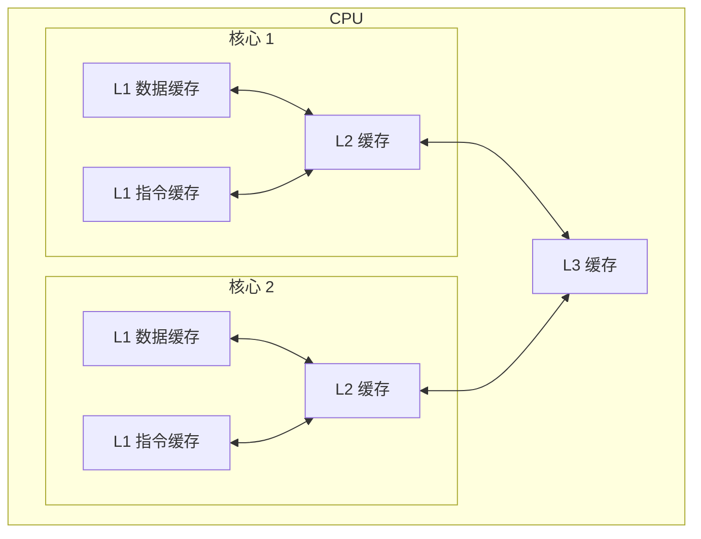

# 图解操作系统

## 一、硬件结构

### 1.1 CPU是如何执行程序的的？

代码写了这么多，你知道 ``a=1+2``这条代码是怎么被cpu执行的吗？

你知道32位和64位的区别吗？32位的操作系统可以运行在64位的电脑上吗？64位的操作系统可以运行在32位的电脑上吗？如果不行，原因是什么？

cpu看了那么多，我们知道cpu通常分为32位和64位，你知道64位相比32位cpu的优势在哪吗？64位cpu的计算性能一定比32位cpu高很多吗？

接下来我们将循序渐进、一层一层的攻破这些问题。

#### 图灵机的工作方式

要想知道程序执行的原理，我们可以先从 ``图灵机``说起，图灵的基本思想是**用机器来模拟人们用纸笔进行数学运算的过程**，而且还定义了计算机有哪些部分组成，程序又是如何执行的。

图灵机的基本组成如下：

- 有一条 ``纸带``,纸带是一个个连续的格子组成，每个格子可以写入字符，纸带就好比内存，而纸带上的格子的字符就好比内存中的数据或程序；
- 有一个 ``读写头``,读写头可以读取纸带上任意格子的字符，也可以把字符写入到纸带的格子;
- 读写头上有一些部件，比如存储单元、控制单元以及运算单元：
- 1. 存储单元用于存放数据
- 2. 控制单元用于识别字符是数据还是指令，以及控制程序的流程等；
- 3. 运算单元用于执行运算指令；

知道了图灵机的组成后，我们以简单数学运算 ``1+2``作为例子，来看看它是怎么执行这行代码的。

- 首先，用读写头把‘1’、‘2’、‘+’这三个字符分别写入纸带上的三个格子，然后读写头先停在 ``1``字符对应的格子上；
- 接着，读写头读入 ``1``到存储设备上，这个存储设备称为图灵机的状态；
- 然后读写头向右移动一个格，用同样的方式把 ``2``读入图灵机的状态，于是现在图灵机的状态中存储着两个连续的数字，1和2；
- 读写头再往右移动一个格，就会碰到 ``+``号，读写头读到+号后，将+号传输给 ``控制单元``，控制单元发现是一个+号而不是数字，所以没有存入到状态中，因为+号是运算符指令，作用是加和目前的状态，于是通知 ``运算单元``工作。运算单元收到要加和状态中的值的通知后，就会把状态中的1和2读入并计算，再将计算的结果3存放到状态中；
- 最后，运算单元将结果返回给控制单元，控制单元将结果传输给读写头，读写头向右移动，把结果3写入到纸带的格子中；

通过上面的图灵机计算 ``1+2``的过程，可以发现图灵机主要功能就是读取纸带格子中的内容，然后交给控制单元识别字符是数字还是运算符指令，如果是数字则存入到图灵机状态中，如果是运算符，则通知运算符单元读取状态中的数值进行计算，计算结果最终返回给读写头，读写头把结果写入到纸带的格子中。

事实上，图灵机这个看起来很简单的工作方式，和我们今天的计算机时基本一样的。接下来，我们一同再看看当今计算机的组成以及工作方式。

---

#### 冯诺依曼模型

在1945年冯诺依曼和其他计算机科学家们提出了计算机具体实现的报告，其遵循了图灵机的设计，而且还提出用电子元件构造计算机，并约定了用二进制进行计算和存储，还定义计算机基本结构为5个部分，分别是：

- 中央处理器CPU
- 内存
- 输入设备
- 输出设备
- 总线

这5个部分也被称为冯诺依曼模型，接下来看这5部分的具体作用:

##### 内存

我们的程序和数据都是存储在内存，存储的区域是线性的。

数据存储的单位是一个**二进制位（bit）**，即0或1.最小的存储单位是**字节（byte）**，1字节等于8位。

内存的地址是从0开始编号的，然后自增排列，最后一个地址位内存总字节数-1，这种结构好似我们程序里的数组，所以内存的读写任何一个数据的速度都是一样的。

##### 中央处理器

中央处理器也就是我们常说的CPU，32位和64位CPU最主要区别在于一次能计算多少字节数据：

- 32位cpu一次可以计算4个字节；
- 64位cpu一次可以计算8个字节。

这里的32位和64位，通常称为CPU的位宽。

之所以CPU要这样设计，是为了能计算更大的数值，如果是8位的CPU，那么一次只能计算1个字节 ``0~255``范围内的数值，这样就无法一次完成计算 ``10000*500``，于是为了能一次计算大数的运算，CPU需要支持多个byte一起计算，所以CPU位宽越大，可以计算的数值就越大，比如说32位CPU能计算的最大整数是 ``4294967295``。

CPU内部还有一些组件，常见的有寄存器、控制单元和逻辑运算单元等。其中，控制单元负责控制CPU工作，逻辑运算单元负责计算，而寄存器可以分为多种类，每种寄存器的功能又不尽相同。

CPU中的寄存器主要作用是存储计算时的数据，你可能会好奇为什么有了内存还需要寄存器？原因很简单，因为内存离cpu太远了，而寄存器就在cpu里，还紧挨着控制单元和逻辑运算单元，自然计算时速度会很快。

常见的寄存器种类：

- **通用寄存器**：用来存放需要进行运算的数据，比如需要进行加和运算的两个数据。
- **程序计数器**：用来存储cpu要执行下一条指令“所在的内存地址”，注意不是存储了下一条要执行的指令，此时指令还在内存中，程序计数器只是存储了下一条指令的地址。
- **指令寄存器**：用来存放程序计数器指向的指令，也就是指令本身，指令被执行完成之前，指令都存储在这里。

##### 总线

总线是用于cpu和内存以及其他设备之间的通信，总线可分为3种：

- **地址总线**：用于指定cpu要操作的内存地址；
- **数据总线**：用于读写内存的数据；
- **控制总线**：用于发送和接收信号，比如中断、设备复位等信号，cpu收到信号后自然进行响应，这时也需要控制总线。

当cpu要读写内存数据的时候，一般需要通过两个总线：

- 首先要通过 ``地址总线``来指定内存的地址；
- 再通过 ``数据总线``来传输数据。

##### 输入、输出设备

输入设备向计算机输入数据，计算机经过计算后，把数据输出给输出设备。期间，如果输入设备是键盘，按下按键时是需要和cpu进行交互的，这时就需要用到控制总线了。

#### 线路位宽与CPU位宽

数据是如何通过线路传输的呢？其实是通过操作电压，低电压表示0、高压电压则表示1。

如果构造了 ``高低高``这样的信号，其实就是 ``101``二进制数据，十进制则表示5，如果只有一条线路，就意味着每次只能传递1 bit的数据，即0或1，那么传输101这个数据，就需要3此才能传输完成，这样的效率非常低。

这样一位一位传输的方式，称为串行，下一个bit必须等待上一个bit传输完成才能进行传输。当然，想一次多传一些数据，增加线路即可，这时数据就可以并行传输。

为了避免低效率的串行传输的方式，线路的位宽最好一次就能访问到所有的内存地址。cpu要想操作的内存地址就需要地址总线，如果地址总线只有一条，那每次只能表示 ``0或1``这两种情况，所以cpu一次只能操作2个内存地址，如果想要cpu操作4G的内存，那么就需要32条地址总线，因为 ``2^32=4G``。

知道了线路位宽的意义后，我们再来看看cpu位宽。

cpu的位宽最好不要小于线路位宽，比如32位cpu控制40位宽的地址总线和数据总线的话，工作起来就会非常复杂且麻烦，所以32位的cpu最好和32位宽的线路搭配，因为32位cpu一次最多只能操作32位宽的地址总线和数据总线。

如果用32位cpu去加和两个64位大小的数字，就需要把这2个64位的数字分成2个低位32位数字和2个高位32位数字来计算，先加和两个低位的32位数字，算出进位，然后加和两个高位的32位数字，最后再加上进位，救恩那个算出结果了，可以发现32位cpu并不能一次性计算出加和两个64位数字的结果。

但是并不代表64位cpu性能比32位cpu高很多，很少应用需要算超过32位的数字，所以
``如果计算的数额不超过32位数字的情况下，32位和64位cpu之间没什么区别的，只有当计算超过32位数字的情况下，64位的优势才能体现出来。``

另外，32位cpu最大只能操作4GB内存，就算装了8 GB内存条，也没用。而64位CPU寻址范围则很大，理论最大的寻址空间位 ``2^64``.

#### 程序执行的基本过程

在前面，我们知道了程序在图灵机的执行过程，接下来我们看看程序在冯诺依曼模型上是怎么执行的。

程序执行实际上是一条一条指令，所以程序的运行过程就是把每一条指令一步一步的执行起来，负责执行指令的就是cpu了。

那cpu执行程序的过程如下：

- 第一步：cpu读取 ``程序计数器``的值，这个值是指令的内存地址，然后cpu的 ``控制单元``操作 ``地址总线``指定需要访问的内存地址，接着通知内存设备准备数据，数据准备好后通过 ``数据总线``将指令数据传给cpu，cpu收到内存传来的数据后，将这个指令数据存入到 ``指令寄存器``。
- 第二步：cpu分析 ``指令寄存器``中的指令，确定指令的类型和参数，如果是计算类型的指令，则交由 ``控制单元``执行；
- 第三步：cpu执行完指令后，``程序计数器``的值自增，表示指向下一条指令。这个自增的大小，由cpu的位宽决定，比如32位的cpu，指令是4个字节，需要4个内存地址存放，因此 ``程序计数器``的值会自增4。

简单总结一下就是：
``一个程序执行的时候，cpu会根据程序计数器里的内存地址，从内存里把需要执行的指令读取到指令寄存器里面执行，然后根据指令长度自增，开始顺序读取下一条指令。``

cpu从程序计数器读取指令、到执行、再到下一条指令，这个过程会不断循环，直到程序执行结束，这个不断循环的过程被称为**cpu的指令周期**。

#### a = 1+2 执行具体过程

知道了基本的程序执行过程后，接下来用 ``a=1+2``的作为例子，进一步分析该程序在冯诺依曼模型的执行过程。

cpu是不认识a=1+2这个字符串，这些字符串只是方便我们程序员认识，要想这段程序能跑起来，还需要把整个程序翻译成 ``汇编``程序，这个过程称为编译成汇编代码。

针对汇编代码，我们还需要用汇编器翻译成 ``机器码``，这些机器码由0到1组成的机器语言，这一条条机器码，就是一条条的 ``计算机指令``，这个才是cpu能够真正认识的东西。

下面来看看a=1+2在32位cpu的执行过程。

程序编译过程中，编译器通过分析代码，发现1和2是数据，于是程序运行时，内存会有个专门的区域来存放这些数据，这个区域就是 ``数据段``。

- 数据 1 被存放到 0x100 位置
- 数据 2 被存放到 0x104 位置

注意，数据和指令是分开区域存放的，存放指令区域的地方称为 ``正文段``。

编译器会把a=1+2翻译成4条指令，存放到正文段中：

- ``0x200 load 0x100->R0`` : 0x200的内容是 ``load``指令将0x100地址中的数据1装入到寄存器 ``R0``;
- ``0x204 load 0x104->R1`` : 0x204的内容是 ``load``指令将0x104地址中的数据2装入到寄存器 ``R1``；
- ``0x208 add R0 R1 R2`` : 0x208的内容是 ``add``指令将寄存器R0和R1的数据相加，并把结果存放到寄存器R2；
- ``0x20c set R2->0x108`` : 0x20c的内容是 ``store``指令将寄存器R2中的数据存回数据段中的0x108地址中，这个地址也就是变量 ``a``内存中的地址。

编译完成后，具体执行程序的时候，程序计数器会被设置为0x200地址，然后依次执行这4条指令。

上面的例子中，由于是在32位cpu执行的，因此一条指令是占32位大小，所以你会发现每条指令间隔4个字节。

而数据的大小是根据你在程序中指定的变量类型，比如 ``int``类型的数据则占4个字节，``char``类型的数据则占1个字节。

##### 指令

上面的例子中，指令的内容是写的简易的汇编diamagnetic，目的是为了方便理解指令的具体内容，事实上指令的内容是一串二进制数字的机器码，每条指令都有对应的机器码，cpu通过解析机器码来知道指令的内容。

不同的cpu有不同的指令集，也就是对应着不同的汇编语言和不同的机器码，接下来选用最简单的MIPS指令集，来看看机器码是如何生成的，这样也能明白二进制的机器码的具体含义。

MIPS的指令是一个32位的整数，高6位代表着操作码，表示这条指令是一条什么样的指令，剩下的26位不同指令类型所表示的内容也就不相同，主要有三种类型R、I、J。

| 指令类型 | 6位              | 5位 | 5位 | 5位                              | 5位             | 6位                        |
| -------- | ---------------- | --- | --- | -------------------------------- | --------------- | -------------------------- |
| R        | opcode（操作码） | rs  | rt  | rd                               | shamt（位移量） | funct（功能码）            |
| I        | opcode（操作码） | rs  | rt  | address/immediate（地址/立即数） |                 |                            |
| J        | opcode（操作码） |     |     |                                  |                 | target address（目标地址） |

三种类型的具体含义：

- **R指令**：用在算数和逻辑操作，里面由读取和写入数据的寄存器地址。如果是逻辑位移操作，后面还有位移操作的 ``位移量``，而最后的 ``功能码``则是前面的操作码不够的时候，扩展操作码来表示对应的具体指令的；
- **I指令**：用在数据传输、条件分支等。这个类型的指令，就没有了位移码和操作码，也没有了第三个寄存器，而把这三部分直接合并成了一个地址值或一个常数；
- **J指令**：用在跳转，高6位之外的26位都是一个跳转后的地址。

接下来，我们把前面例子的这条指令：``add``指令将寄存器 ``R0``和 `R1`的数据相加，并把结果放入到 `R2`，翻译成机器码。

| 指令         | 指令类型 | 操作码 6位 | rs 5位 | rt 5位 | rd 5位 | 位移量 5位 | 功能码/十六进制 |
| ------------ | -------- | ---------- | ------ | ------ | ------ | ---------- | --------------- |
| add          | R        | 000000     | 00000  | 00001  | 00010  | 00000      | 100000（funct） |
| 十六进制表示 |          |            |        |        |        |            | 0x00011020      |

加和运算add指令是属于R指令类型：

- add对应的MIPS指令里操作码是 `000000`，以及最末尾的功能码是 `100000`，这些数值都是固定的，查一下MIPS指令集的手册就能知道的；
- rs代表第一个寄存器R0的编号，即 `00000`；
- rt代表第二个寄存器R1的编号，即 `00001`；
- rd代表目标的临时寄存器R2的编号，即 `00010`；
- 因为不是位移操作，所以位移量是 `00000`

把上面这些数字拼在一起就是一条32位的MIPS加法指令了，那么用16进制表示的机器码则是 `0x00011020`。

编译器在编译程序的时候，会构造指令，这个过程叫作指令的编码。cpu执行程序的时候，就会解析指令，这个过程叫作指令的解码。

现代大多数cpu都使用来流水线的方式来执行指令，所谓的流水线就是把一个任务拆分成多个小任务，于是一条指令通常分为4个阶段，称为四级流水线


四个阶段的具体含义：

1. CPU通过程序计数器读取对应内存地址的指令，这个部分称为 `Fetch（取得指令）`；
2. CPU对指令进行解码，这个部分称为 `Decode（指令译码）`；
3. CPU执行指令，这个部分称为 `Execution（执行指令）`;
4. CPU将计算结果存回寄存器或者将寄存器的值存入内存，这个部分称为 `Stroe（数据回写）`。

上面这四个阶段，我们称为 `指令周期（Instruction Cycle）`，CPU的工作就是一个周期接着一个周期，周而复始。

事实上，不同的阶段其实是由计算机中的不同组件完成的：

- 取指令阶段，我们的指令是存放在 `存储器`里的，实际上，通过程序计数器和指令寄存器取出指令的过程，是由 `控制器`操作的；
- 指令的译码过程，也是由 `控制器`进行的；
- 指令执行的过程，无论是进行算术操作、逻辑操作，还是进行数据传输、条件分支操作，都是由 `算术逻辑单元`操作的，也就是由 `运算器`处理的，但是如果是一个简单的无条件地址跳转，则是直接在 `控制器`里面完成的，不需要用到运算器。

##### 指令类型

指令从功能角度划分，可以分为5大类：

- **数据传输类型的指令**：比如 `store/load`是寄存器与内存间数据传输的指令，`mov`是将一个内存地址的数据移动到另一个内存地址的指令；
- **运算类型的指令**：比如加减乘除、位运算、比较大小等等，它们最多只能处理两个寄存器中的数据；
- **跳转类型的指令**：通过修改程序计数器的值来达到跳转执行指令的过程，比如编程中常见的 `if-else`、`swtich-case`、函数调用等。
- **信号类型的指令**：比如发生中断的指令 `trap`；
- **闲置类型的指令**：比如指令 `nop`，执行后cpu会空转一个周期。

##### 指令的执行速度

CPU的硬件参数都会有 `GHz`这个参数，比如一个1GHz的cpu，指的是时钟频率是1 G，代表着一秒钟会产生1G次数的脉冲信号，每一次脉冲信号高低电平的转换就是一个周期，称为时钟周期。

对于CPU来说，在一个时钟周期内，CPU仅能完成一个最基本的动作，时钟频率越高，时钟周期就越短，工作速度就越快。

一个时钟周期一定能执行完一条指令码？答案是不一定的，大多数指令不能在一个时钟周期完成，通常需要若干个时钟周期。不同的指令需要的时钟周期是不同的，加法和乘法都对应着一条cpu指令，但是乘法需要的时钟周期就要比加法多。

*如何让程序跑的更快？*

程序执行的时候，耗费的CPU时间少就说明程序是快的，对于程序的cpu执行时间，我们可以拆解成
**CPU时钟周期数（CPU Cycles）**和**时钟周期时间（Clock Cycle Time）的乘积**。
`程序的cpu执行时间= cpu时钟周期数 * 时钟周期时间`

时钟周期时间就是我们前面提及的cpu主频，主频越高说明cpu的工作速度就越快，比如我手头上的电脑的cpu是2.4GHz 四核 Intel Core i5，这里的2.4 GHz就是电脑的主频，时钟周期时间就是 1/2.4G。

要想CPU跑的更快，自然缩短时钟周期，也就是提升CPU主频，但是今非彼日，摩尔定律早已失效，当今的CPU主频已经很难再做到翻倍的效果了。

另外，换一个更好的cpu，这个也是我们软件工程师控制不了的使其，我们应该把目光放到另一个惩罚因子————cpu时钟周期数，如果能减少程序所需的CPU时钟周期数量，一样也是能提升程序的性能的。

对于CPU时钟周期数，我们可以进一步拆解成：`指令数*每条指令的平均时钟周期数（Cycles Per Instruction，简称 CPI）`，于是程序的CPU执行时间的公式可变成如下：
`程序的cpu执行时间= 指令数*CPI*时钟周期时间）`

因此，要想程序跑的更快，优化这三者即可：

- **指令数**：表示执行程序所需要多少条指令，以及哪些指令。这个层面是基本靠编译器来优化，毕竟同样的代码，在不同的编译器，编译出来的计算机指令会有各种不同的表示方式。
- **每条指令的平均时钟周期数CPI**：表示一条指令需要多少个时钟周期数，现代大多数CPU通过流水线技术（Pipline），让一条指令需要的CPU时钟周期数尽可能的少；
- **时钟周期时间**：表示计算机主频，取决于计算机硬件。有的CPU支持超频技术，打开了超频意味着把CPU内部的时钟给调快了，于是CPU工作速度就变快乐，但是也是有代价的，CPU跑的越快，散热的压力就会越大，CPU越容易崩溃。

#### 总结

回到最开始的问题：

##### 64位相比32位CPU的优势在哪？64位cpu的计算性能一定比32位cpu高很多吗？

64位相比32位cpu的优势主要体现在两个方面：

- 64位cpu可以一次计算超过32位的数字，而32位cpu如果要计算超过32位的数字，要分多步骤进行计算，效率就没那么高，但是大部分应用程序很少会计算那么大的数字，所以**只有运算大数字的时候，64位cpu的优势才会体现出来，否则和32位cpu的计算性能相差不大**。
- 64位cpu可以**寻址更大的内存空间**，32位cpu最大的寻址地址是4g，即使你加了8G大小的内存，也还是只能寻址到4G，而64位cpu最大寻址地址是 `2^64`，远超于32位cpu最大寻址地址的 `2^32`。

##### 你知道软件的32位和64位之间的区别吗？再来32位的操作系统可以运行在64位的电脑上吗？64位的操作系统可以运行在32位的电脑上吗？如果不行，原因是什么？

64位和32位软件，实际上代表指令是64位还是32位的：

- 如果32位指令在64位机器上执行，需要一套兼容机制，就可以做到兼容运行了。但是**如果64位指令在32位机器上执行，就比较困难了，因为32位的寄存器存不下64位的指令**；
- 操作系统其实也是一种程序，我们也会看到操作系统分为32位操作系统、64位操作系统，其代表意义就是擦欧总系统中程序的指令是多少位，比如64位操作系统，指令也就是64位，因此不能装在32位机器上。

总之，硬件的64位和32位指的是cpu的位宽，软件的64位和32位指的是指令的位宽。

### 1.2 存储器金字塔

大家如果想自己组装电脑的画，肯定需要买一个cpu，但是存储器方面的设备，分类比较多，那我们肯定不能只买一种存储器，比如你除了买内存，还要买硬盘，而针对硬盘我们还可以选择是固态硬盘还是机械硬盘。

相信大家都知道内存和硬盘都属于计算机的存储设备，断电后内存的数据是会丢失的，而硬盘不会，一位内硬盘是持久化存储设备，同时也是一个I/O设备。

但其实cpu内部也有存储数据的组件，这个应该比较少人注意到，比如 `寄存器`、`CPU L1/L2/L3 Cache`也都是属于存储设备，只不过它们能存储的数据非常小，但是它们因为靠近cpu核心，所以访问速度都非常快，快过硬盘好几个数量级别。

问题来了，**那机械硬盘、固态硬盘、内存这三个存储器，到底和CPU L1 Cache相比速度差多少倍呢？**

在回答这个问题之前，我们先来看看**存储器的层次架构**，好让我们对存储器设备有一个整体的认识。

#### 存储器的层次结构

我们想象一个场景，大学期末准备考试了，你前去图书馆临时抱佛脚。那么，在看书的时候，我们的大脑会思考问题，也会记忆知识点，另外我们通常也会把常用的书放在自己的桌子上，当我们要找一本不常用的书，则会去图书馆的书架找。

就是这么一个小小的场景，已经把计算机的存储结构基本都涵盖了。

我们可以把cpu比喻成我们的大脑，大脑正在思考的东西，就好比cpu中的 `寄存器`,处理速度是最快的，但是能存储的数据也是最少的，毕竟我们也不能一下同时思考太多的事情，除非你练过。

我们大脑中的记忆，就好比 `CPU Cache`，中文称为CPU高速缓存，处理速度相比寄存器慢了一点，但是能存储的数据也稍微多了一些。

CPU Cache通常会分为 `L1、L2、L3三层`，其中L1 Cache通常分为“数据缓存”和“指令缓存”，L1是距离CPU最近的，因此它比L2、L3的读写速度都快、存储空间都小。我们大脑中短期记忆，就好比L1 Cache，而长期记忆好比L2/L3 Cache。

寄存器和CPU Cache都是在CPU内部，跟CPU挨着很近，因此它们的读写速度都相当的快，但是能存储的数据很少，毕竟CPU就这么丁点大。

知道CPU内部的存储器的层次分布，我们放眼看CPU外部的存储器。

当我们大脑记忆中没有资料的时候，可以从书桌或书架上拿书来阅读，那我们桌子上的书，就好比 `内存`，我们虽然可以一伸手就可以拿到，但读写速度肯定远慢于寄存器，那图书馆书架上的书，就好比 `硬盘`，能存储的数据非常大，但是读写速度相比内存差好几个数量级，更别说寄存器的差距了。

我们从图书馆书架取书，把书放到桌子上，在阅读书，我们但那哦就会记忆知识点，然后再经过大脑思考，这一系列过程，相当于，数据从硬盘加载到内存，再从内存加载到CPU的寄存器和Cache中，然后再通过CPU进行处理和计算。

**对于存储器，它的速度越快、能耗会越高、而且材料的成本也是越贵的，以至于速度快的存储器的容量都比较小。**

CPU的寄存器和Cache，是整个计算机存储器中价格最贵的，虽然存储空间很小，但是读写速度是极快的，而相比较便宜的内存和硬盘，速度肯定比不上CPU内部的存储器，但是能弥补存储空间的不足。

存储器通常可以分为这么几个级别：

- 寄存器；
- CPU Cache：
  1. L1-Cache
  2. L2-Cache
  3. L3-Cache
- 内存；
- SSD/HDD 硬盘

##### 寄存器

最靠近CPU的控制单元和逻辑计算单元的存储器，就是寄存器了，它使用的材料速度也是最快的，因此价格也是最贵的，那么数量不能很多。

存储器的数量通常在几十到几百之间，每个寄存器可以用来存储一定的字节（byte）的数据。比如：

- 32位cpu中大多数寄存器可以存储*4*个字节
- 64位cpu中大多数寄存器可以存储*8*个字节

寄存器的访问速度非常快，一般要求在半个CPU时钟周期内完成读写，CPU时钟周期跟CPU主频息息相关，比如2GHz主频的CPU，那么它的时钟周期就是1/2G，也就是0.5ns。

CPU处理一条指令的时候，除了读写寄存器，还需要解码指令、控制指令执行和计算。如果寄存器的速度太慢，则会拉长指令的处理周期，从而给用户的感觉，就是电脑“很慢”。

##### CPU Cache

CPU Cache用的是一种叫**SRAM（Static Random-Access Memory，静态随机存储器）**的芯片。

SRAM之所以叫“静态”存储器，是因为只要有电，数据就可以保持存在，而一旦断电，数据就会丢失了。

在SRAM里面，一个bit的数据，通常需要6个晶体管，所以SRAM的存储密度不高，同样的物理空间下，能存储的数据是有限的，不过也因为SRAM的电路简单，所以访问速度非常快。

CPU的高速缓存，通常可以分为L1、L2、L3这样的三层高速缓存，也成为一级缓存、二次缓存、三次缓存。

###### L1 高速缓存

L1 高速缓存的访问速度几乎和寄存器一样快，通常只需要2~4个时钟周期，而大小在几十KB到几百KB不等。

每个CPU核心都有一块属于自己的L1高速缓存，指令和数据在L1是分开存放的，所以L1高速缓存通常分成*指令缓存*和*数据缓存*。

在Linux系统，我们可以通过这条命令，查看CPU里的L1 Cache “数据”缓存的容量大小：

```shell
cat /sys/devices/system/cpu/cpu0/cache/index0/size
```

而查看L1 Cache “指令”缓存的容量大小，则是：

```shell
cat /sys/devices/system/cpu/cpu0/cache/index1/size
```

###### L2 高速缓存

L2高速缓存同样每个CPU核心都有，但是L2高速缓存位置比L1高速缓存距离CPU核心更远，它大小比L1高速缓存更大，CPU型号不同大小也就不同，通常大小在几百KB到几MB不等，访问速度则更慢，速度在 ``10~20``个时钟周期。

在Linux系统，我们可以通过这条命令，查看CPU里的L2 Cache的容量大小：

```shell
cat /sys/devices/system/cpu/cpu0/cache/index2/size
```

###### L3 高速缓存

L3高速缓存通常是多个CPU核心共用的，位置比L2高速缓存距离CPU核心更远，大小也会更大些，通常大小在几MB到几十MB不等，具体值根据CPU型号而定。

访问速度相对也比较慢一些，访问速度在 `20~60`个时钟周期。

在Linux系统，我们可以通过这条命令，查看CPU里的L3 Cache的容量大小：

```shell
cat sys/devices/system/cpu/cpu0/cache/index3/size
```

##### 内存

内存用的芯片和CPU Cache有所不同，它使用的是一种叫作**DRAM （Dynamic Random Access Memory，动态随机存取存储器）**的芯片。

相比SRAM，DRAM的密度更高，功耗更低，有更大的容量，而且造价比SRAM芯片便宜很多。

DRAM存储一个bit数据，只需要一个晶体管和一个电容就能存储，但是因为数据会被存储在电容里，电容会不断漏电，所以需要“定时刷新”电容，才能保证数据不会被丢失，这就是DRAM之所以被称为“动态”存储器的原因，只有不断刷新，数据才能被存储起来。

DRAM的数据访问电路和刷新电路都比SRAM更复杂，所以访问的速度会更慢，内存速度大概在 `200~300`个时钟周期之间。

##### SSD/HDD硬盘

SSD（Solid-state disk）就是我们常说的固体硬盘，结构和内存类似，但是它相比内存的优点是断电后数据还是存在的，而内存、寄存器、高速缓存断电后数据都会丢失。内存的读写速度比SSD大概快 `10~1000`倍。

当然，还有一款传统的硬盘，也就是机械硬盘（Hard Disk Drive，HDD），它是通过物理读写的方式来访问数据的，因此它访问速度是非常慢的，它的速度比内存慢*10W*倍左右。

由于SSD的加个快接近机械硬盘了，因此机械硬盘已经逐渐被SSD替代了。

#### 存储器的层次关系

现代的一台计算机，都用上了CPU Cache、内存、到SSD或HDD硬盘这些存储器设备了。

其中，存储空间越大的存储器设备，其访问速度越慢，所需成本也相对越少。

CPU并不会直接和每一种存储器设备直接打交道，而是每一种存储器设备只和它相邻的存储器设备打交道。

比如，CPU Cache的数据是从内存加载过来的，写回数据的时候也只写回到内存，CPU Cache不会直接把数据写到硬盘，也不会直接从硬盘加载数据，而是先加载到内存，再从内存加载到CPU Cache中。

所以，**每个存储器只和相邻的一层存储器设备打交道，并且存储设备为了追求更快的速度，所需的材料成本必然也是跟高，也正因为成本太高，所以CPU内部的寄存器、L1\L2\L3 Cache 只好用较小的容量，相反内存、硬盘则可用更大的容量，这就是我们今天所说的存储器层次结构。**

另外，当CPU需要访问内存中某个数据的时候，如果寄存器有这个数据，CPU就直接从寄存器取数据即可，如果寄存器没有这个数据，CPU就会查询L1高速缓存，如果L1没有，则查询L2高速缓存，L2还是没有的话就查询L3高速缓存，L3依然没有的话，才去内存中取数据。

所以，存储层次结构也形成了缓存的体系。

#### 存储器之间的实际价格和性能差距

前面我们知道了，速度越快的存储器，造价成本往往也越高，那我们就以实际的数据来看看，不同层级的存储器之间的性能和价格差异。

| 存储器   | 硬件介质  | 单位成本 `<br>`(美元/MB) | 随机访问延时 |
| -------- | --------- | -------------------------- | ------------ |
| L1 Cache | SRAM      | 7                          | 1 ns         |
| L2 Cache | SRAM      | 7                          | 4 ns         |
| Memory   | DRAM      | 0.015                      | 100ns        |
| Disk     | SSD(NAND) | 0.0004                     | 150 us       |
| Disk     | HDD       | 0.00004                    | 10ms         |

可以看到L1 Cache的访问延时是1纳秒，而内存以及是100纳秒了，相比L1 Cache速度慢了*100*倍。另外，机械硬盘的访问延时更是高达10毫秒，相比L1 Cache 速度慢了*10000000*倍，差了好几个数量级别。

在价格上，每生成MB大小的L1 Cache相比内存贵了*466*倍，相比机械硬盘那更是贵了*175000*倍。

#### 总结

各种存储器之间的关系，可以用图书馆学习这个场景来理解。

CPU可以比喻成我们的大脑，我们当前正在思考和处理的只是的过程，就好比CPU中的*寄存器*处理数据的过程，速度极快，但是容量很小。而cpu中的*L1-L3 Cache*就好比我们大脑中的短期记忆和长期记忆，需要小小花费点时间来调取数据并处理。

我们面前的桌子就相当于*内存*，能放下更多的书（数据），但是找起来和看起来就需要花费一些时间，相比CPU Cache 慢不少。而图书馆的书架相当于*硬盘*，能放下比内存更多的数据，但找起来就更花费时间了，可以说是最慢的存储器设备了。

从寄存器、CPU Cache，到内存、硬盘，这样一层层下来的存储器，访问速度越来越慢，存储容量越来越大，价格也越来越便宜，而且每个存储器只和相邻的一层存储设备打交道，于是这样就形成了存储器的层次结构。

再来回答，开头的问题：`那机械硬盘、固态硬盘、内存这三个存储器，到底和*CPU L1 Cache*相比速度差多少倍呢？`

CPU L1 Cache随机访问延时是1纳秒，内存则是100纳秒，所以**CPU L1 Cache 比内存 快 ***100***倍左右**。

SSD随机访问延时是150微秒，所以**CPU L1 Cache 比SSD快15000倍左右**。

最慢的机械硬盘随机访问延时已经高达10毫秒，我们来看看机械硬盘到底有多“龟速”：

- SSD比机械硬盘快70倍左右；
- 内存比机械硬盘快100000倍左右；
- CPU L1 Cache比机械硬盘快10，000，000倍左右

我们把上述的时间比例差异放大后，就能非常直观感受到它们的性能差异了。如果CPU访问L1 Cache的缓存时间是1秒，那访问内存则需要大约2分钟，随机访问SSD里的数据则需要1.7天，访问机械硬盘那更久，长达近4个月。

可以发现，不同的存储器之间性能差距很大，构造存储器分级很有意思，分级的目的是要构造**缓存**体系。

### 1.3 如何写出让CPU跑得更快的代码？

代码都是由CPU跑起来的，我们代码写得好与坏就决定了CPU的执行效率，特别是在编写计算密集型的程序，更要注重CPU的执行效率，否则将会大大影响系统性能。

CPU内部嵌入了CPU Cache，它的存储容量很小，但是离CPU核心很近，所以缓存的读写速度是极快的，那么如果CPU运算时，直接从CPU Cache读取数据，而不是从内存的话，运算速度就会很快。

但是，大多数人不知道CPU Cache的运行机制，以至于不知道如何才能够写出配合CPU Cache工作机制的代码，一旦掌握了它，写代码的时候，就有新的优化思路了。

那么接下来我们就来看看，CPU Cahce到底是什么样的，是如何工作的，又该如何写出让CPU执行更快的代码。

#### CPU Cahce 有多快？

你可能会好奇为什么有了内存，还需要CPU Cache？根据摩尔定律，CPU的访问速度每18个月就会翻倍，相当于每年增长60%左右，内存的速度当然也会不断增长，但是增长的速度远小于CPU，平均每年只增长7%左右。于是，CPU与内存的访问性能的差距不断拉大。

到现在，一次内存访问所需时间是**200-300**多个时钟周期，这意味着CPU和内存的访问速度已经相差**200-300**多倍了。

为了弥补CPU与内存两者之间的性能差距，就在CPU内部引入了CPU Cache，也称高速缓存。

CPU Cache通常分为大小不等的三级缓存，分别是**L1 Cache、L2 Cache和L3 Cache**。

由于CPU Cache所使用的材料是SRAM，加个比内存使用的DRAM高出很多，在当今每生产1MB大小的CPU Cache需要7美金的成本，而内存只需要0.015美金的成本，成本方面相差了466倍，所以CPU Cache不像内存那样动辄以GB计算，他的大小以KB或MB来计算的。

在Linux系统中，我们可以使用下图的方式来查看各级CPU Cache的大小，比如这台服务器，离CPU核心最近的L1 Cache是32KB，其次L2 Cache是256KB，最大的L3 Cache则是3MB。

其中，**L1 Cache 通常会分为“数据缓存”和“指令缓存”**，这意味着数据和指令在L1 Cache这一层是分开缓存的，`index0`也就是数据缓存，而 `index1`则是指令缓存，它俩的大小通常是一样的。

另外，你也会注意到，L3 Cache比L1 Cache和L2 Cache大很多，这是因为**L1 Cache 和L2 Cache 都是每个CPU核心独有的，而L3 Cache是多个CPU核心共享的**。

程序执行时，会先将内存中的数据加载到共享的L3 Cache中，再加载到每个核心独有的L2 Cache，最后进入到最快的L1 Cache，之后才会被CPU读取。它们之间的层级关系如下图：



越靠近CPU核心的缓存其访问速度越快，CPU访问L1 Cache只需要*2-4*个时钟周期，访问L2 Cache大约*10-20*个时钟周期，访问L3 Cache大约*20-60*个时钟周期，而访问内存速度大概再*200-300*个时钟周期之间。

**所以，CPU从L1 Cache 读取数据的速度，相比从内存读取的速度，会快 100 多倍。**

#### CPU Cache的数据结构和读取过程是什么样的？

CPU Cache的数据是从内存读取过来的，它是以一小块一小块读取数据的，而不是按照单个数组元素来读取数据的，在CPU Cache中的这样一小块一小块的数据，称为 `Cache Line（缓存块）`。

可以在Linux系统，用下面这种方式来查看CPU的Cache Line的**一次载入数据的大小（字节byte）**

```shell
cat /sys/devices/system/cpu/cpu0/cache/idnex0/coherency_line_size
```

比如，有一个 ``int array[100]``的数组，当载入 `array[0]`时，由于这个数组元素的大小在内存只占4字节，不足64字节，CPU就会**顺序加载**数组元素到 `array[15]`，意味着 `array[0]-array[15]`数组元素都会被缓存在CPU Cache中了，因此当下次访问这些数组元素时，会直接从CPU Cache读取，而不用再从内存中读取，大大提高了CPU读取数据的性能。

事实上，CPU读取数据的时候，无论数据是否存放到Cache中，CPU都是先访问Cache，只有当Cache中找不到数据时，才会去访问内存，并把内存中的数据读入Cache中，CPU再从CPU Cache读取数据。

这样的访问机制，跟我们使用“内存作为硬盘的缓存”的逻辑是一样的，如果内存有缓存的数据，则直接返回，否则要访问龟速一般的硬盘。

那CPU怎么知道要访问的内存数据，是否在Cache里？如果在的话，如何找到Cache对应的数据呢？我们从最简单、基础的**直接映射Cache（direct Mapped Cache）** 说起，来看看整个CPU Cache的数据结构和访问逻辑。

前面，我们提到CPU访问内存数据时，时一小块一小块数据读取的，具体这一小块数据的大小，取决于 `coherency_line_size`的值，一般64字节。在内存中，这一块的数据我们称为**内存块（Block）**，读取的时候我们要拿到数据所在内存块的地址。

对于直接映射Cache采取的策略，就是把内存块的地址始终“映射”在一个CPU Line（缓存块）的地址，至于映射关系实现方式，则是使用“取模运算”，把取模运算的结果就是内存块地址对应的CPU Line（缓存块）的地址。

举个例子，内存共被划分为32个内存块，CPU Cache共有8个CPU Line，假设CPU想要访问第15号内存块，如果15号内存块中的数据已经缓存在CPU Line中的话，则是一定映射在7号CPU Line中，因为 `15%8`的值是7。

机制的你肯定发现了，使用取模方式映射的话，就会出现多个内存块对应同一个CPU Line，比如上面的例子，除了15号内存块是映射在7号CPU Line中，还有7号、23号、31号内存块都是映射到7号CPU Line中。

因此，为了区别不同的内存块，在对应的CPU Line中我们还会存储一个**组标记（Tag）**。这个组标记会记录当前CPU Line中存储的数据对应的内存块，我们可以用这个组标记来区分不同的内存块。

除了组标记信息外，CPU Line还有两个信息：

- 一个是，从内存加载过来的实际存放**数据（Data）**。
- 另一个是，**有效位（Valid bit）**，它是用来标记对应的CPU Line中的数据是否是有效的，如果有效位是0，无论CPU Line中是否有数据，CPU都会直接访问内存，重新加载数据。

CPU在从CPU Cache读取数据的时候，并不是读取CPU Line中的整个数据块，而是读取CPU所需要的一个数据片段，这样的数据统称为一个**字（Word）**。那怎么在对应的CPU Line中数据块中找到所需的字呢？答案是，需要一个**偏移量（Offset）**。

因此，一个内存的访问地址，包括**组标记、CPU Line 索引、偏移量**这三种信息，于是CPU就能通过这些信息，在CPU Cache中找到缓存的数据。而对于CPU Cache里的数据结构，则是由**索引+有效位+组标记+数据块**组成。

如果内存中的数据已经在CPU Cache中了，那CPU访问一个内存地址的时候，会经历这4个步骤：

1. 根据内存地址中索引信息，计算在CPU Cache中的索引，也就是找出对应的CPU Line的地址；
2. 找到对应的CPU Line后，判断CPU Line中的有效位，确认CPU Line中数据是否是有效的，如果是无效的，CPU就会直接访问内存，并重新加载数据，如果数据有效，则往下执行；
3. 对比内存地址中组标记和CPU Line中的组标记，确认CPU Line中的数据就是我们要访问的内存数据，如果不是的话，CPU就会直接访问内存，并重新加载数据，如果是的话，则往下执行；
4. 根据内存地址中偏移量信息，从CPU Line的数据块中，读取对应的字。

到这里，相信你对直接映射Cache有了一定认识，但其实除了直接映射Cache之外，还有其他通过内存地址找到CPU Cache中的数据的策略，比如全相连Cache（Fully Associative Cache）、组相连Cache（Set Associative Cache）等，这几种策略的数据结构都比较相似，我们理解了直接映射Cache的工作方式，其他的策略如果你有兴趣去看，相信很快就能理解的了。

#### 如何写出让CPU跑得更快的代码？

我们知道CPU访问内存的速度，比访问CPU Cache的速度慢了100多倍，所以如果CPU所要操作的数据在CPU Cache中的话，这样将会带来很大的性能提升。访问的数据在CPU Cache中的话，意味着**缓存命中**，缓存命中率越高的话，代码的性能就会越好，CPU也就跑的越快。

于是，“如何写出让CPU跑得更快地的代码？”这个问题，可以改成“如何写出CPU缓存命中率高的代码？”。

在前面也提到，L1 Cache通常分为数据缓存和指令缓存，这是一位内CPU会处理数据和指令，比如 `1+1=2`这个运算，`+`就是指令，会被放在指令缓存中，而输入数字 `1`则会被放在数据缓存里。

因此，**我们要分开看数据缓存和指令缓存的缓存命中率**。

##### 如何提升数据缓存的命中率？

假设要遍历二维数组，有以下两种形式，虽然代码执行结果一样，但你觉得哪种形式效率最高呢？为什么高呢？

```c
array[N][N] = 0;
```

```c
// 形式一：
for(i=0;i<N;i+=1){
  for(j=0;j<N;j+=1>){
    array[i][j]=0;
  }
}
```

```c
// 形式二：
for(i=0;i<N;i+=1){
  for(j=0;j<N;j+=1>){
    array[j][i]=0;
  }
}
```

经过测试，形式以 ``array[i][j]``执行时间比 ``array[j][i]``块好几倍。

之所以有这么大的差距，是因为二维数组 `array`所占用的内存是连续的，比如长度 `N`的值是 `2`的话，那么内存中的数组元素的布局顺序是这样的:

```c
// 内存中的数组元素的布局顺序
array[0][0],array[0][1],array[1][0],array[1][1]
```

形式一用 array[i][j]访问数组元素的顺序，正是和内存中数组元素存放的顺序一致。当CPU访问 array[0][0]时，由于数据不在Cache中，于是会顺序把跟随其后的3个元素从内存中加载到CPU Cache，这样当CPU访问后面的3个数组元素时，就能在CPU Cache中成功找到数据，这意味着缓存命中率很高，缓存命中的数据不需要访问内存，这便大大提高了代码性能。

而如果用形式二的 `array[j][i]`来访问，可以看到访问的方式是跳跃式的，而不是顺序的，那么如果N的数值很大，那么操作array[j][i]时，是没办法把array[j+1][i]也读入CPU Cache中的，既然array[j+1][i]没有读取到CPU Cache，那么就需要从内存读取该数据元素了。很明显，这种不连续性、跳跃式访问数据元素的方式，可能不能充分利用到了CPU Cache的特性，从而代码的性能不高。

那访问 array[0][0]元素时，CPU具体会一次从内存加载多少元素到CPU Cache呢？这个问题，在前面我们也提到过，这跟CPU Cache Line有关，他表示CPU Cache一次性 能加载数据的大小，可以在Linux里通过 `coherency_line_size`配置查看它的大小，通常是64个字节。

也就是说，当CPU访问内存数据时，如果数据不在CPU Cache中，则会一次性连续加载64字节大小的数据到CPU Cache，那么当访问array[0][0]时，由于该元素不足64字节，于是就会往后*顺序*读取array[0][0]-array[0][15]到cpu cache中。顺序访问的array[i][j]因为利用了这一特点，所以就会比跳跃式访问的array[j][i]要快。

**因此，遇到这种遍历数组的情况时，按照内存布局顺序访问，将可以有效的利用CPU Cache带来的好处，这样我们代码的性能就会得到很大的提升**

##### 如何提升指令缓存的命中率？

提升数据的缓存命中率的方式，是按照内存布局顺序访问，那针对指令的缓存该如何提升呢？

我们以一个例子来看看，有一个元素位0到100之间随机数字组成的一维数组：

```c
int array[N];
for(i=0;i<N;i++){
  array[i]=rand()%100;
}
```

接下来，对这数组做两个操作：

```c
for(i=0;i<N;i++){
  if(array[i]<50){
    array[i]=0;
  }
}

sort(array,array+N);
```

- 第一个操作：循环遍历数组，把小于50的数组元素置为0；
- 第二个操作：将数组排序；

那么问题来了，你觉得先遍历在排序速度快，还是先排序再遍历速度快呢？

再回答这个问题之前，我们先了解CPU的**分支预测器**。对于if条件语句，意味着此时至少可以选择跳转到两段不同的指令执行，也就是if还是else中的指令。那么，**如果分支预测可以预测接下来要执行if里的指令，还是else指令的话，就可以提前把这些指令放在指令缓存中，这样CPU就可以直接从Cache读取到指令，于是执行速度就会很快。**

当数组中的元素时随机的，分支预测就无法有效工作，而数组元素都是顺序的，分支预测器会动态地根据历史命中数据对未来进行预测，这样命中率就会很高。

因此，先排序再遍历速度会更快，这是因为排序之后，数字是从小到大的，那么前几次循环命中 `if<50`的次数会比较多，于是分支预测就会缓存 `if`里的 `array[i]=0`指令到Cache中，后续CPU执行该指令就只需要从Cache读取就好了。

如果你肯定代码中的if表达式判断为true的概率比较高，我们可以使用显示分支预测工具，比如在C/C++语言中编译器提供了likely和unlikely这两种宏，如果if条件为true的概率大，则可以把likely宏if里的表达式包裹起来，反之用unlikely宏。

实际上，CPU自身的动态分支预测已经是比较准的了，所以只有当非常确信CPU预测的不准，且能够知道实际的概率情况时，才建议使用这两种宏。

##### 如何提升多核CPU的缓存命中率

在单核CPU，虽然只能执行一个进程，但是操作系统给每个进程分配了一个时间片，时间片用完了，就调度下一个进程，于是各个进程就按时间片交替地占用CPU，从宏观上看起来各个进程同时在执行。

而现代CPU都是多核心的，进程可能在不同CPU核心来回切换执行，这对CPU Cache不是有利的，虽然L3 Cache是多核心之间共享的，但是L1和L2 Cache都是每个核心独有的，**如果一个进程在不同核心来回切换，各个核心的缓存命中率就会受到影响**，相反如果进程都在同一个核心上执行，那么其数据的L1和L2 Cache的缓存命中率可以得到有效提高，缓存命中率就意味着CPU可以减少访问内存的频率。

当有多个同时执行“计算密集型”的线程，为了防止因为切换到不同的核心，从而导致缓存命中率下降的问题，可以把**线程绑定在某一个CPU核心上**，这样性能可以得到非常可观的提升。

在Linux上提供了 `sched_setaffinity`方法，来实现将线程绑定到某个CPU核心这一功能。

#### 总结

由于随着计算机技术的发展，CPU与内存的访问速度相差越来越多，如今差距已经高达好几百倍了，所以CPU内部嵌入了CPU Cache组件，作为内存与CPU之间的缓存层，CPU Cache由于离CPU核心很近，所以访问速度也是非常快的，但由于所需材料成本比较高，它不像内存动辄几个GB大小，而是仅有几十KB到MB大小。

当CPU访问数据的时候，先是访问CPU Cache，如果缓存命中的话，则直接返回数据，就不用每次都从内存读取了。因此，缓存命中率越高，代码的性能越好。

但需要注意的是，当CPU访问数据时，如果CPU Cache没有缓存该数据，则会从内存读取数据，但是并不是只读取一个数据，而是一次性读取一块一块的数据存放到CPU Cache中，之后才会被CPU读取。

内存地址映射到CPU Cache地址里的策略有很多种，其中比较简单是直接映射Cache，它巧妙的把内存地址拆分成“索引+组标记+偏移量”的方式，使我们可以将很大的内存地址，映射到很小的CPU Cache地址里。

要想写出让CPU跑得更快的代码，就需要写出缓存命中率高的代码，CPU L1 Cache 分为数据缓存和指令缓存，因而需要分别提高它们的缓存命中率：

- 对于数据缓存，我们在遍历数据的时候，应该按照内存布局的顺序操作，这是因为CPU Cache是根据CPU Cache Line批量操作数据的，所以顺序地操作连续内存数据时，性能能得到有效的提升；
- 对于指令缓存，有规律的条件分支语句能够让CPU的分支预测器发挥作用，进一步提高执行的效率；

另外，对于多核CPU系统，线程可能在不同CPU核心来回切换，这样各个核心的缓存命中率就会受到影响，于是要想提高进程的缓存命中率，可以考虑把线程绑定CPU到某一个CPU核心。

### 1.4 CPU缓存一致性

#### CPU Cache的数据写入

随着时间的推移，CPU和内存的访问性能相差越来越大，于是就在CPU内部嵌入了CPU Cache，CPU Cache离CPU核心相当近，因此它的访问速度是很快的，于是它充当了CPU与内存之间的缓存角色。

CPU Cache通常分为三级缓存：L1 Cache、L2 Cache、L3 Cache，级别越低的离CPU核心越近，访问速度也越快，但是存储容量相对就会越小。其中，在多核心的CPU里，每个核心都有各自的L1/L2 Cache，而L3 Cache是所有核心共享使用的。

我们先简单了解下CPU Cache的构造，CPU Cache是由很多个Cache Line组成的，CPU Line是CPU 从内存读取数据的基本单位，而 CPU Line是各种标志（Tag）+数据块（Data Block）组成。

我们当然期望cpu读取数据的时候，都是尽可能地从CPU Cache中读取，而不是每次都要从内存中获取数据。所以，身为程序员，我们要尽可能写出缓存命中率高的代码，这样就有效提高程序的性能，具体的做法，可以参考上一章“如何写出让CPU跑得更快的代码？”

事实上，数据不光是只有读操作，还有写操作，那么如果数据写入Cache之后，内存与Cache相对应的数据将会不同，这种情况下Cache和内存数据都不一致了，于是我们肯定要把Cache的数据同步到内存里的。

问题来了，那在什么时机才把Cache中的数据写回到内存呢？为了对应这个问题，下面介绍两种针对写入数据的方法：

- 写直达（Write Through）
- 写回（Write Back）

##### 写直达

保持内存与Cache一致性最简单的方式是，**把数据同时写入内存和Cache中**，这种方法称为**写直达**。

在这个方法里，写入前会先判断数据是否已经在CPU Cache里面了：

- 如果数据已经在Cache里面，先将数据更新到Cache里面，再写入到内存里面；
- 如果数据没有在Cache里面，就直接把数据更新到内存里面。

写直达法很直观，也很简单，但是问题明显，无论数据在不在Cache里面，每次写操作都会写回到内存，这样写操作会花费大量时间，无疑性能会收到很大的影响。

##### 写回

既然写直达由于每次写操作都会把数据写回到内存，而导致影响性能，于是为了要减少数据写回内存的频率，就出现了**写回**的方法。

在写回机制中，**当发生写操作时，新的数据仅仅被写入Cache Block里，只有当修改过的Cache Block“被替换”时才需要写到内存中**，减少了数据写回内存的频率，这样便可以提高系统的性能。

那具体如何做到的呢？下面来详细说一下：

- 如果当发生写操作时，数据已经在CPU Cache里的话，则把数据更新到CPU Cache里，同时标记CPU Cache里的这个Cache Block为脏（Dirty）的，这个脏的标记代表这个时候，我们CPU Cache里面的这个Cache Block的书和内存是不一致的，这种情况是不用把数据写到内存里的；
- 如果发生写操作时，数据所对应的 Cache Block 里存放的是“别的内存地址的数据”的话，就要检查这个Cache Block 里的数据有没有有被标记为脏的，如果是脏的话，我们就要这个 Cache Block 里的数据写回到内存，然后再把当前要写入的数据，写入到这个Cache Block 里，同时也把它标记为脏的；如果Cache Block里面的数据没有被标记为脏的，则就直接将数据写入到这个Cache Block里，然后再把这个Cache Block标记为脏的就好了。

可以发现写回这个方法，在把数据写入到Cache的时候，只有在缓存不命中，同时数据对应的Cache中的Cache Block为脏标记的情况下，才会把数据写到内存中，而在缓存命中的情况下，则在写入Cache后，只需要把该数据对应的Cache Block标记为脏即可，而不用写到内存里。

这样的好处是，如果我们大量的操作都能够命中缓存，那么大部分时间里CPU都不需要读写内存，自然性能相比写直达会高很多。

#### 缓存一致性问题

现在CPU都是多核的，由于L1/L2 Cache是多个核心各自独有的，那么会带来多核心的**缓存一致性（Cache Coherennce）**的问题，如果不能保证缓存一致性的问题，就可能造成结果错误。

那缓存一致性的问题具体是怎么发生的呢？我们以一个含有两个核心的CPU作为例子看一看。

假设A号核心和B号核心同时运行两个线程，都操作共同的变量i（初始值为0）。

这时如果A号核心执行了 `i++`语句的时候，为了考虑性能，使用了我们前面所说的写回策略，先把值为 `1`的执行结果写入到L1/L2 Cache中，然后把L1/L2 Cache中对应的Block标记为脏的，这个时候数据其实没被同步到内存中的，因为写回策略，只有在A号核心中的这个Cache Block要被替换的时候，数据才会写入到内存里。

如果这时旁边的B号核心尝试从内存读取i变量的值，则读到的将会是错误的值，因为刚才A号核心更新i值还没写入到内存中，内存中的值还依然是0。**这个就是所谓的缓存一致性问题，A号核心和B号核心的缓存，在这个时候是不一致，从而会导致执行结果的错误。**

那么，要解决这一问题，就需要一种机制，来同步两个不同核心里面的缓存数据。要实现的这个机制的话，要保证做到下面这2点：

1. 某个cpu核心里的Cache数据更新时，必须要传播其他核心的Cache，这个称为**写传播（Write Propagation）**；
2. 某个CPU核心里对数据的操作顺序，必须在其他核心看起来顺序是一样的，这个称为**事务的串行化（Transaction Serialization）**。

第一点写传播很容易就理解，当某个核心在Cache更新了数据，就需要同步到其他核心的Cache里。而对于第二点事务的串行化，我们举个例子来理解它。

假设我们有一个含有4个核心的CPU，这4个核心都操作共同的变量i（初始值为0）。A号核心先把i值变为100，而此时同一时间，B号核心先把i值变为200，这里两个修改，都会“传播”到c和d号核心。

那么问题来了，C号核心先收到了A号核心更新数据的事件，在收到B号核心更新数据的事件，因此C号核心看到的变量i是先变成100，后变成200.

而如果D号核心收到的事件是反过来的，则D号核心看到的是变量i先变成200，再变成100，虽然是做到了写传播，但是各个Cache里面的数据还是不一致的。

所以，我们要保证C号核心呵呵D号核心都能看到**相同顺序的数据变化**，比如变量i都是先变成100，再变成200，这样的过程就是事务的串行化。

要实现事务串行化，要做到2点：

- CPU核心对于Cache中数据的操作，需要同步给其他CPU核心；
- 要引入“锁”的概念，如果两个CPU核心里由相同数据的Cache，那么对于这个Cache数据的更新，只有拿到了“锁”，才进行对应的数据更新。

那接下来我们看看，写传播和事务串行化具体是用什么技术实现的。

#### 总线嗅探

写传播的原则就是当某个CPU核心更新了Cache中的数据，要把事件广播通知到其他核心。最常见实现的方式是**总线嗅探（Bus Snooping）**。

还是以前面的i变量例子来说明总线嗅探的工作机制，当A号CPU核心修改了L1 Cache中i变量的值，通过总线把这个事件广播通知给其他所有的核心，然后每个CPU核心都会监听总线上的广播事件，并检查是否由相同的数据在自己的L1 Cache里面，如果B号CPU核心的L1 Cache由该数据，那么也需要把该数据更新到自己的L1 Cache。

可以发现，总线嗅探方法很简单，CPU需要每时每刻监听总线上的一切活动，但是不管别的核心的Cache是否缓存相同的数据，都需要发出一个广播事件，这无疑会加重总线的负载。

另外，总线嗅探只是保证了某个CPU核心的Cache更新数据这个事件能被其他CPU核心知道，但是并不能保证事务串行化。

于是，有一个协议基于总线嗅探机制实现了事务串行化，也用状态机机制降低了总线带宽压力，这个协议就是MESI协议，这个协议就做到了CPU缓存一致性。

#### MESI协议

MESI协议其实是4个状态单词的开头字母缩写，分别是：

- Modified，已修改
- Exclusive，独占
- Shared，共享
- Invalidated，已失效

这四个状态来标记Cache Line 四个不同的状态。

*已修改*状态就是我们前面提到的脏标记，代表该Cache Block上的数据已经被更新过，但是还没有写到内存里。而*已失效*状态，表示的是这个Cache Block里的数据已经失效了，不可以读取该状态的数据。

*独占*和*共享*状态都代表Cache Block里的数据是干净的，也就是说，这个时候Cache Block里的数据和内存里面的数据是一致性的。

*独占*和*共享*的差别在于，独占状态的时候，数据只存储在一个CPU核心的Cache里，而其他CPU核心的Cache没有该数据。这个时候，如果要向独占的Cache写数据，就可以直接自由地写入，而不需要通知其他CPU核心，一位内只有你这有这个数据，就不存在缓存一致性的问题了，于是就可以随便操作该数据。

另外，在*独占*状态下的数据，如果有其他核心从内存读取了相同的数据到各自的Cache，那么这个时候，独占状态下的数据就会变成共享状态。

那么，*共享*状态代表着相同的数据在多个CPU核心的Cache里都有，所以当我们要更新Cache里面的数据的时候，不能直接修改，而是要先向所有的其他CPU核心广播一个请求，要求先把其他核心的Cache中对应的Cache Line标记为*无效*状态，然后再更新当前Cache里面的数据。

举个具体的例子来看看这四个状态的转换：

1. 当A号CPU核心从内存读取变量i的值，数据被缓存在A号CPu核心自己的Cache里面，此时其他CPU核心的Cache没有缓存该数据，于是标记Cache Line状态为*独占*，此时其Cache中的数据和内存是一致的。
2. 然后B号CPU核心也从内存读取了变量i的值，此时会发送消息给其他CPU核心，由于A号CPU核心已经缓存了该数据，所以会把数据返回给B号CPU核心。在这个时候，A和B核心缓存了相同的数据，Cache Line的状态就会变成*共享*，并且其Cache中的数据与内存也是一致的；
3. 当A号CPU核心要修改Cache中i变量的值，发现数据对应的Cache Line的状态是共享状态，则要向所有的其他CPU核心广播一个请求，要求先把其他核心的Cache中对应的Cache Line标记为*无效*状态，然后A号CPU核心才更新Cache里面的数据，同时标记Cache Line为*已修改*状态，此时Cache中的数据就与内存不一致了。
4. 如果A号CPU核心*继续*修改Cache中i变量的值，由于此时的Cache Line是*已修改*状态，因此不需要给其他CPU核心发送消息，直接更新数据即可。
5. 如果A号CPU核心的Cache里的i变量对应的Cache Line要被*替换*，发现Cache Line状态是*已修改*状态，就会在替换前先把数据同步到内存。

所以，可以发现当Cache Line状态是*已修改*或者*独占*状态时，修改更新其数据不需要发送广播给其他CPU核心，这在一定程度上减少了总线带宽压力。

事实上，整个MESI的状态可以用一个有限状态机来表示它的状态流转。还有一点，对于不同状态触发的事件操作，可能是来自本地CPU核心发出的广播事件，也可以是来自其他CPU核心通过总线发出的广播事件。

MESI协议的四种状态之间的流转过程，汇总成下面的表格

#### 总结

CPU在读写数据的时候，都是在CPU Cache读写数据的，原因是Cache 离CPU很久，读写性能相比内存高出很高。对于Cache里么有缓存CPU所需要读取的数据的这种情况，CPU则会从内存读取数据，并将数据缓存到Cache里面，最后CPU再从Cache读取数据。

而对于数据的写入，CPU都会先写入到Cache里面，然后再在找个合适的时机写入到内存，那就有*写直达*和*写回*两种策略保证Cache与内存的数据一致性：

- 写直达，只要有数据写入，都会直接把数据写入到内存里面，这种方式简单直观，但是性能就会受限于内存的访问速度；
- 写回，对于已经缓存在 Cache 的数据的写入，只需要更新其数据就可以，不用写入到内存，只有在需要把缓存里面的脏数据交换出去的时候，才把数据同步到内存里，这种方式在缓存命中率高的情况，性能会更好；

当今CPU都是多核的，每个核心都有各自独立的L1/L2 Cache，只有L3 Cache是多个核心之间共享的。所以，我们要确保多核缓存时一致性的，否则会出现错误的结果。

要想实现缓存一致性，关键是要满足2点：

- 第一点是写传播，也就是当某个CPU核心发生写入操作时，需要把事件广播通知给其他核心；
- 第二点是事物的串行化，这个很重要，只有保证了这个，才能保障我们的数据是真正一致的，我们的程序在各个不同的核心上运行的结果也是一致的；

基于总线嗅探机制的MESI协议，就满足上面这两点，因此它是保障缓存一致性的协议。

MESI，是已修改、独占、共享、已失效这四个状态的英文缩写的组合。整个MSI状态的变更，则是根据来自本地CPU核心的请求，或者来自其他CPU核心通过总线传输过来的请求，从而构成一个流动的状态机。另外对于在已修改或者独占状态的Cache Line，修改更新其数据不需要发送广播给其他CPU核心。

### 1.5 CPU是如何执行任务的

本章要讨论的问题：

- 有了内存，为什么还需要CPU Cache？
- CPu是怎么读写数据的？
- 如何让CPU读取数据更快一些？
- CPU伪共享是如何发生的？又该如何避免？
- CPU是如何调度任务的？如果你的任务对响应要求很高，你希望它总是能被先调度，该怎么办？

#### CPU如何读写数据？

一个CPU里通常会有多个CPU核心，并且每个CPU核心都有自己的L1 Cache和L2 Cache，而L1 Cache通常分为 **dCache（数据缓存）** 和 **iCache（指令缓存）** ，L3 Cache则是多个核心共享的，这就是CPU典型的缓存层次。

上面提到的都是CPU内部的Cache，放眼外部的话，还会有内存和硬盘，这些存储设备共同构成了金字塔存储层次。

cpu访问L1 cache的速度比访问内存快100倍，这就是为什么CPU里会有L1-L3 Cache的原因，目的就是把Cache作为CPU与内存之间的缓存层，以减少对内存的访问频率。

CPU从内存中读取数据到Cache的时候，并不是一个字节一个字节读取，而是一块一块的方式来读取数据的，这一块一块的数据被称为 **CPU Line（缓存行）** ，所以 **CPU Line 是CPU从内存读取数据到Cache的单位**。

至于CPU Line大小，在Linux中可以通过下述命令查到

```shell
cat /sys/devices/system/cpu/cpu0/cache/index0/coherency_line_size 
```

那么对数组的加载，CPU就会加载数组里面连续的多个数据到Cache里，因此我们应该按照物理内存地址分布的顺序去访问元素，这样访问数组元素的时候，cache命中率就会很高，于是就能减少从内存读取数据的频率，从而提高程序的性能。

但是，在我们不使用数组，而是单独使用变量的时候，则会有Cache伪共享的问题，Cache伪共享问题上是一个性能杀手，我们应该回避它。

接下来，就来看看cache伪共享是什么？又如何避免这个问题？

现在假设有一个双核心的CPU，这两个cpu核心并行运行着两个不同的线程，它们同时从内存中读取两个不同的数据，分别是类型为 `long`的变量A和B，这两个数据的地址在物理内存上是 **连续的**，如果cache line的大小是64字节，并且变量A在cache line的开头位置，那么这两个数据是位于 **同一个Cache Line**中，又因为CPU Line是CPU从内存读取数据到cache的单位，所以这两个数据会被同时读入到了两个CPU核心中各自cache中。

我们来思考一个问题，如果这两个不同核心的线程分别修改不同的数据，比如1号CPU核心的线程只修改了变量A，或2号CPu核心的线程只修改了变量b，会发生上面呢？

##### 分析伪共享的问题

现在我们结合保证多核缓存一致的MESI协议，来说明这一整个的过程。

1. 最开始变量A和B都还不在Cache里面，假设1号核心绑定了线程A，2号核心绑定了线程B，线程A只会读写变量A，线程B只会读写变量B
2. 1号核心读取变量A，由于CPU从内存读取数据到cache的单位是cache line，也正好变量A和变量B的数据归属于同一个Cache Line，所以A和B的数据都会加载到Cache，并将此Cache Line标记为 **独占** 状态。
3. 接着，2号核心开始从内存里读取变量B，同样的也是读取Cache Line大小的数据到cache中，此cache line中的数据也包含了变量A和变量B，此时1号和2号核心的cache line状态变为 **共享** 状态。
4. 1号核心需要修改变量A，发现此cache line的状态是 **共享** 状态，所以先需要通过总线发送消息给2号核心，通知2号核心把cache中对应的cache line 标记为 **已失效** 状态，然后1号核心对应的cache line 状态变成了 **已修改**状态，并且修改变量A。
5. 之后，2号核心需要修改变量B，此时2号核心的cache中对应的cache line 是已失效状态，另外由于1号核心的cache也有此相同的数据，且状态为 **已修改** 状态，所以要先把1号核心的cache对应的cache line写回到内存，然后2号核心再从内存读取cache line 大小的数据到cache中，最后把变量b修改到2号核心的cache张，并将状态标记为 **已修改** 状态。

所以，可以发现如果1号和2号cpu核心这样持续交替的分别修改变量A和B，就会重复4和5这两个步骤，cache并没有起到缓存的效果，虽然变量a和b之间其实并没有任何的关系，但是因为同时归属于一个cache line，这个cache line中的任意数据被修改后，都会相互影响，从而出现4和5这两个步骤。

因此，这种因为多个线程同时读写一个cache line的不同变量时，而导致cpu cache失效的现象称为 **伪共享（false sharing）** 。

##### 避免伪共享的方法

因此，对于多个线程共享的热点数据，即经常会修改的数据，应该避免这些数据刚好在同一个cache line中，否则就会出现为伪共享的问题。

接下来，看看在实际项目中是用什么方式来避免伪共享的问题的。

在Linux内核中存在 `_cacheline_aligned_in_smp`宏定义，是用于解决伪共享的问题。

```c
#ifdef CONFIG_SMP
#define __cacheline_aligned_in_smp __cacheline_aligned
#else
#define __cacheline_aligned_in_smp
#endif
```

从上面的宏定义，可以看到：

- 如果在多核（MP）系统里，该宏定义是 `__cacheline_aligned`，也就是Cache Line的大小；
- 而如果在单核系统里，该宏定义是空的；

因此，针对在同一个Cache Line中的共享的数据，如果在多核之间竞争比较严重，为了防止伪共享现象的发生，可以采用上面的宏定义使得变量在Cache Line里是对齐的。

举个例子：

```c
struct test{
  int a;
  int b;
}
```

结构体里的两个成员变量a和b在物理内存上是连续的，于是它们可能会位于同一个cache line中

所以为了防止前面提到的cache伪共享问题，我们可以用上面介绍的宏定义，将b的地址设置为cache line对齐地址：

```c
struct test{
  int a;
  int b __cacheline_aligned_in_smp;
}
```

这样a和b变量就不会在同一个cache line中了

我们再来看一个用用岑你干嘛的规避方案，有一个Java并发框架Disruptor使用 “字节填充+继承”的方式，来避免伪共享的问题。

Disruptor中有一个RingBuffer类经常被多个线程使用，代码如下：

```java
abstract class RingBufferPad{
  protected long p1,p2,p3,p4,p5,p6,p7;
}

abstract calss RingBufferFields<E> extends RingBufferPad{
  ......
  private final long indexMask;
  private final long Objejct[] entries;
  protected final int bufferSzie;
  protected final Sequencer sequencer;
  ......
}

public final class RingBuffer<E> extends RingBufferFields<E> implements Cursored,EventSequencer<E>,EventSink<E>{
  public static final long INITIAL_CURSOR_VALUE = Sequence.INITIAL_VALUE;
  protected long p1,p2,p3,p4,p5,p6,p7;
  ......
}
```

你可能会觉得RingBufferPad类里7个long类型的名字很奇怪，但事实上，它们虽然看起来毫无作用，但却对性能的提升起到了至关重要的作用。

我们都知道，CPU Cache从内存读取数据的单位是CPU Line，一般64位CPU的CPU Line的大小是64字节，一个long类型的数据是8个字节，所以CPU一下会加载8个long类型的数据。

根据JVM对象继承关系中父类成员和子类成员，内存地址是连续排列布局的，因此RingBufferPad中的7个long类型数据作为Cache Line **前置填充**，而RingBuffer中的7个long类型数据则作为Cache Line **后置填充**，这14个long变量没有任何实际用途，更不会对它们进行读写操作。

另外，RingBufferFelds里面定义的这些变量都是 `final`修饰的，意味着第一次加载之后不会再修改，又 **由于前后各填充了7个不会被读写的long类型变量，所以无论怎么加载Cache Line，这整个Cache Line里都么有会发生更新操作的数据，于是只要数据被频繁地读取访问，就自然没有数据被换出Cache地可能，也因此不会产生伪共享地问题。**

#### CPU如何选择线程

了解完CPU读取数据的过程后，我们再来看看CPU是根据什么来选择当前要执行的线程。

在Linux内核中，进程和线程都是用 `tark_struct`结构体表示的，区别在于线程地tark_struct结构体结构体里部分资源是共享了进程已创建地资源，比如内存地址空间、代码段、文件描述符等，所以Linux中的线程也被称为轻量级进程，因为线程的tark_struct相比进程的tark_struct承载的资源比较少，因此以轻得名。

一般来说，没有创建线程的进程，是只有单个执行流，它被称为主线程。如果想让进程处理更多的事情，可以创建多个线程分别去处理，但不管怎么样，它们对应到内赫里都是tark_struct。

所以，在Linux内核里的调度器，调度的对象就是tark_struct，接下来我们就把这个数据结构统称为 **任务**。

在Linux系统中，根据任务的优先级以及相应要求，主要分为两种，其中优先级的数值越小，优先级越高：

- 实时任务，对系统的响应时间要求很高，也就是要尽可能快的执行实时任务，优先级在 `0-99`范围内的就算实时任务。
- 普通任务，响应时间没有很高的要求，优先级在 `100-139`范围内都是普通任务级别；

##### 调度类

由于任务有优先级之分，Linux系统为了保障高优先级的任务能够尽可能早的被执行，于是分为了这几种调度类：

| 调度类   | 调度器          | 调度策略                          | 运行队列 |
| -------- | --------------- | --------------------------------- | -------- |
| Deadline | Deadline 调度器 | SCHED_DEADLINE                    | dl_rq    |
| Realtime | RT 调度器       | SCHED_FIFO `<br>` SCHED_RR      | rt_rq    |
| Fair     | CFS 调度器      | SCHED_NORMAL `<br>` SCHED_BATCH | cfs_rq   |

Deadline和Realtime这两个调度类，都是应用于实时任务的，这两个调度类的调度策略合起来共有三种，它们的作用如下：

- SCHED_DEADLINE：是按照dealine进行调度的，距离当前时间点最近的deadline的任务就会被优先调度。
- SCHED_FIFO：对于相同优先级的任务，按先来先服务的原则，但是优先级更高的任务，可以抢占低优先级的任务，也就是优先级高的可以“插队”；
- SCHED_RR：对于相同优先级的任务，轮流着运行，每个任务都有一定的时间片，当用完时间片的任务会被放到队列尾部，以保证相同优先级任务的公平性，但是高优先级的任务依然可以抢占低优先级的任务；

而Fair调度类是应用于普通任务，都是由CFS调度器管理的，分为两种调度策略：

- SCHED_NORMAL：普通任务使用的调度策略；
- SCHED_BATCH：后台任务的调度策略，不和终端进行交互，因此在不影响其他需要交互的任务，可以适当降低它的优先级。

##### 完全公平调度

我们平日里遇到的基本都是普通任务，对于普通任务来说，公平性最重要，在Linux里面，实现一个基于CFS的调度算法，也就是 **完全公平调度（Completely Fair Scheduling）**。

这个算法的理念是想让分配给每个任务的CPU时间是一样，于是它为每个任务安排一个虚拟运行时间vruntime，如果一个任务在运行，其运行的越久，该任务的vruntime自然就会越大，而没有被运行的任务，vruntime是不会变化的。

那么，**在cfs算法调度的时候，会优先选择vruntime少的任务**，以保证每个任务的公平性。

这就好比，让你把一桶的奶茶平均分到10杯奶茶杯里，你看着哪杯奶茶少，就多倒一些；哪个多了，就先不倒，这样经过多轮操作，虽然不能保证每杯奶茶完全一样多，但至少是公平的。

当然，上面提到的例子没有考虑到优先级的问题，虽然是普通任务，但是普通任务之间还是有优先级区分的，所以在计算虚拟运行时间vruntime还要考虑普通任务的 **权重值**，注意权重值并不是优先级的值，内核中会有一个nice级别与权重值的转换表，nice级别越低的权重值就越大，至于nice值是什么，后面就会提到。

`虚拟运行时间vruntime += 实际运行时间delta_exec * NICE_0_LOAD / 权重`

可以不用管NICE_0_LOAD 是什么，你就认为他是一个常量，那么在同样的实际运行时间里，高权重任务的vruntime比低权重任务的vruntime **少** ，你可能会奇怪为什么是少的？你还记得CFS调度吗，它是会优先选择vruntime少的任务进行调度，所以高权重的任务就会被优先调度了，于是高权重的获得的实际运行时间自然就多了。

##### CPU运行队列

一个系统通常会运行着很多任务，多任务的数量基本都是远超CPU核心数量，因此这时候就需要 **排队**。

事实上，每个CPU都有自己的 **运行队列（Run Queue，rq）** ，用于描述在此CPU上所运行的所有进程，其队列包含三个运行队列，Deadline运行队列dl_rq、实时任务运行队列rt_rq和CFS运行队列csf_rq,其中csf_rq是用红黑树来描述的，按vruntime大小来排序的，最左侧的叶子节点，就是下次会被调度的任务。

这几种调度类是有优先级的，优先级如下：Deadline>Realtime>Fair，这意味着Linux选择下一个任务执行的时候，会按照此优先级顺序进行选择，也就是说先从 `dl_rq`里选择任务，然后从 `rt_rq`里选择任务，最后从 `csf_rq`里选择任务。因此，**实时任务总是会比普通任务优先被执行**。

##### 调度优先级

如果我们启动任务的时候，没有特意去指定优先级的话，默认情况下都是普通任务，普通任务的调度类是Fail，由CFS调度器来进行管理。CFS调度器的目的是实现任务运行的公平性，也就是保障每个任务的运行的时间是差不多的。

如果你想让某个普通任务有更多的执行时间，可以调整任务的 `nice`值，从而让优先级高一些的任务执行更多时间。nice的值能设置的范围是 `-20~19`，值越低，表明优先级越高，因此-20是最高优先级，19则是最低优先级，默认优先级是0。

是不是觉得nice值的范围很诡异？事实上，nice值并不是表示优先级，而是表示优先级的修正数值，它与优先级（priority）的关系是这样的：priority(new)=priority(old)+nice。内核中，priority的范围是0~139，值越低，优先级越高，其中前面的0~99范围是提供给实时任务使用的，而nice值是映射到100~139，这个范围提供给普通任务用的，因此nice值调整的是普通任务的优先级。

在前面我们提到了，权重值与nice值的关系，nice值越低，权重值越大，计算出来的vruntime就会越少，由于cfs算法调度时，就会优先选择vruntime少的任务进行执行，所以nice值越低，任务的优先级就越高。

我们可以在启动任务的时候，可以指定nice的值，比如将mysqld以-3优先级

```shell
nice -n -3 /usr/sbin/mysqld
```

如果想修改已经运行中的任务的优先级，则可以使用 `renice`来调整nice值:

```shell
renice -10 -p <进程pid>
```

nice调整的是普通任务的优先级，所以不管怎么缩小nice值，任务永远是普通任务，如果某些任务要求实时性比较高，那么可以调考虑改变任务的调度策略，变成实时任务

```shell
chrt -f 1 -p 1996
```

#### 总结

理解cpu是如何读写数据的前提，是要理解CPU的架构，CPU内部的多个Cache+外部的内存和磁盘都构成了金字塔的存储器结构，在这个金字塔中，越往下，存储器的容量就越大，但访问速度就会小。

CPU读写数据的时候，并不是按一个一个字节为单位来进行读写，而是以CPU Line大小为单位，CPu Line大小一般是64字节，也就意味着CPU读写数据的时候，每一次都是以64字节大小为一块进行操作。

因此，如果我们操作的数据是数组，那么访问数组元素的时候按内存分布的地址顺序进行访问，这样能充分利用到Cache，程序的性能得到提升。但如果操作的数据不是数组，而是普通的变量，并在多核CPU的情况下，我们还需要避免Cache Line伪共享的问题。

所谓的 Cache Line 伪共享问题就是，多个线程同时读写同一个 Cache Line 的不同变量时，而导致 CPUCache 失效的现象。那么对于多个线程共享的热点数据，即经常会修改的数据，应该避免这些数据刚好在同一个 Cache Line 中，避免的方式一般有 Cache Line 大小字节对⻬，以及字节填充等方法。

系统中需要运行的多线程数一般都会大于 CPU 核心，这样就会导致线程排队等待 CPU，这可能会产生一定的延时，如果我们的任务对延时容忍度很低，则可以通过一些人为手段干预 Linux 的默认调度策略和优先级。

### 1.6 软中断

#### 中断是什么？

**什么是中断** ：中断是系统用来响应硬件设备请求的一种机制，操作系统收到硬件的中断请求，会打断正在执行的进程，然后调用内核中的中断处理程序来响应请求。

举个例子：

```
点外卖时，平台上会显示配送进度，但是不能一直傻傻盯着，要去干别的事情，等外卖员通过 “电话”通知我，电话响了，就会停下手中的事情，去拿外卖。
```

这里的打电话，就是计算机的中断。

从这个例子，我们可以知道，中断是一种异步的事件处理机制，可以提高系统的并发处理能力。

操作系统收到了中断请求，会打断其他进程的运行，所以 **中断请求的响应程序，也就是中断处理程序，要尽可能快的执行完，这样可以减少对正常进程运行调度地影响**。

而且，中断程序在响应中断时，可能还会“临时中断关闭”，意味着当前中断程序没有执行完之前，系统中其他的中断请求都无法响应，也就是说中断有可能会丢失，所以中断处理程序要短且快。

回到外卖的例子，如果点了两份外卖，第一份外卖到的时候，配送员打了很长时间的电话，第二个配送员在打电话时候就无法打通电话，可能尝试几次就走掉了。

#### 什么是软中断

Linux系统 **为了解决中断处理程序执行过长和中断丢失的问题，将中断过程分成了两个阶段，分别是上半部和下半部分**。

- **上半部用来快速处理中断**，一般会暂时关闭中断请求，主要负责处理跟硬件紧密相关或者时间敏感的事情。
- **下半部用来延迟处理上半部未完成的工作**，一般以“内核线程”的方式来运行。

依旧是外卖：第一个配送员给我长时间通电话，导致第二位配送员无法拨通我的电话，其实当接到第一个电话，可以告诉配送员下楼见面在手，然后挂断电话，拿到外卖后再说其他事情。

这样，第一位配送员不会占用太多时间，第二位配送员可以拨通我的电话。

再举一个计算机的例子：

1. 网卡收到网络包后，通过 **硬件中断**通知内核有新的数据到了，于是内核会调用对应的中断处理程序来响应事件，这个事件的处理也是会分成上半部和下半部。
2. 上部分要做到快速处理，所以只要把网卡的数据放到内存中，然后更新硬件寄存器的状态，比如把状态更新为表示数据已经读到内存中的状态值。
3. 接着，内核会触发一个 **软中断**，把一些处理比较耗时且复杂的事情，交给“软中断处理程序”去做，也就是中断的下半部，其主要是需要从内存中找到网络数据，再按照网络协议栈，对网络数据进行逐层解析和处理，最后把数据送给应用程序。

所以中断程序的上部分和下半部可以理解为：

- **上半部直接处理硬件请求，也就是硬中断**，主要是负责耗时短的工作，特点是快速执行；
- **下半部是由内核触发，也就是软中断**，主要是负责上半部未完成的工作，通常是耗时比较长的事情，特点是延迟执行。

其他区别：
硬中断（上半部）会打断CPU正在执行的任务，然后立即执行中断处理程序；而软中断（下半部）是以内核线程的方式执行，并且每一个CPU都对应一个软中断内核线程，名字通常为"ksoftirqd/0"

不过，软中断不只是包括硬件设备中断处理程序的下半部，一些内核自定义事件也属于软中断，比如内核调度等、RCU锁（内核里常用的一种锁）等。

##### 系统里有哪些软中断

在Linux系统里，可以通过 `/proc/softirqs`的内容来知晓"软中断"的运行情况，以及 `/proc/interrupts`的内容来知晓"硬中断"的运行情况。

每一个cpu都有自己对应的不同类型软中断的 **累计运行次数**。

累计中断次数没有参考意义，但是系统的 **中断次数的变化速率**才是要关注的
可以使用 `watch -d cat /proc/softirqs`命令查看中断次数的变化速率。

##### 如何定位软中断cpu使用率过高的问题

要想知道当前的系统的软中断情况，可以使用 `top`命令查看

如果要查看那张软中断类型导致的，可以使用 `watch -d cat/proc/softirqs`命令查看每个软件中断类型的中断次数的变化速率。

一般对于网络I/O比较高的Web服务器，`NET_RX`网络接收中断的变化速率相比其他中断类型快很多。

如果发现 `NET_RX`网络接收中断次数的变化速率过快，接下里就可以使用 `sar -n DEV`查看网卡的网络包接受速率情况，然后分析是哪个网卡有大量的网络包进来。

接在再通过 `tcpdump`抓包，分析这些包的来源，如果是非法的地址，可以考虑加防火墙，如果是正常浏览，则要考虑硬件升级。

#### 总结

为了避免由于中断处理程序执行时间过⻓，而影响正常进程的调度，Linux 将中断处理程序分为上半部和下半部：

- 上半部，对应硬中断，由硬件触发中断，用来快速处理中断；
- 下半部，对应软中断，由内核触发中断，用来异步处理上半部未完成的工作；

Linux 中的软中断包括网络收发、定时、调度、RCU 锁等各种类型，可以通过查看 /proc/softirqs 来观察软中断的累计中断次数情况，如果要实时查看中断次数的变化率，可以使用 watch -d cat /proc/softirqs 命令。

每一个 CPU 都有各自的软中断内核线程，我们还可以用 ps 命令来查看内核线程，一般名字在中括号里面的，都认为是内核线程。

如果在 top 命令发现，CPU 在软中断上的使用率比较高，而且 CPU 使用率最高的进程也是软中断ksoftirqd 的时候，这种一般可以认为系统的开销被软中断占据了。

这时我们就可以分析是哪种软中断类型导致的，一般来说都是因为网络接收软中断导致的，如果是的话，可以用 sar 命令查看是哪个网卡的有大量的网络包接收，再用 tcpdump 抓网络包，做进一步分析该网络包的源头是不是非法地址，如果是就需要考虑防火墙增加规则，如果不是，则考虑硬件升级等。

## 二、操作系统结构

### 2.1 Linux内核 vs Windows内核

Windows虽然占领了大部分市场，但是他不开源，想要接触源码必须加入Windows的开发团队中。

对于服务器使用的操作系统基本上都是Linux，且内核源码也是开源的。

操作系统的核心就是内核，这章主要来看，**Linux内核和Windows内核有什么区别**？

#### 内核

**内核是什么** ：内核是连接应用与硬件设备的桥梁，应用程序只需要关心与内核交互，不用关心硬件的细节。

**内核的能力**
一般有4个基本能力：

1. 管理进程、线程，决定哪个进程、线程使用cpu，也就是进程的调度能力；
2. 管理内存，决定内存的分配和回收，也就是内存管理的能力
3. 管理硬件设备，为进程与硬件设备之间提供通信能力，也就是硬件通信能力；
4. 提供系统调用，如果应用程序要运行更高权限的服务，那么需要有系统调用，它是用户程序与操作系统之间的接口。

**内核是怎么工作的**

内核具有很高的权限，可以控制cpu、内存、硬盘等硬件；而应用程序的权限很小，因此大多数操作系统把内存分为两个区域：

1. **内核空间**：只有内核程序可以访问
2. **用户空间**：专门给应用程序使用

用户空间的代码只能访问局部的内存空间，内核空间的代码可以访问所有的内存空间。
**用户态**：程序使用用户空间
**内核态**：程序使用内核空间

系统调用过程：

1. 应用程序使用系统调用的时候，发生中断。
2. 中断后，CPU中断当前在执行的用户程序，跳转到中断处理程序，开始执行内核程序。
3. 内核处理完后，主动触发中断，把CPU执行权限交回给用户程序，回到用户态继续工作。

#### Linux的设计

Linux内核设计的主要理念：

- **mutitask**多任务
- **smp** 对称多处理
- **ELF** 可执行文件链接格式
- **Monolithic Kernel** 宏内核

##### MutiTask

Linux是一个多任务的操作系统。
意味着可以多个任务同时执行，这里的“同时”可以是并发或并行

##### SMP

代表着每个CPU的地位是相等的，对资源的使用权限也是相同的，多个CPU共享一个内存，每个CPU都可以访问完整的内存和硬件资源。

##### ELF

Linux操作系统中可执行文件的存储格式

ELF把文件分成了一个个分段，各个段有自己的作用

ELF文件有两种索引：

- **Program header table** 记录了“运行时”所需的段
- **Section header table** 记录了二进制文件中各个“段的首地址”

**ELF文件的生成方式**：

1. “编译器”将我们的代码编译成汇编代码
2. 接着通过“汇编器”变成目标代码（目标文件）
3. 最后通过“链接器”把多个目标文件以及调用的各种函数库链接起来，形成一个可执行文件，也就是ELF文件。

**ELF文件的执行**：

1. 通过装载器把ELF文件装载到内存里
2. CPU读取内存中的指令和数据，于是程序就被执行起来了

##### Monolithic Kernel

Monolithic Kernel是 **宏内核** 的意思。
Linux 内核架构就是宏内核，意味着Linux的内核是一个完整的可执行性程序，且拥有最高的权限。

**宏内核特征**：系统内核的所有模块（如进程调度、内存管理、文件系统、设备驱动等）都运行在内核态。

Linux也实现了动态加载内核模块，进行解耦，让驱动开发和加载更为灵活方便。

**微内核**：与宏内核相反，内核只保留最基本的能力（进程调度、虚拟机内存、中断等），把一些应用放到了用户空间，比如驱动程序、文件系统等。这样服务与服务之间是隔离的，单个服务出现故障或者完全攻击，也不会导致整个操作系统挂掉，提高了操作系统的稳定性和可靠性。

**微内核的优缺点**

- 优点：服务少，可已执行性高
- 缺点：由于驱动程序不在内核中，又会频繁调用底层能力，所以需要频繁切换内核态，会有性能损耗。

**混合类型内核**：核里面会有一个最小版本的内核，然后其他模块会在这个基础上搭建，然后实现的时候会跟宏内核类似，也就是把整个内核做成一个完整的程序，大部分服务都在内核中，这就像是宏内核的方式包裹着一个微内核。

#### Windows设计

win7、win10使用的内核叫作Windows New Technology

**与Linux的异同**

- 都支持 **MutiTask**和 **SMP**
- **Windows内核设计是混合型内核**，**microkernel**就是最小版本的内核
- 可执行文件都不同，不可在对方上运行，Windows的可执行文件格式叫PE，称为 **可移植执行文件**，扩展名为 `.exe`、`.dll`、`.sys`

## 三、内存管理

### 3.1 虚拟内存

#### 虚拟内存

**为什么要引用虚拟内存？**
如果直接使用物理内存，不能同时运行两段程序，因为会互相擦除相同位置上的数据

所以要避免使用绝对物理地址

要把进程使用的地址“隔离开”，就需要使用 **虚拟地址**，各个线程只需要跟自己的虚拟内存交互即可，但不能访问物理地址。

**操作系统会把不同进程的虚拟地址和不同内存的物理地址映射起来**

- 程序所使用的内存地址叫作 **虚拟内存地址（virtual memory address）**
- 实际存在硬件里面的空间地址叫 **物理内存地址（physical memory address）**

通过CPU芯片中的 **内存管理单元（MMU）** 的映射关系，可以将进程持有的虚拟内存转换为物理地址，然后再通过物理地址访问内存。

**操作系统是如何管理虚拟地址与物理地址之间的关系？**

主要有两种方式：

- 内存分段
- 内存分页

#### 内存分段

程序由若干个逻辑分段组成（如 代码分段、数据分段、栈段等） **不同的段有不同的属性，所以就用分段（Segmentation）的形式把这些段分离出来**

**分段机制下，虚拟地址和物理地址是如何映射的？**

分段机制下的虚拟地址由两部分组成，**段选择子**和 **段内偏移量**。

- **段选择子** 就保存在段寄存器里面。段选择子里面最重要的是 **段号**，用作段表的索引。**段表**里面保存的是这个 **段的基地址、段的界限和特权等级 等**。
- 虚拟地址的 **段内偏移量**应该位于0和段界限之间，如果段内偏移量是合法的，就将段基地址加上段内偏移量得到物理内存地址。

分段解决程序本身不需要关心具体的物理内存地址问题，但也有不足之处：

1. **内存碎片**问题
2. **内存交换效率低**问题

**产生内存碎片的原因**

举例：

```
共有1G的物理内存，分配了三个程序512MB 128MB 256MB，如果中间的程序终止，空闲内存为
1024-512-256-256MB
但是这256MB是不连续的（为两段128）
这样就不能打开一个200MB大小的程序
```

这里的内存碎片由两处地方：

1. **外部内存碎片**：产生了多个不连续的小物理内存，导致新程序无法被装载；
2. **内部内存碎片**：程序所有的内存都被装载到了物理内存，但是这个程序有部分的内存可能并不是很常用，这样会导致内存的浪费；

解决外部内存碎片靠 **内存交换**

为什么分段会导致内存交换效率低呢？

多进程系统，用分段的方式，很容易产生外部内存碎片，产生了内存碎片，就不得不 `swap`内存区域，容易产生性能瓶颈：硬盘的访问速度比内存慢太多，每一次内存交换，都需要把一大段连续的内存写到硬盘上。

**如果交换的是一个占内存很大的程序，这样整个机器都会显得卡顿。**

为了解决内存分段的内存碎片和内存交换效率低的问题，就出现了内存分页。

#### 内存分页

分段的好处是能产生连续的内存抗拒，但是会出现内存碎片和内存交换的空间太大的问题。

为了解决上述问题，有了 **内存分页（Paging）**。

**分页是把整个虚拟和物理内存空间切成一段段固定尺寸的大小**
这样一个连续并且尺寸固定的内存空间，我们叫 **页（Page）**，在Linux，每一页的大小为 `4KB`

虚拟地址与物理地址之间通过 **页表** 来映射

页表是存储在内存里的，**内存管理单元（MMU）**的工作是将虚拟内存地址转换成物理地址的工作。

而当进程访问的虚拟地址在页表中查不到时，系统会产生一个 **缺页异常** ，进入系统内核空间分配物理内存、更新进程页表，最后在返回用户空间，恢复进程的运行。

**分页是怎么解决分段的内存碎片、内存交换效率低的问题？**

内存空间都是预先划分好的，也就不会像分段产生间隙非常小的内存，**采用分页，释放的内存都是以页为单位释放的，也就不会产生无法给进程使用的小内存**

如果内存空间不够，操作系统会把会把其他正在运行的“最近没被使用”的内存页面给释放掉，也就是暂时写在磁盘上，称为 **换出（Swap Out）**。一旦需要，再加载进来，称为 **换入（Swap In）**。所以一次性写入磁盘的也只有少数的一个页或者几个页，不会花太多时间，**内存交换效率相对比较高**。

分页的方式使得我们在加载程序的时候，不再需要一次性把程序加载到物理内存中。虚拟内存和物理内存的页映射之后，并不需要真的把页加载到物理内存里，而是 **只有在程序运行中，需要用到对应虚拟内存里面的指令和数据时，再加载到物理内存里面去**。

**分页机制下，虚拟地址和物理地址是如何映射的？**

分页机制下，虚拟地址分为两部分，**页号** **页内偏移**。页号作为页表的索引，**页表**包含物理页每页所在 **物理内存的基地址**，这个基地址与页内偏移的组合就形成了物理内存地址。

**简单分页的缺陷**：具有空间上的缺陷，操作系统可以运行很多进程，意味着页表会非常庞大

##### 多级页表

采用 **多级页表（Multi-Level Page Table）**解决方案

本质是将单级页表 “分层拆分”，把虚拟地址按不同层级划分为多个字段，每个字段对应一级页表的索引，仅当需要访问某段虚拟地址时，才加载对应层级的页表项，未使用的页表部分不占用物理内存。

将 32 位虚拟地址拆分为三个部分：

1. 页目录号（Page Directory Index, PDI）：高 10 位，用于索引一级页表（页目录表）。
2. 页表号（Page Table Index, PTI）：中间 10 位，用于索引二级页表。
3. 页内偏移（Offset）：低 12 位，对应物理页内的具体地址（因 4KB=2¹²，故需 12 位）。
   拆分逻辑：虚拟地址 = 页目录号（10位） + 页表号（10位） + 页内偏移（12位）

对于64位的系统，两级分页肯定不够了，变成了四级目录，分别是：

- 全局⻚目录项 PGD（Page Global Directory）；
- 上层⻚目录项 PUD（Page Upper Directory）；
- 中间⻚目录项 PMD（Page Middle Directory）；
- ⻚表项 PTE（Page Table Entry）；

##### TLB

**多级页表问题**：虽然解决了空间上的问题，但是地址转换多了几道工序，显然降低了地址的转换速度，带来了时间上的开销。

程序是有局部性的，即在一段时间内，整个程序的执行仅限于程序的某一部分，相应地，执行所访问的存储空间也局限于某个内存区域。

可以利用这一特性，把最常访问的几个页表项存储到访问速度更快的硬件，就是CPU中的 **TLB（Translation Lookaside Buffer）**，通常称为页表缓存、转址旁路缓存、快表等。

#### 段页式内存管理

实现方式：

- 先将程序划分为多个有逻辑意义的段，也就是前面提到的分段机制；
- 接着再把每个段划分为多个⻚，也就是对分段划分出来的连续空间，再划分固定大小的⻚；

地址结构由 **段号、段内页号、页内位移**三部分组成

访问方式：

- 第一次访问段表，得到⻚表起始地址；
- 第二次访问⻚表，得到物理⻚号；
- 第三次将物理⻚号与⻚内位移组合，得到物理地址。

#### Linux内存管理

早期因为Intel处理器采取段式内存管理，所以Linux不得不采取内存分段

但是Linux主要采取页式内存管理
**Linux 系统中的每个段都是从 0 地址开始的整个 4GB 虚拟空间（32 位环境下），也就是所有的段的起始地址都是一样的。这意味着，Linux 系统中的代码，包括操作系统本身的代码和应用程序代码，所面对的地址空间都是线性地址空间（虚拟地址），这种做法相当于屏蔽了处理器中的逻辑地址概念，段只被用于访问控制和内存保护**

## 四、进程与线程

### 4.1 进程、线程基础知识

#### 进程

**进程（process）**：将硬盘中的静态文件，编译后陈伟二进制可执行文件，运行这个可执行文件后，它被装载到内存中，CPU会执行程序中的每一条指令，这个运行中的程序就是进程。

**多个程序、交替执行**：这是CPU管理多个进程的初步想法，当进程要从硬盘读取数据时，CPU 不需要阻塞等待数据的返回，而是去执行另外的进程。当硬盘数据返回时，CPU 会收到个中断，于是 CPU 再继续运行这个进程。

##### 进程的状态

**在一个进程的活动期间至少具备三种基本状态：运行状态、就绪状态、阻塞状态**

- **运行状态Runing**：该时刻进程占用CPU；
- **就绪状态Ready**：可运行，由于其他进程处于运行状态而暂时停止运行；
- **阻塞状态Blocked**：该进程正在等待某一事件发生（如等待输入/输出操作的完成）而暂时停止运行，这时，即使给它CPU控制权，它也无法运行。

进程还有两个基本状态：

- **创建状态New**：进程正在被创建时的状态；
- **结束状态Exit**：进程正在从系统中消失时的状态。

进程的状态变迁：

- **NULL → 创建状态**：一个新进程被创建时的第一个状态
- **创建状态 → 就绪状态**：当进程被创建完成并初始化后，一切就绪准备运行时，变为就绪状态，这个过程很快
- **就绪态 → 运行状态**：处于就绪状态的进程被操作系统的进程调度器选中后，就分配给CPU正式运行该进程；
- **运行状态 → 结束状态**：当进程已经运行完成或出错时，会被操作系统结束状态处理
- **运行状态 → 就绪状态**：处于运行状态的进程在运行过程中，由于分配给它的运行时间片用完，操作系统会把该进程变为就绪态，接着从就绪态选中另外一个进程运行
- **运行状态 → 阻塞状态**：当进程请求某个事件且必须等待时，例如请求I/O事件
- **阻塞状态 → 就绪状态**：当进程要等待的事件完成时，从阻塞状态变为就绪状态

在虚拟内存管理的操作系统中，通常会把阻塞状态的进程的物理内存空间换出到硬盘，需要再次运行的时候，再从硬盘换入到物理内存

那么就需要一个新的状态 来 **描述进程没有占用实际的物理内存空间的情况，即 挂起状态**

挂起状态分为两种：

- **阻塞挂起状态**：进程在外存并等待某个事件的出现
- **就绪挂起状态**：进程在外存，但只要进入内存，即刻立刻运行

导致进程挂起的其他情况：

- 通过sleep让进程间歇性挂起
- 用户希望挂起一个程序的执行，比如在Linux中用 `Ctrl+Z`挂起进程

##### 进程的控制结构

**进程控制块PCB是进程存在的唯一标识**这意味着一个进程的存在，必然会有一个 PCB，如果进程消失了，那么PCB 也会随之消失。

**PCB包含的信息**：

- **进程描述信息**：
  - 进程标识符：标识各个进程，每个进程都有一个并且唯一的标识符
  - 用户标识符：进程归属的用户，用户标识符主要为共享和保护服务
- **进程控制和管理信息**：
  - 进程当前状态，如new、ready、running、waiting、blocked等
  - 进程优先级：进程抢占CPU时的优先级
- **资源分配清单**：
  - 有关内存地址空间或虚拟地址空间的信息，所打开文件的列表和所使用的I/O设备信息
- **CPU相关信息**：
  - CPU中各个寄存器的值，当进程被切换时，CPU的状态信息都会被保存在相应的PCB中，以便进程重新执行时，能从断电出继续执行。

**PCB组织方式**：
通常是通过 **链表**的方式进行组织，把具有 **相同状态的进程链在一起，组成各种队列**

- 将所有就绪状态的进程链在一起，称为 **就绪队列**
- 将所有因等待某事件而处于等待状态的进程链在一起就组成各种 **阻塞队列**

除了链接的组织方式，还有索引方式：将同一状态的进程组织在一个索引表中，索引表项指向相应的PCB，不同状态对应不同的索引表。

一般会选择链表，因为可能会面临进程创建，销毁等调度导致进程状态发生变化，所以采用链表更加灵活

##### 进程的控制

进程的控制：是指 **创建、终止、阻塞、唤醒**的过程

**创建进程**

操作系统允许一个进程创建另一个进程，允许子进程集成父进程的所拥有的资源，同时父进程终止会导致所有子进程终止

但在LINUX中，父进程终止后，子进程会交给1号进程接管

创建进程的过程如下：

- 为新进程分配一个唯一的进程标识号，并申请一个空白的PCB，PCB是有限的，若申请失败则创建失败
- 为进程分配资源，此处如果资源不足，进程就会进入等待状态
- 初始化PCB
- 如果进程的调度队列能够接纳新进程，那就将进程插入到就绪队列，等待被调度运行

**终止进程**

进程可以有3种终止方式：正常结束、异常结束以及外界干预（信号 `kill`掉）

终止进程过程：

- 查找需要终止的进程的PCB
- 如果处于执行状态，则立即终止该进程的执行，然后将CPU资源分配给其他进程
- 如果还有其他子进程，则应将其所有子进程终止
- 将该进程所拥有的全部资源都归还给父进程或操作系统
- 将其从PCB所在队列中删除

**阻塞进程**

当进程需要等待某一事件完成时，它可以调用阻塞语句把自己阻塞等待。而一旦被阻塞等待，它只能由另一个进程唤醒。

阻塞进程的过程如下：

- 找到将要被阻塞进程标识号对应的PCB
- 如果该进程为运行状态，则保护其现场，将其状态转为阻塞状态，停止运行
- 将该PCB插入到阻塞队列中去

**唤醒进程**

如果某进程正在等待 I/O 事件，需由别的进程发消息给它，则只有当该进程所期待的事件出现时，才由发现者进程用唤醒语句叫醒它。

- 在该事件的阻塞队列中找到对应进程的PCB
- 将其从阻塞队列中移出，并置其状态为就绪状态
- 把该PCB插入到就绪队列中，等待调度程序调度

进程的阻塞和唤醒是一对功能相反的语句，如果某个进程调用了阻塞语句，则必有一个与之对应的唤醒语句。

##### 进程的上下文切换

各个进程之间是共享 CPU 资源的，在不同的时候进程之间需要切换，让不同的进程可以在 CPU 执行，那么这个**一个进程切换到另一个进程运行，称为进程的上下文切换**。

**CPU上下文切换**：
操作系统需要事先帮CPU设置好 **CPU寄存器和程序计数器**

- CPU上下文切换就是先把前一个任务的 CPU 上下文（CPU 寄存器和程序计数器）保存起来，
- 然后加载新任务的上下文到这些寄存器和程序计数器，
- 最后再跳转到程序计数器所指的新位置，运行新任务。
- 系统内核保存上下文信息，
- 当此任务再次被分配给cpu时，CPU重新加载这些上下文信息
- 这样就能保证任务原来的状态不受影响，让任务看起来还是连续运行

上面说到的任务，主要包含进程、线程和中断，所以可以根据任务的不同，把CPU上下文切换分为：

- **进程上下文切换**
- **线程上下文切换**
- **中断上下文切换**

**进程的上下文切换**：
进程的切换只能发生在内核态，因为进程由内核 管理和调度

所以进程的上下文切换包含了：

- 用户空间资源：
  - **虚拟内存**
  - **栈**
  - **全局变量**
- 内核空间资源:
  - **内核堆栈**
  - **寄存器**等

通常，交换的信息保存在 **进程的PCB**中，当运行另外一个进程时需要从这个进程的PCB取出上下文，然后恢复到CPU中

**发生进程上下文切换的场景**：

- 进程时间片耗尽，该进程从运行状态变为就绪状态，系统从就绪队列选择另外一个进程运行
- 进程在系统资源不足（如：内存不足），要等到资源满足才可以运行，这个时候进程也会被挂起，并由系统调度其他进程运行
- 进程通过睡眠函数sleep方法主动挂起，会重新调度
- 更高优先级的进程运行时，当前进程会被挂起
- 发生硬件中断时，CPU上的进程会被中断挂起，转而执行内核中的中断服务程序

#### 线程

##### **为什么使用线程**：

多进程的一些缺陷及问题：

- 进程之间如何通信，共享数据？
- 维护进程的系统开销较大

所以需要有一种新的实体，满足下述特性：

- 实体之间可以并发运行
- 实体之间共享相同的地址空间

这个实体就是 **线程（Thread）**

##### **线程是什么**：

**线程是进程当中的一条执行流程**。

线程所共享与私有的部分：

- 共享：代码段、数据段、打开的文件等
- 私有：寄存器、栈

##### **线程的优缺点**：

优点：

- 一个进程可以有多个线程
- 各个线程之间可以并发执行
- 各个线程之间可以共享地址空间和文件等资源
  缺点：
- 一个线程崩溃，会导致进程中的其他线程也崩溃

##### **线程与进程的区别**:

比较：

- 进程是资源分配的单位（例如：内存、打开的文件）；线程是CPU调度的单位
- 进程拥有一个完整的资源平台，而线程只独享必不可少的资源（例如：寄存器和栈）
- 线程同样有就绪、阻塞、执行三种基本状态，同样具有状态之间的转换关系
- 线程能减少并发执行的时间和空间开销

对于，线程相比进程能减少开销，体现在：

- 线程的创建时间比进程快，进程还需要资源管理信息（例如：内存管理信息、文件管理信息），线程只需要共享上述信息
- 线程终止时间比进程快，因为线程释放的资源相对更少
- 线程的切换时间比进程切换快，因为线程具有相同的地址空间（虚拟内存共享，同一个进程的线程具有同一个页表），进程切换时候就需要切换页表，并且页表切换过程开销比较大
- 同一进程下的线程共享内存和文件资源，线程间传递数据的时候，就不需要经过内核

##### **线程上下文切换**

最大区别：**线程是调度单位，进程是资源拥有的基本单位**

操作系统的任务调度，实际上的调度对象是线程，进程只给线程提供了虚拟内存、全局变量等资源。

线程的上下文切换，要看两个线程是否在同一个进程之中：

- 不属于同一进程：切换线程和进程的上下文切换一样
- 属于同一进程：只需要切换私有数据、寄存器等不共享的数据

所以线程的上下文切换相比进程开销小很多

##### **线程的实现**

主要有三种实现方式：

- **用户线程（User Thread）**：在用户空间实现的线程，不是由内核管理的线程，是由用户态的线程库来完成线程的管理
- **内核线程（Kernel Thread）**：在内核中实现的线程，由内核管理的线程
- **轻量级进程（LightWeight Process）**：在内核中来支持用户线程

用户线程由用户态的线程管理库来实现，**线程控制块TCB**也是在库里面实现的，操作系统看不见TCB，只能看到整个进程的PCB

**用户线程的整个线程管理和调度，操作系统是不直接参与的，而是由用户级线程库函数来完成线程的管理，包括线程的创建、终止、同步、调度**

用户线程优缺点：

- 优点：
  - 每个进程都需要有它私有的线程控制块（TCB）列表，用来跟踪记录它各个线程状态信息（PC、栈指针、寄存器），TCB 由用户级线程库函数来维护，可用于不支持线程技术的操作系统；
  - 用户线程的切换也是由线程库函数来完成的，无需用户态与内核态的切换，所以速度特别快；
- 缺点：
  - 由于操作系统不参与线程的调度，如果一个线程发起了系统调用而阻塞，那进程所包含的用户线程都不能执行了
  - 当一个线程开始运行后，除非它主动地交出 CPU 的使用权，否则它所在的进程当中的其他线程无法运行，因为用户态的线程没法打断当前运行中的线程，它没有这个特权，只有操作系统才有，但是用户线程不是由操作系统管理的。
  - 由于时间片分配给进程，故与其他进程比，在多线程执行时，每个线程得到的时间片较少，执行会比较慢

内核线程的优缺点：

- 优点：
  - 在一个进程当中，如果某个内核线程发起系统调用而被阻塞，并不会影响其他内核线程的运行；
  - 分配给线程，多线程的进程获得更多的 CPU 运行时间；
- 缺点：
  - 在支持内核线程的操作系统中，由内核来维护进程和线程的上下文信息，如PCB 和 TCB
  - 线程的创建、终止和切换都是通过系统调用的方式来进行，因此对于系统来说，系统开销比较大；

##### 调度

**调度程序（scheduler）**：操作系统选择一个进程运行

###### 调度时机

在进程的生命周期中，当进程从一个运行状态到另外一状态变化的时候，会触发一次调度

例如：

- **就绪→运行**：当进程被创建时，会进入到就绪队列，操纵系统会从就绪队列选择一个进程运行
- **运行→阻塞**：当进程发生I/O事件而阻塞时，操作系统必须选择另外一个进程运行
- **运行→结束**：进程退出结束后，操作系统从就绪队列选择另外一个进程运行

因为，这些状态变化的时候，操作系统需要考虑是否要让新的进程给CPU运行，或者是否让当前进程从CPU退出而换另一个进程运行

如果硬件时钟提供某个频率的周期性中断，可以根据如何处理时钟中断，将调度算法分为两类：

- **非抢占式调度算法**：挑选一个进程运行，直到该进程阻塞或者退出，才会调用另外一个进程，也就是说不会理时钟中断事情。
- **抢占式调度算法**：挑选一个进程，只让它运行某段时间，如果这段时间结束，该进程还在运行，则将其挂起，然后调度程序从就绪队列挑选另外一个进程。这种抢占式调度处理，需要在时间间隔的末端发生 **时钟中断**，以便把CPU控制返回给调度程序进行调度，也就是常说的 **时间片机制**。

###### 调度原则

1. 如果运行的程序，发生了I/O事件的请求，那CPU使用率必然会很低，因为此时进程在阻塞等待硬盘的数据返回。这样的过程，势必会造成CPU突然的空闲。所以，**为了提高CPU利用率，在这种发送I/O事件致使CPU空闲的情况下，调度程序需要从就绪队列中选择一个进程来运行**。
2. 有的程序执行某个任务花费的时间会比较长，如果这个程序一直占用着CPU，会造成系统吞吐量降低，所以，**要提高系统的吞吐率，调度程序要权衡长任务和短任务进程的运行完成数量。**
3. 从进程开始到结束，这段周转时间分为 进程运行时间 和 进程等待时间。进程的周期时间越小越好，**如果进程的等待时间很长而运行时间很短，那周转时间就很长，这不是我们期望的，调度程序应该避免这种事情发生**。
4. 处于就绪队列的进程，也不能等太久，当然希望这个等待的时间越短越好，这样可以使得进程更快的在 CPU 中执行。所以，**就绪队列中进程的等待时间也是调度程序所需要考虑的原则**。
5. 对于鼠标、键盘这种交互式比较强的应用，我们当然希望它的响应时间越快越好，否则就会影响用户体验了。**对于交互式比较强的应用，响应时间也是调度程序需要考虑的原则**。

总结如下：

- **cpu利用率**：调度程序应确保CPU是始终匆忙的状态，这可提升CPU的利用率
- **系统吞吐量**：吞吐量表示的是单位时间内CPU完成进程的数量，长作业的进程会占用较长的CPU资源，因此会降低吞吐量，相反，短作业的进程会提升系统吞吐量
- **周转时间**：周转时间是进程运行和阻塞时间总和，一个进程的周转时间越小越好
- **等待时间**：等待时间不是阻塞状态的时间，而是进程处于就绪队列的时间，等待的时间越长，用户越不满意；
- **响应时间**：用户提交请求到系统第一次产生响应所花费的时间，在交互式系统中，响应时间是衡量调度算法好坏的主要标准。

###### 调度算法

不同的调度算法适用的场景是不同的

**单核CPU系统**：

1. **先来先服务（First Come Frist Served，FCFS）**:每次从就绪队列选择最先进入队列的进程，然后一直运行，知道进程退出或被阻塞，才会继续从队列中选择第一个进程接着运行。

利于长作业、不利于短作业

适合CPU密集型作业，不适合I/O密集型作业

2. **最短作业优先（Shortest Job First，SJF）**：优先选择运行时间最短的进程来运行，有助于提高系统的吞吐量

这显然对⻓作业不利，很容易造成一种极端现象。

3. **高响应比优先调度算法（Highest Response Ratio Next, HRRN）**：每次进行进程调度时，先计算「响应比优先级」，然后把「响应比优先级」最高的进程投入运行，「响应比优先级」的计算公式：

```
优先权 = （等待时间+要求服务时间）/要求服务时间
```

从上面的公式，可以发现：

- 如果两个进程的「等待时间」相同时，「要求的服务时间」越短，「响应比」就越高，这样短作业的进程容易被选中运行；
- 如果两个进程「要求的服务时间」相同时，「等待时间」越⻓，「响应比」就越高，这就兼顾到了⻓作业进程，因为进程的响应比可以随时间等待的增加而提高，当其等待时间足够⻓时，其响应比便可以升到很高，从而获得运行的机会。

4. **时间片轮转（Round Robin, RR）调度算法**：每个进程被分配一个时间段，称为时间片（Quantum），即允许该进程在该时间段中运行。

- 如果时间片用完，进程还在运行，那么将会把此进程从 CPU 释放出来，并把 CPU 分配给另外一个进程；
- 如果该进程在时间片结束前阻塞或结束，则 CPU 立即进行切换

另外，时间片的⻓度就是一个很关键的点：

- 如果时间片设得太短会导致过多的进程上下文切换，降低了 CPU 效率；
- 如果设得太⻓又可能引起对短作业进程的响应时间变⻓。

一般来说，时间片设为20ms~50ms通常是一个比较合理的折中值。

5. **最高优先级（Highest Priority First，HPF）调度算法**

进程的优先级可以分为，静态优先级和动态优先级：

- 静态优先级：创建进程时候，就已经确定了优先级了，然后整个运行时间优先级都不会变化；动态优先级：
- 根据进程的动态变化调整优先级，比如如果进程运行时间增加，则降低其优先级，如果进程等待时间（就绪队列的等待时间）增加，则升高其优先级，也就是随着时间的推移增加等待进程的优先级

该算法也有两种处理优先级高的方法，非抢占式和抢占式：

- 非抢占式：当就绪队列中出现优先级高的进程，运行完当前进程，再选择优先级高的进程。
- 抢占式：当就绪队列中出现优先级高的进程，当前进程挂起，调度优先级高的进程运行。

6. **多级反馈队列（Multilevel Feedback Queue）调度算法**

「多级」表示有多个队列，每个队列优先级从高到低，同时优先级越高时间片越短。
「反馈」表示如果有新的进程加入优先级高的队列时，立刻停止当前正在运行的进程，转而去运行优先级高的队列；

工作过程：

- 设置了多个队列，赋予每个队列不同的优先级，每个队列优先级从高到低，同时优先级越高时间片越短
- 新的进程会被放入到第一级队列的末尾，按先来先服务的原则排队等待被调度，如果在第一级队列规定的时间片没运行完成，则将其转入到第二级队列的末尾，以此类推，直至完成；
- 当较高优先级的队列为空，才调度较低优先级的队列中的进程运行。如果进程运行时，有新进程进入较高优先级的队列，则停止当前运行的进程并将其移入到原队列末尾，接着让较高优先级的进程运行；

可以发现，对于短作业可能可以在第一级队列很快被处理完。对于⻓作业，如果在第一级队列处理不完，可以移入下次队列等待被执行，虽然等待的时间变⻓了，但是运行时间也变更⻓了，所以该算法很好的兼顾了⻓短作业，同时有较好的响应时间。

### 4.2 进程间通信

每个进程的用户地址空间都是独立的，一般而言是不能互相访问的，但内核空间是每个进程都共享的，所以进程之间要通信必须通过内核。

Linux 内核提供了不少进程间通信的机制

#### 管道

如果你学过 Linux 命令，那你肯定很熟悉「|」这个竖线

```sh
ps auxf | grep mysql
```

上面命令行里的「|」竖线就是一个管道，它的功能是将前一个命令（ps auxf）的输出，作为后一个命令（grep mysql）的输入，从这功能描述，可以看出管道传输数据是单向的，如果想相互通信，我们需要创建两个管道才行

同时，我们得知上面这种管道是没有名字，所以「|」表示的管道称为匿名管道，用完了就销毁

管道还有另外一个类型是命名管道，也被叫做FIFO，因为数据是先进先出的传输方式

在使用命名管道前，先需要通过mkfifo命令来创建，并且指定管道名字：

```sh
mkfifo mypPipe
```

基于 Linux 一切皆文件的理念，所以管道也是以文件的方式存在

往管道中写入数据：

```sh
echo "hello" > myPipe
```

操作之后，就会卡住，因为管道的内容没有被读取，只有当管道里的数据被读完，命令才可以正常退出

执行另外一个命令读取管道数据:

```sh
cat < myPipe
```

可以看到管道里的内容被读取出来，并且打印在终端上面

**管道这种通信方式效率低，不适合进程间频繁地交换数据**然，它的好处，自然就是简单，同时也我们很容易得知管道里的数据已经被另一个进程读取了

**管道的原理如下**
匿名管道通过如下的系统调用：

```c
int pipe(int fd[2])
```

这里表示创建一个匿名管道，并返回了两个描述符，一个是管道的读取端描述符fd[0]，另一个是管道的写入端描述符fd[1]。注意，这个匿名管道是特殊的文件，只存在于内存，不存于文件系统中。

**所谓的管道，就是内核里面的一串缓存。**从管道的一段写入的数据，实际上是缓存在内核中的，另一端读取，也就是从内核中读取这段数据。另外，管道传输的数据是无格式的流且大小受限。

父子进程通信：
使用 `fork`创建子进程，**创建的子进程会复制父进程的文件描述符**，这样就做到了两个进程各有两个 fd[0] fd[1]，两个进程可以通过各自的fd写入和读取同一个管道文件，实现跨进程通信。

管道只能一端写入，一端读出，所以为了避免混乱，父进程关闭读取的fd[0]，子进程关闭写入的fd[1]，如果需要双向通信，则应该创建两个管道。

如果是 `A | B` 命令，A和B两个进程都是shell的子进程，他们之间不存在父子关系，父进程都是shell进程

所以说，在 shell 里通过「|」匿名管道将多个命令连接在一起，实际上也就是创建了多个子进程，那么在我们编写 shell 脚本时，能使用一个管道搞定的事情，就不要多用一个管道，这样可以减少创建子进程的系统开销。

我们可以得知，对于匿名管道，它的通信范围是存在父子关系的进程。因为管道没有实体，也就是没有管道文件，只能通过 fork 来复制父进程 fd 文件描述符，来达到通信的目的。

另外，对于命名管道，它可以在不相关的进程间也能相互通信。因为命令管道，提前创建了一个类型为管道的设备文件，在进程里只要使用这个设备文件，就可以相互通信。

#### 消息队列

**消息队列**可以解决管道的低效率，可以进行频繁地交换数据

实现方式：
**消息队列是保存在内核中的消息链表**
发送数据时，会分成一个个独立的数据单元——消息体（数据块），由用户自定义，每个消息体的大小是固定的的，不像管道的无格式的字节流数据

生命周期与内核一致，而管道则是和进程一致

**缺点**：

1. 通信不及时
2. 附件大小有限制
3. **不适合较大数据的传输**，因为每个消息体都有一个最大长度限制，消息队列所含消息体的总长度也是有上限的，会有两个宏定义限制 `MSGMAX`和 `MSGMNB`，以字节为单位
4. **存在用户态和内核态之间的数据拷贝开销**

#### 共享内存

解决了用户态内核态之间消息拷贝开销的问题

现代操作系统采用了虚拟内存机制，每个进程都有自己独立的虚拟内存空间，不同进程的虚拟内存映射到不同的物理内存中。

**机制**：拿出一块虚拟空间来，映射到相同的物理内存中。这样写入的东西，另外一个进程马上就可以看到了，不需要拷贝，大大提高进程间通信的速度

**缺点**：如果多个进程修改同时修改同一个共享内存，有可能会冲突

#### 信号量

为了解决 **共享内存**中的冲突问题，所以引入了信号量，作为保护机制，可以保证任意时刻只有一个进程访问

**信号量是一个整型的计算器，主要用于实现进程间的互斥与同步，而不是用于缓存进程间通信的数据**

控制信号量的两种原子操作：

1. **P操作**：使信号量减1，如果：
   - 信号量<0，表示资源已被占用，进程需要阻塞等待；
   - 信号量<=0，表示还有资源可使用，进程可正常继续执行
2. **V操作**：使信号量加1，如果：
   - 信号量<=0，表明当前有阻塞中的进程，于是会将该进程唤醒运行
   - 信号量>0，表明当前没有阻塞中的进程

P用在进入共享资源之前，V用在离开共享资源之后，这两个操作必须成对出现

#### 信号

**信号**与**信号量**关系并不大
**信号**主要为了解决异常情况下的工作模式，用来通知进程

在 Linux 操作系统中，为了响应各种各样的事件，提供了几十种信号，分别代表不同的意义。我们可以通过kill -l命令，查看所有的信号

信号事件来源：

- 硬件来源（例如：Ctrl+C）
- 软件来源（例如：kill命令）

信号是进程间通信机制中 **唯一的异步通信机制**，有信号产生，用户进程对信号有以下几种用户进程对信号的处理方式：

1. **执行默认操作**：Linux对每种信号都规定了默认操作
2. **捕捉信号**：可以为信号定义一个信号处理函数。当信号发生时，我们就执行相应的信号处理函数。
3. **忽略信号**：我们不希望处理某些信号的时候，就可以忽略该信号，不做任何处理。有两个信号是应用进程无法捕捉和忽略的，**即SIGKILL和SEGSTOP**，它们用于在任何时候中断或结束某一进程。

#### Socket

上述的几种方法都是同一台主机上的进程通信
**Socket主要实现跨网络与不同主机上的进程之间通信**

Socket也可以在同主机上进程通信

socket的系统调用：

```c
int socket(int domain, int type, int protocal)
```

三个参数含义：

1. **domain**：用来指定协议族（例如：AF_INET用于IPV4、AF_INET6 用于 IPV6、AF_LOCAL/AF_UNIX 用于本机）
2. **type**：用来指定通信特性（例如 SOCK_STREAM 表示的是字节流，对应 TCP、SOCK_DGRAM表示的是数据报，对应 UDP、SOCK_RAW 表示的是原始套接字）
3. **protocal**：原本用来指定通信协议，现在基本废弃，目前一般写成0即可

根据创建 socket 类型的不同，通信的方式也就不同：

- 实现 TCP 字节流通信： socket 类型是 AF_INET 和 SOCK_STREAM；
- 实现 UDP 数据报通信：socket 类型是 AF_INET 和 SOCK_DGRAM；
- 实现本地进程间通信：「本地字节流 socket 」类型是 AF_LOCAL 和 SOCK_STREAM，「本地数据报 socket 」类型是 AF_LOCAL 和 SOCK_DGRAM。另外，AF_UNIX 和 AF_LOCAL 是等价的，所以AF_UNIX 也属于本地 socket；

### 4.3 多线程同步

#### 竞争与协作

线程是调度的基本单位，进程则是资源分配的基本单位。

线程之间可以共享进程的资源，比如：

- 代码段
- 堆空间
- 数据段
- 打开的文件

但每个线程都有自己独立的栈空间

于是就有了问题：**多个线程竞争，如果不采取措施，则会造成共享数据混乱**

##### 互斥的概念

**竞争条件**：多个线程相互竞争操作共享变量

**临界区**： 多线程执行操作共享变量的这段代码

我们希望代码是 **互斥**的：即一个线程在临界区执行时，其他线程应该被阻止进入临界区

##### 同步的概念

有些时候，我们需要多个线程来配合（例如：线程A负责读入数据，线程B负责处理数据）来共同完成一个任务

**所谓同步，就是并发进程/线程在一些关键点上可能需要互相等待与互通消息，这种相互制约的等待与互通信息称为进程/线程同步**。

#### 互斥与同步的实现和使用

为了实现进程/线程正确的协作，操作系统必须提供实现进程协作的措施和方法，主要有两种：

1. **锁**：加锁、解锁
2. **信号量**：P、V操作

这两个都可以方便地实现进程/线程互斥、而信号量比锁的功能更强一些，它可以方便地实现进程/线程同步。

##### 锁

使用加锁操作和解锁操作可以解决并发线程/进程的互斥问题。

任何想进入临界区的线程，必须先执行加锁操作。若加锁操作顺利通过，则线程可进入临界区；在完成对临界资源的访问后再执行解锁操作，以释放该临界资源。

锁可以分为：

1. **忙等待锁**：
   先了解一个现代CPU体系结构提供的特殊 **原子操作指令**————**测试和置位（Test-and-set）**

```c
int TestAndSet(int *old_ptr, int new){
  int old = *old_ptr;
  *old_ptr = new;
  return old;
}
```

**这段代码是原子执行的**，既可以测试旧值，也可以设置新值

用这段代码来实现 忙等待锁：

```c
typedef struct lock_t{
  int flag;
} lock_t;

void init(lock_t *lock){
  lock->flag = 0;
}

void lock(lock_t *lock){
  while(TestAndSet(&lock->flag, 1) == 1){
    // do noting
  }
}

void unlock(lock_t *lock){
  lock->flag = 0;
}

```

当线程获取不到锁的时候，就会一直while循环，不做任何事情，所以被称为忙等待锁，也被称为 **自旋锁（spin lock）**

这是最简单的一种锁，一直自旋，利用 CPU 周期，直到锁可用。在单处理器上，需要抢占式的调度器（即不断通过时钟中断一个线程，运行其他线程）。否则，自旋锁在单 CPU 上无法使用，因为一个自旋的线程永远不会放弃 CPU。

2. **无等待锁**：获取不到锁的时候不用自旋

当没有获取锁的时候，就把当前线程放入到锁的等待队列，然后执行调度程序，把CPU让给其他线程执行。

```c
typedef struct lock_t{
  int flag;
  queue_t *q; // 等待队列
} lock_t;

void init(lock_t *lock){
  while(TestAndSet(&lock->flag, 1) == 1){
    // 1. 保存现在运行线程TCB；
    // 2. 将现在运行的线程TCB插入到等待队列；
    // 3. 设置该线程为等待状态；
    // 4. 调度程序；
  }
}

void unlock(lock_t *lock){
  if(lock->q != NULL){
    // 1. 移出等待队列的队头元素
    // 2. 将该线程的TCB插入到就绪队列；
    // 3. 设置该线程为就绪状态；
  }
  lock->flag = 0;
}
```

##### 信号量

通常 **信号量表示资源的数量**，对应的变量是一个整型（sem）变量。

另外，还有 **两个原子操作的系统调用函数来控制信号量的**：

1. **P操作**：将sem减1，如果sem<0，则进程进入阻塞等待，否则继续，表明p操作可能会阻塞
2. **V操作**：将sem加1，如果sem<=0，唤醒一个等待中的进程/线程，表明V操作不会阻塞

实现如下:

```c
// 信号量数据结构
typedef struct sem_t{
  int sem;    // 资源个数
  queue_t *q; // 等待队列
} sem_t;

// 初始化信号量
void init(sem_t *s, int sem){
  s->sem = sem;
  queue_init(s->q);
}

// P操作
void P(sem_t *s){
  s->sem--;
  if(s->sem < 0){
    // 1. 保留调用线程CPU现场；
    // 2. 将该线程的TCB插入到s的等待队列；
    // 3. 设置该线程为等待状态；
    // 4. 执行调度程序；
  }
}

// V操作
void V(sem_t *s){
  s->sem++;
  if(s->sem <= 0){
    // 1. 移出s等待队列队首元素；
    // 2. 将该线程的TCB插入就绪队列；
    // 3. 设置该线程为"就绪"状态'
  }
}
```

PV操作的函数是由操作系统管理和实现的,已经使其有原子性了

##### 生产者消费者问题

**问题描述**:
生产者在生成数据后,将数据放入缓冲区
消费者从缓冲区取出数据
任何时刻,只有一个生产者或者消费者可以访问缓冲区

1. 缓冲区是临界代码,**需要互斥**
2. 缓冲区空时,消费者必须等待生产者生成;缓冲区满时,生产者必须等待消费者取出数据存,**说明需要同步**

需要三个信号量:

- **mutex**:互斥信号量,互斥缓冲区
- **fullBuffers**:用于消费者询问缓冲区是否有数据,有数据则读取数据,初始值为0
- **emptyBuffers**:用于生产者询问缓冲区是否有空位,有空位则生成数据,初始值为n

具体实现:

```c
#define N 100

semaphore mutex = 1;
semaphore emptyBuffers = N;
semaphore fullBuffers = 0;


// 生产者线程函数
void producer(){
  while(TRUE){
    P(emptyBuffers);
    p(mutex);
    // 将生成的数据放入缓冲区中
    V(mutex);
    V(fullBuffers);
  }
}

// 消费者线程函数
void consumer(){
  while(TRUE){
    P(fullBuffers);
    P(mutex);
    // 从缓冲区读取数据
    P(mutex);
    V(emptyBuffers);
  }
}
```

#### 经典同步问题

##### 哲学家就餐问题

**问题描述**：

- N个哲学家围着一张圆桌吃饭
- 圆桌上只有N个叉子，每两个哲学家之间放一支叉子
- 哲学家围在一起思考，思考饿了就会吃饭
- **哲学家只有拥有两只叉子才会吃饭**
- **吃完后，会把叉子放回原处，继续思考**

问题：如何保证哲学家永远不会有人拿不到叉子

```c
void smart_person(int i){
  while(TRUE){
    think();
    P(fork[i]);
    P(fork[(i+1)%N]);
    eat();
    V(fork[i]);
    V(fork[(i+1)%N]);
  }
}

```

上述代码可能会存在死锁问题：每个哲学家都拿起同一方向的叉子，就会都拿不到另一个方向的叉子，导致死锁

解决方案：可以在拿去叉子前，再加入一个互斥信号量，保持此时只有一个人吃饭

```c
    think();
    P(mutex);
    P(fork[i]);
    P(fork[(i+1)%N]);
    eat();
    V(fork[i]);
    V(fork[(i+1)%N]);
    P(mutex);
```

但是这样也会有新的问题，效率太低，叉子没有被充分利用

有两种方案：

1. 避免让哲学家同时拿同一个方向的叉子，**让偶数号哲学家先拿左后拿右，奇数号先拿右再拿左**

```c
#define N 5

semaphore fork[N];

void smart_person(int i){
    while(true){
        think();
        if(i%2==0){
            P(fork[i]);
            P(fork[(i+1)%N]);
        }
        else{
            P(fork[(i+1)%N]);
            P(fork[i]);
        }
        eat();
        V(fork[i]);
        V(fork[(i+1)%N]);
    }
}
```

2. 用state来记录每一位哲学家的状态，是思考还是饥饿、进食。只有两侧哲学家都不为进食状态，才可以进入进食状态

```c
#define N
#define LEFT (i+N-1)%N
#define RIGHT (i+1)%N

#define THINKING 0
#define HUNGRY 1
#define EATING 2

int state[N];

semaphore s[N];
semaphore mutex = 1;

void test(int i) {
    // 如果i的左边Philosopher正在吃，或者i的右边Philosopher正在吃，则i不能吃
    if (state[i]==HUNGRY&&state[LEFT] != EATING && state[RIGHT] != EATING) {
        state[i] = EATING;
        V(s[i]);
    }
}

void take_fork(int i) {
    P(mutex);
    state[i] = HUNGRY;
    test(i);
    V(mutex);
    P(s[i]);
}

void put_fork(int i) {
    P(mutex);
    state[i] = THINKING;
    test(LEFT);
    test(RIGHT);
    V(mutex);
}

void smart_philosopher(int i) {
    while (true) {
        think();
        take_fork(i);
        eat();
        put_fork(i);
    }
}
```

##### 读者写者问题

哲学家进餐问题对互斥访问有限的竞争问题（I/O设备）一类的建模过程十分有用

对于数据库访问也有模型：读者写者

问题描述：

- **读-读** 允许： 同一时刻，允许多个读者同时读
- **读-写** 互斥： 没有写着时读者才能读，没有读者时写者才能写
- **写-写** 互斥： 没有其他写者时，写者才能写

**1. 方案一**
使用信号量：

- wMutex ：控制写操作的互斥信号量，初始值为1
- rCount ：正在进行读操作的读者个数，初始化为0
- rCountMutex ：控制对rCount读者计数器的互斥修改，初始值为1

```c
semaphore wMutex;
semaphore rCountMutex;
int rCount

// 写进程
void wirter(){
    while(true){
        P(wMutex);
        wirte();
        V(wMutex);
    }
}

// 读进程
void reader(){
    while(true){
        P(rCountMutex);
        if(rCount == 0){
            P(wMutex);
        }
        rCount++;
        V(rCountMutex);

        read();

        P(rCountMutex);
        rCount--;
        if(rCount == 0){
            V(wMutex);
        }
        V(rCountMutex);
        }
    }
}
```

面的这种实现，是读者优先的策略，因为只要有读者正在读的状态，后来的读者都可以直接进入，如果读者持续不断进入，则写者会处于饥饿状态。

**2. 方案二**

写者优先策略：

- 只要有写者准备进入，写者应尽快执行写操作，后来的读者必须被阻塞
- 如果有写者持续不断写入，则读者就处于饥饿

在方案一的基础上增加了如下变量：

- semaphore `rMutex` ：控制读者进入的互斥信号量，初始值为1
- semaphore `wDataMutex` ：控制写者写操作的互斥信号量，初始值为1
- int `wCount` ：记录写者数量，初始值为0
- semaphore `wCountMutex` ：控制wCount互斥修改，初始值为1

```c
semaphore rCountMutex;
semaphore rMutex;

semaphore wCountMutex;
semaphore wDataMutex;

int rCount = 0;
int wCount = 0;


void writer(){
    while(true){
        P(wCountMutex);
        if(wCount == 0){
            P(rMutex);
        }
        wCount++;
        V(wCountMutex);

        P(wDataMutex);
        write();
        V(wDataMutex);

        P(wCountMutex);
        wCount--;
        if(wCount == 0){
            V(rMutex);
        }
        V(wCountMutex);
    }
}

void reader(){
    while(true){
        P(rMutex);
        P(rCountMutex);
        if(rCount == 0){
            P(wDataMutex);
        }
        rCount++;
        V(rCountMutex);
        V(rMutex);

        read();

        P(rCountMutex);
        rCount--;
        if(rCount == 0){
            V(wDataMutex);
        }
        V(rCountMutex);

    }
}
```

注意，这里rMutex的作用，开始有多个读者读数据，它们全部进入读者队列，此时来了一个写者，执行了P(rMutex)之后，后续的读者由于阻塞在rMutex上，都不能再进入读者队列，而写者到来，则可以全部进入写者队列，因此保证了写者优先。同时，第一个写者执行了P(rMutex)之后，也不能⻢上开始写，必须等到所有进入读者队列的读者都执行完读操作，通过V(wDataMutex)唤醒写者的写操作

**3. 方案三**
为了避免饥饿现象，可以实现公平策略：

- 优先级相同
- 写者、读者互斥访问
- 只能一个写者访问临界区
- 可以有多个读者同时访问临界资源

```c
semaphore rCountMutex;
semaphore wDataMutex;
semaphore flag
int rCount = 0;

void writer(){
  while(true){
    P(flag);
    P(wDataMutex);
    write();
    V(wDataMutex);
  }
}

// 读者进程/线程执行的函数
void reader(){
  while(TRUE){
    P(flag);
    P(rCountMutex);
    if(rCount==0){
      P(wDataMutex);
    }
    rCount++;
    V(rCountMutex);
    V(flag);

    read();

    P(rCountMutex);
    rCount--;
    if(rCount==0){
      V(wDataMutex);
    }
    V(rCountMutex);
  }
}
```

看完代码不知你是否有这样的疑问，为了加了一个信号量 `flag`，就实现了公平竞争？

对比方案一的读者优先策略，可以发现，读者优先中只要后续有读者到达，读者就可以进入读者队列，而写者必须等待，直到没有读者到达。

没有读者到达会导致读者队列为空，即 `rCount==0`，此时写者才可以进入临界区执行写操作。

而这里 `flag`的作用就是阻止读者的这种特殊权限（特殊权限是只要读者到达，就可以进入读者队列）。

比如：开始来了一些读者读数据，它们全部进入读者队列，此时来了一个写者，执行 `P(flag)`操作，使得后续到来的读者都阻塞在 `flag`上，不能进入读者队列，这会使得读者队列逐渐为空，即 `rCount`减为0.

这个写者也不能立马开始写（因为此时读者队列不为空），会阻塞在信号量 `wDataMutex`上，读者队列中的读者全部读取结束后，最后一个读者进程执行 `V(wDataMutex)`，唤醒刚才的写者，写者则继续开始进行写操作。

### 4.4 死锁

#### 死锁的概念

在多线程编程中，我们为了防止多线程竞争共享资源而导致数据错乱，都会在操作共享资源之前加上互斥锁，只有成功获得到锁的线程，才能操作共享资源，获取不到锁的线程，就只能等待，直到锁被释放。

那么，当两个线程为了保护两个不同的共享资源而使用了两个互斥锁，那么这两个互斥锁应用不当的时候，可能会造成**两个线程都在等待对方释放锁**，在没有外力的作用下，这些线程会一直相互等待，就没办法继续运行，这种情况就是发生了**死锁。**

死锁只有**同时满足**以下四个条件才会发生：

* 互斥条件
* 持有并等待条件
* 不可剥夺条件
* 环路等待条件

##### 互斥条件

互斥条件就是指**多个线程不能同时使用同一个资源**。

##### 持有并等待条件

持有并等待条件是指，当线程A已经有了资源1，又想申请资源2，而资源2已经被线程C持有了，所以线程A就会处于等待状态，但是**线程A在等待资源2的同时并不会释放自己已经持有的资源1**。

##### 不可剥夺条件

不可剥夺条件是指，当线程已经持有了资源，**在自己使用完之前不能被其他线程获取**，线程B如果也想使用此资源，则只能在线程A使用完并释放后才能获取。

##### 环路等待条件

环路等待条件是指，在死锁发生的时候，**两个线程获取资源的顺序构成了环形链**。

#### 排查死锁的工具

##### 对于Java程序

可以使用 **jstack** 工具，它是JDK自带的线程堆栈分析工具。

##### 对于Linux环境下的C语言

可以使用 `pstack` + `gdb` 工具来定位死锁问题。

pstack命令可以显示每个线程的栈跟踪信息（函数调用过程），它的使用方式也很简单，只需要 `pstack<pid>`就可以了。

那么，在定位死锁问题时，我们可以多次执行pstack命令查看线程的函数调用过程，多次对比结果，确认哪几个线程一直没有变化，且是因为在等待锁，那么大概率是由于死锁问题导致的。

##### 避免死锁问题的发生

前面提到，产生死锁有四个必要条件：互斥条件、持有并等待条件、不可剥夺条件、环路等待条件。

避免死锁问题，只需要打破其中一条即可，最常见的并且可行的就是**使用资源有序分配法，来破坏环路等待条件**

**资源有序分配法：** 线程A和线程B获取资源的顺序要一样，当线程A是先尝试获取资源A，然后尝试获取资源B的时候，线程B同样也是先尝试获取资源A，然后尝试获取资源B。也就是说，线程A和线程B总是以相同的顺序申请自己想要的资源。

#### 总结

死锁问题的产生是由两个或者以上线程并行执行的时候，争夺资源而相互等待造成的。

死锁只有同时满足互斥、持有并等待、不可剥夺、环路等待这四个条件的时候才会发生。

所以要避免死锁问题，就是要破坏其中一个条件即可，最常用的方法就是使用资源有序分配法来破坏环路等待条件。

### 4.5 悲观锁与乐观锁

多线程访问共享资源的时候，避免不了资源竞争而导致数据错乱的问题，所以我们通常为了解决这一问题，都会在访问共享数据之前加锁。

最常用的就是互斥锁，当然还有很多种不同的锁，比如自旋锁、读写锁、乐观锁等，不同种类的锁自然适用于不同的场景。

如果选择了错误的锁，那么在一些高并发的场景下，可能会降低系统的性能，这样用户体验就会非常差了。

所以，为了选择合适的锁，我们不仅需要清楚知道加锁的成本开销有多大，还需要分析业务场景中访问的共享资源的方式，再来还要考虑并发访问共享资源时的冲突概率。

#### 互斥锁与自旋锁

最底层的两种就是会“互斥锁和自旋锁”，有很多高级的锁都是基于它们实现的，可以认为它们是各种锁的地基，所以我们必须清楚他俩之间的区别和应用。

加锁的目的就是保证共享资源在任意时间里，只有一个线程访问，这样就可以避免多线程导致共享数据错乱的问题。

当已经有一个线程加锁后，其他线程加锁则就会失败，互斥锁和自旋锁对于加锁失败后的处理方式是不一样的：

* **互斥锁**加锁失败后，线程会**释放CPU**，给其他线程
* **自旋锁**加锁失败后，线程会**忙等待**，直到它拿到锁

互斥锁是一种“独占锁”，比如当线程A加锁成功后，此时互斥锁已经被线程A独占了，只要线程A没有释放手中的锁，线程B加锁就会失败，于是就会释放CPU让给其他线程，**既然线程B释放掉了CPU，自然线程B加锁的代码就会被阻塞**。

**对于互斥锁加锁失败而阻塞的现象，是由操作系统内核实现的**。当加锁失败时，内核就会将线程置为“睡眠”状态，等到锁被释放后，内核会在合适的时机唤醒线程，当这个线程成功获取到锁后，于是就可以继续执行。

互斥锁加锁失败时，会从用户态陷入到内核态，让内核办公我们切换线程，虽然简化了使用锁的难度，但存在一定的性能开销成本。

即， **会有两次线程上下文切换的成本**：

1. 当线程加锁失败的时候，内核会把线程的状态从“运行”状态设置为“睡眠”状态，然后把CPU切换给其他线程运行
2. 接着，当锁被释放时，之前“睡眠”状态的线程会变为“就绪”状态，然后内核会在合适的时间，把CPU切换给该线程运行

**线程的上下文切换是什么：** 当两个线程是属于同一个进程，**因为虚拟内存是共享的，所以在切换时，虚拟内存这些资源就保持不动，只需要切换线程的私有数据、寄存器等不共享的数据。**

上下文切换的耗时，根据统计，大约在几十纳秒到几微秒之间，如果锁住的代码执行时间比较短，那可能上下文切换的时间比锁住的代码执行时间还要长。

所以，**如果能确定被锁住的代码执行时间很短，就不该用互斥锁，而应该选用自旋锁，否则使用互斥锁。**

自旋锁是通过CPU提供的 `CAS `函数，在用户态完成加锁和解锁操作，不会主动产生线程上下文切换，所以相比互斥锁来说，会快一些，开销也小一些。

一般加锁的过程，包含两个步骤：

1. 第一步，查看锁的状态，如果锁是空闲的，则执行第二步
2. 第二部，将锁设置为当前线程持有

CAS函数就把这两个步骤合并成一条硬件级指令，形成**原子指令**，这样就保证了这两个步骤是不可分割的，要么一次性执行完两个步骤，要么两个步骤都不执行。

使用自旋锁的时候，当发生多线程竞争锁的情况，加锁失败的线程会忙等待，因为可以减少循环等待时的耗电量。

自旋锁是最比较简单的一种锁，一直自旋，利用CPU周期，直到锁可用。**需要注意，在单核CPU上，需要抢占式的调度器（即不断通过时钟中断一个线程，运行其他线程）。否则，自旋在单CPU上无法使用，因为一个自旋的线程永远不会放弃CPU。**

自旋锁开销少，在多核系统下一般不会主动产生线程切换，适合异步、协程等在用户态切换请求的编程方式，但如果被锁住的代码执行时间过长，自选的线程会长时间占用CPU资源，所以自旋的时间和被锁住的代码执行的时间是成正比的关系。

自旋锁与互斥锁使用层面比较相似，但实现层面上完全不同：**当加锁失败时，互斥锁用“线程切换”来应对，自旋锁则用“忙等待”来应对**。

他俩是锁的最基本处理方式，更高级的锁都会选择其中一个来实现，比如读写锁既可以选择互斥锁实现，也可以基于自旋锁实现。

#### 读写锁

读写锁从字面意思我们也可以知道，它由“读锁”和“写锁”两部分构成，如果只读取共享资源用“读锁”加锁，如果要修改共享资源则用“写锁”加锁。

所以，**读写锁是用于能明确区分读操作和写操作的场景**。

读写锁的工作原理是：

* 当写锁没有被线程持有时，多个线程能够并发地持有读锁，这大大提高了共享资源的访问效率，因为读锁是用于读取共享资源的场景，所以多个线程同时持有读锁也不会破坏共享资源的数据。
* 但是，一旦写锁被线程持有后，读线程的获取读锁的操作会被阻塞，而且其他写线程的获取写锁的操作也会被阻塞。

所以说，写锁是独占锁，因为任何时刻只能有一个线程持有写锁，类似于互斥锁和自旋锁，而读锁是共享锁，因为读锁可以被多个线程同时持有。

知道了读写锁的工作原理后，我们可以发现，**读写锁在读多写少的场景，能发挥出优势。**

另外，根据实现的不同，读写锁可以分为 “读优先锁”和“写优先锁”

读优先锁期望的是，读锁能被更多的线程持有，以便提高读线程的并发性，它的工作方式是：当读线程A先持有了读锁，写线程B在获取写锁的时候，会被阻塞，并且在阻塞过程中，后续来的读线程C仍然可以成功获取读锁，最后直到读线程A和C释放读锁后，写线程B才可以成功获取写锁。

而写优先锁是优先服务写线程，其工作方式是：当线程A先持有了读锁，写线程B在获取写锁的时候，会被阻塞，并且在阻塞过程中，后续来的读线程C获取读锁时会失败，于是读线程C将阻塞在获取读锁的操作，这样只要读线程A释放读锁后，写线程B就可以成功获取读锁。

读优先锁对于读线程并发性更好，但也不是没有问题，我们试想一下，如果一直有读线程获取读锁，那么写线程将永远获取不到写锁，这就造成了写线程饥饿的现象。

写优先锁可以保证写线程不会饿死，但是一直有写线程获取写锁，读线程也会被饿死。

既然不管优先读锁还是写锁，对方可能会出现饿死问题，那么我们就不偏袒任何一方，搞个公平读写锁。

**公平读写锁比较简单的一种方式是：用队列把获取锁的线程排队，不管是写线程还是读线程都按照先进先出的原则加锁即可，这样读线程仍然可以并发，也不会出现饥饿现象。**

互斥锁和自旋锁都是最基本的锁，读写锁可以根据场景来选择这两种锁其中的一个进行实现。

#### 乐观锁与悲观锁

前面提到的互斥锁、自旋锁、读写锁都是属于悲观锁。

悲观锁做事比较悲观，它认为**多线程同时修改共享资源的概率比较高，于是很容易出现冲突，所以访问共享资源前，先要上锁**。

那相反的，如果多线程同时修改共享资源的概率比较低，就可以采用乐观锁。

乐观锁做事比较乐观，它假定冲突的概率很低，它的工作方式是：**先修改完共享资源，再验证这段时间内有没有发生冲突，如果没有其他线程在修改资源，那么操作完成，如果发现有其他线程已经修改过这个资源，就放弃本次操作。**

放弃后如何重试，这跟业务场景息息相关，虽然重试的成本很高，但是冲突的概率足够低的花，还是可以接受的。

可见，乐观锁的心态是，不管三七二十一，先修改了资源再说。另外，你会发现**乐观锁全程没有加锁，所以它也叫无锁编程**。

例子：在线文档

我们都知道在线文档可以同时多人编辑，如果使用了悲观锁，那么只要有一个用户正在编辑文档，此时其他用户就无法打开相同的文档了，这用户体验当然不好了。

那实现多人同时编辑，实际上是用了乐观锁，它允许多个用户打开同一个文档进行编辑，编辑完提交之后才验证修改的内容是否有冲突。

怎么样才算冲突？这里举个例子，比如用户A在浏览器编辑文档，之后用户B在浏览器也打开了相同的文档进行编辑，但是用户B比用户A提交改动，这一过程用户A是不知道的，当A提交修改完的内容时，那么A和B之间并行修改的地方就会冲突。

服务端要怎么验证是否冲突了呢？通常方案如下：

* 由于发生冲突的概率比较低，所以先让用户编辑文档，但是浏览器在下载文档时会记录下服务端返回的文档版本号
* 当用户提交修改时，发给服务端的请求会带上原始文档版本号，服务器收到后将它与当前版本号进行比较，如果版本号一致则修改成功，否则提交失败。

实际上，我们常见的SVN和Git也是用了乐观锁的思想，先让用户编辑代码，然后提交的时候，通过版本号来判断是否产生了冲突，发生了冲突的地方，需要我们自己修改后，再重新提交。

乐观锁虽然去除了加锁解锁的操作，但是一旦发生冲突，重试的成本非常高，所以**只有在冲突概率非常低，且加锁成本非常高场景时，才考虑使用乐观锁**。
