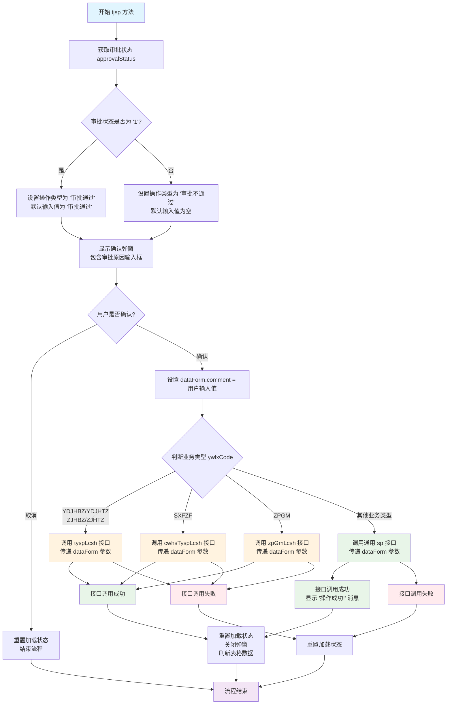

```mermaid
 graph TD
    A[开始 tjsp 方法] --> B[获取审批状态 approvalStatus]
    B --> C{审批状态是否为 '1'?}
    
    C -->|是| D[设置操作类型为 '审批通过'<br/>默认输入值为 '审批通过']
    C -->|否| E[设置操作类型为 '审批不通过'<br/>默认输入值为空]
    
    D --> F[显示确认弹窗<br/>包含审批原因输入框]
    E --> F
    
    F --> G{用户是否确认?}
    G -->|取消| H[重置加载状态<br/>结束流程]
    
    G -->|确认| I[设置 dataForm.comment = 用户输入值]
    I --> J{判断业务类型 ywlxCode}
    
    J -->|YDJHBZ/YDJHTZ<br/>ZJHBZ/ZJHTZ| K[调用 tyspLcsh 接口<br/>传递 dataForm 参数]
    J -->|SXFZF| L[调用 cwhsTyspLcsh 接口<br/>传递 dataForm 参数]
    J -->|ZPGM| M[调用 zpGmLcsh 接口<br/>传递 dataForm 参数]
    J -->|其他业务类型| N[调用通用 sp 接口<br/>传递 dataForm 参数]
    
    K --> O[接口调用成功]
    L --> O
    M --> O
    N --> P[接口调用成功<br/>显示 '操作成功!' 消息]
    
    O --> Q[重置加载状态<br/>关闭弹窗<br/>刷新表格数据]
    P --> Q
    
    K --> R[接口调用失败]
    L --> R
    M --> R
    N --> S[接口调用失败]
    
    R --> T[重置加载状态]
    S --> T
    
    Q --> U[流程结束]
    T --> U
    H --> U
    
    style A fill:#e1f5fe
    style U fill:#f3e5f5
    style K fill:#fff3e0
    style L fill:#fff3e0
    style M fill:#fff3e0
    style N fill:#e8f5e8
    style O fill:#e8f5e8
    style P fill:#e8f5e8
    style R fill:#ffebee
    style S fill:#ffebee
```