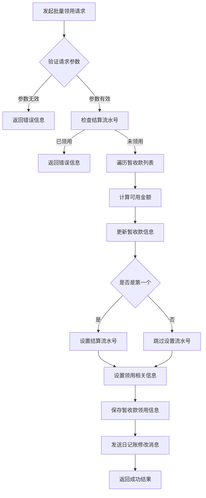
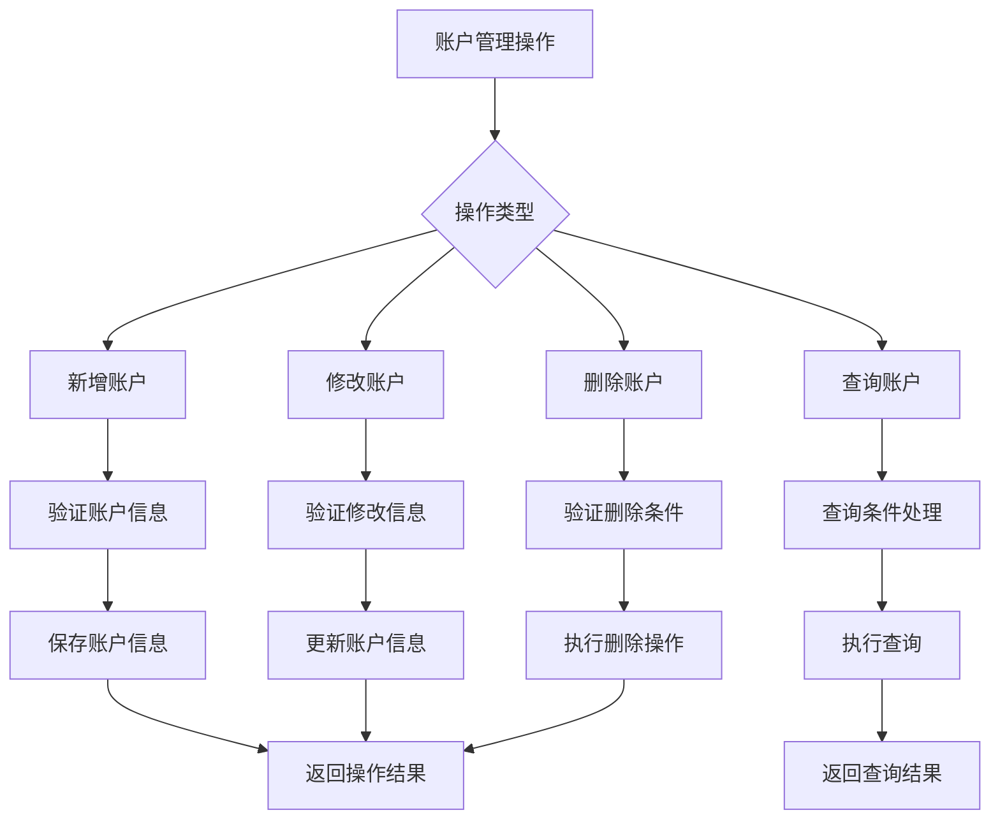

# Hystrix分析

## 1. Hystrix在项目中的使用方式

项目中主要通过两种方式使用Hystrix实现服务熔断和降级：

### 方式一：FallbackFactory

以YwglFeignClient为例，通过实现FallbackFactory接口来处理熔断情况：

```java
@FeignClient(name = "capinfo-gjj-busi-zjjs-ywgl-basic-svc", path = "/api/v1/ywgl",
        fallbackFactory = YwglFallbackFactory.class)
public interface YwglFeignClient {
    // 接口方法定义
}
```

```java
@Slf4j
@Component
public class YwglFallbackFactory implements FallbackFactory<YwglFeignClient> {
    @Override
    public YwglFeignClient create(Throwable cause) {
        return new YwglFeignClient() {
            @Override
            public R<YwlxSfgxCxRespDTO> getYwlxSfgx(YwlxSfgxReqDTO ywlxSfgxReqDTO) {
                log.info("fallbackFactory 收付款类型数据查询 getYwlxSfgx");
                return R.fail("fallbackFactory 收付款类型数据查询 getYwlxSfgx");
            }
            // 其他方法的降级实现
        };
    }
}
```

### 方式二：直接Fallback类

```java
@FeignClient(name = "capinfo-gjj-busi-zjjs-ywgl-basic-svc", path = "/api/v1/ywgl",
        fallback = YwglFeignClientFallback.class)
public interface YwglFeignClient {
    // 接口方法定义
}
```

```java
@Slf4j
@Component
public class YwglFeignClientFallback implements YwglFeignClient {
    @Override
    public R<YwlxSfgxCxRespDTO> getYwlxSfgx(YwlxSfgxReqDTO ywlxSfgxReqDTO) {
        log.info("fallback 收付款类型数据查询 getYwlxSfgx");
        return R.fail("fallback 收付款类型数据查询 getYwlxSfgx");
    }
    // 其他方法的降级实现
}
```

## 2. Hystrix的作用

1. **服务熔断**：当依赖的服务出现故障或响应超时时，自动切断调用，防止故障传播
2. **服务降级**：在服务不可用时提供备用方案，保证系统核心功能可用
3. **资源隔离**：为不同的服务调用分配独立的线程池，避免故障扩散
4. **监控告警**：提供实时的服务调用监控和统计信息

## 3. 解决的问题

1. **雪崩效应**：当某个服务出现故障时，防止故障在整个系统中传播，避免整个系统瘫痪
2. **服务雪崩**：通过熔断机制，当服务调用失败率达到阈值时，自动熔断，一段时间后尝试恢复
3. **提高系统可用性**：通过降级机制，在部分服务不可用时仍能提供核心功能
4. **性能优化**：通过资源隔离和限流，防止某个服务的大量请求影响其他服务

## 4. 实际应用场景

在项目中，Hystrix主要用于：

1. **微服务间调用**：各个业务模块通过Feign进行服务间调用时，添加熔断降级保护
2. **外部系统依赖**：对接银行、第三方支付等外部系统时，防止外部系统故障影响自身系统

## 5. 面试重点

在面试中，可以重点强调：

1. **FallbackFactory vs Fallback类**：FallbackFactory能够获取到异常信息，更便于问题排查
2. **实际降级策略**：项目中返回统一的失败响应，记录日志，便于问题追踪
3. **配置方式**：通过@FeignClient注解配置熔断降级策略
4. **监控和告警**：结合Hystrix Dashboard进行实时监控

# 账户管理模块功能详解

### 1. 模块概述

账户管理模块（zhgl）是资金结算系统的核心模块之一，主要负责银行账户管理、暂收款/暂付款管理、支票管理等功能。该模块通过银行接口与外部银行系统交互，实现资金账户的统一管理。

### 2. 核心功能模块

#### 2.1 银行账户管理   

银行账户管理是整个模块的基础，提供了银行账户的增删改查功能：

1. **账户信息管理**

   - 新增银行账户信息
   - 修改银行账户信息
   - 查询银行账户信息（单个、列表、分页）
   - 删除银行账户信息
2. **账户余额管理**

   - 查询账户实时余额
   - 定期存款余额管理
   - 协定存款余额管理
   - 账户余额备份管理
3. **虚拟账户管理**

   - 虚拟账户开户
   - 虚拟账户修改
   - 虚拟账户领用
   - 虚拟账户取消领用

#### 2.2 暂收款/暂付款管理

暂收款和暂付款管理是账户管理模块的核心功能，主要用于处理暂时性的资金流入和流出：

1. **暂收款管理**

   ```java
   // 暂收款实体类关键字段
   public class Zsk extends BaseEntity {
       private Long zhxxId;        // 账户id
       private BigDecimal je;      // 金额
       private String dszh;        // 对手账号
       private String dshm;        // 对手户名
       private String jyrq;        // 交易日期
       private String lyzt;        // 领用状态
       private String tkzt;        // 退款状态
       private String rzzt;        // 入账状态
       private String cxzt;        // 冲销状态
       private String xtlx;        // 系统类型
       private String ywlx;        // 业务类型
       private String fpjbjgbh;    // 分配机构编号
       private String lyjbjgbh;    // 领用机构编号
       private String jslsh;       // 结算流水号
       private String clzt;        // 处理状态
   }
   ```
2. **暂付款管理**

   - 暂付款添加
   - 暂付款维护
   - 暂付款查询
3. **暂收款批量领用**
   暂收款批量领用功能允许用户一次性领用多个暂收款，主要实现逻辑如下：

   ```java
   @Override
   @Transactional(rollbackFor = Exception.class)
   public R<Boolean> zskGdPlRl(ZskDkPlLyReqDTO reqDTO) {
       if (reqDTO.getZskIds() == null || reqDTO.getZskIds().length == 0) {
           throw new BizException(ResultErrorCodeEnum.FAIL.getCode(), "资金流水id不能为空");
       }
       BigDecimal syYwfse = reqDTO.getYwfse();
       //判断结算流水号是否已经领用过暂收款
       if (zskDmService.countZskByJslsh(reqDTO.getJslsh()) > 0) {
           throw new BizException(ResultErrorCodeEnum.ZCK_JSLSH_YLZSK.getCode(), "结算流水号" + reqDTO.getJslsh() + "已领用过暂收款");
       }
       int i = 0;
       do{
           ZskDO zsk = zskDmService.getById(reqDTO.getZskIds()[i]);
           BigDecimal zskKyje = zsk.getJe().subtract(zsk.getLjfpje());
           syYwfse = syYwfse.subtract(zskKyje);
           Zsk edit = new Zsk();
           edit.setId(zsk.getId());
           if(syYwfse.compareTo(BigDecimal.ZERO) < 0){
               edit.setLjfpje(zsk.getLjfpje().add(syYwfse));
               edit.setFpje(syYwfse);
           }else{
               edit.setLjfpje(zsk.getLjfpje().add(zskKyje));
               edit.setFpje(zskKyje);
           }
           if(i == 0){
               //修改zsk结算流水号
               edit.setJslsh(reqDTO.getJslsh());
           }
           edit.setLyywlsh(reqDTO.getLyywlsh());
           edit.setLydwzh(reqDTO.getDkzh());
           edit.setLyjbjgbh(reqDTO.getLyjbjgbh());
           edit.setLyjbjgmc(reqDTO.getLyjbjgmc());
           edit.setXtlx(XtlxEnum.XTLX_GDGL.getValue());
           edit.setYwlx(reqDTO.getYwlx());
           zskDmService.zskLy(edit);
           i++;
       }while (syYwfse.compareTo(BigDecimal.ZERO) > 0 && i < reqDTO.getZskIds().length);
       //发送修改日记账消息
       YhckrjzEditReqDTO editReqDTO = new YhckrjzEditReqDTO();
       editReqDTO.setId(reqDTO.getZskIds()[0]);
       editReqDTO.setJslsh(reqDTO.getJslsh());
       R<Boolean> rjzUpdatR = cwhsFeignClient.editYhckrjz(editReqDTO);
       if (rjzUpdatR.getIsError()) {
           throw new BizException(ResultErrorCodeEnum.FAIL.getCode(), "日记账修改失败");
       }
       return R.success(true);
   }
   ```
4. **暂收款其他功能**

   - 暂收款退款
   - 暂收款占用与取消占用
   - 暂收款自动匹配
   - 暂收款人工分配
   - 暂收款台账查询

#### 2.3 支票管理

支票管理模块包括支票购买、领用、使用、核销等全生命周期管理：

1. **支票购买管理**

   - 支票购买申请
   - 支票购买审核
   - 支票购买登记
2. **支票领用管理**

   - 支票领用
   - 支票批量领用
   - 支票退回
3. **支票使用管理**

   - 支票使用
   - 支票使用修改
   - 支票核销
   - 支票作废

#### 2.4 定期存款管理

定期存款管理功能主要处理银行定期存款业务：

1. **定期存款明细管理**

   - 定期存款明细查询
   - 通知存款支取通知查询
2. **协定存款管理**

   - 协定存款余额查询
   - 协定存款余额变更

### 3. 核心业务流程

#### 3.1 暂收款批量领用流程

暂收款批量领用是账户管理模块的重要功能，其业务流程如下：



#### 3.2 银行账户管理流程

银行账户管理流程包括账户的创建、修改、查询等操作：



### 4. 技术特点

1. **分布式架构**

   - 使用Feign进行服务间调用
   - 通过Hystrix实现熔断降级
   - 使用分布式ID生成器
2. **事务管理**

   - 使用@Transactional注解保证数据一致性
   - 对关键操作进行事务控制
3. **异常处理**

   - 自定义BizException处理业务异常
   - 统一的异常处理机制
4. **日志记录**

   - 使用@Slf4j进行日志记录
   - 关键操作记录详细日志

### 5. 与其他模块的交互

1. **与财务核算模块交互**

   - 通过Feign调用财务核算服务
   - 提供银行账户余额信息
   - 处理财务记账相关操作
2. **与业务管理模块交互**

   - 获取业务相关信息
   - 处理业务资金结算
3. **与参数管理模块交互**

   - 获取系统参数配置
   - 处理业务规则配置

### 6. 总结

账户管理模块是资金结算系统的核心模块，主要负责银行账户、暂收款/暂付款、支票等资金相关业务的管理。该模块通过完善的业务流程设计和严格的数据校验机制，确保资金业务的安全性和准确性。其中暂收款批量领用功能通过批量处理多个暂收款，大大提高了业务处理效率，是该模块的重要特色功能。
