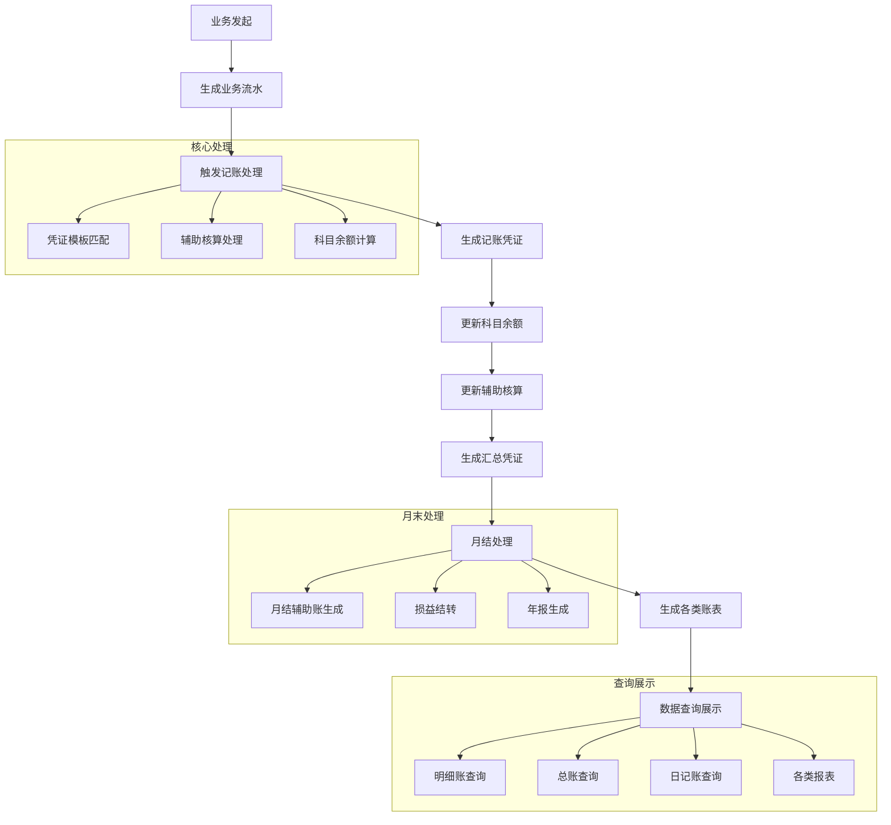

## jzgl(记账管理)模块功能分析

### 1. 核心业务功能

#### 1.1 财务核算核心功能

从[CwhsController](file://D:\workspace\capinfo-gjj-busi-jshs\capinfo-gjj-busi-cwhs-jzgl\capinfo-gjj-busi-cwhs-jzgl-basic-svc-busi\src\main\java\cn\capinfo\gjj\busi\cwhs\jzgl\busi\controller\CwhsController.java#L42-L3401)可以看出，这是财务核算的核心控制器，主要提供以下功能：

1. **账套管理**

   - 账套设置查询和管理
   - 通过ID获取账套设置数据
   - 账套参数管理
2. **记账凭证管理**

   - 凭证模板管理
   - 记账凭证查询、增加、修改
   - 汇总记账凭证管理
3. **业务流水管理**

   - 业务流水表(Ywlsb)管理
   - 业务流水总表(Ywlszb)管理
   - 业务流水的增删改查
4. **科目管理**

   - 科目信息管理
   - 科目参数设置
   - 科目余额查询
5. **辅助核算管理**

   - 辅助项分类(Fzxfl)管理
   - 辅助项设置(Fzxsz)管理
   - 凭证辅助明细(PzFzmx)管理
6. **月结管理**

   - 月结处理
   - 月结辅助账管理
   - 月结辅助明细管理
7. **账表管理**

   - 各类财务账表管理
   - 日记账管理
   - 明细账管理

### 1.2 核心实体类分析

#### 业务流水相关实体

- [Ywlsb](file://D:\workspace\capinfo-gjj-busi-jshs\capinfo-gjj-busi-cwhs-jzgl\capinfo-gjj-busi-cwhs-jzgl-basic-svc-busi\src\main\java\cn\capinfo\gjj\busi\cwhs\jzgl\busi\domain\entity\Ywlsb.java#L13-L205)(业务流水表) - 记录具体的业务流水信息
- [Ywlszb](file://D:\workspace\capinfo-gjj-busi-jshs\capinfo-gjj-busi-cwhs-jzgl\capinfo-gjj-busi-cwhs-jzgl-basic-svc-busi\src\main\java\cn\capinfo\gjj\busi\cwhs\jzgl\busi\domain\entity\Ywlszb.java#L16-L211)(业务流水总表) - 业务流水的汇总信息

关键字段包括：

- 业务受理编号(ywslbh)
- 结算流水号(jslsh)
- 业务流水号(ywlsh)
- 银行代码(yhdm)
- 专户账号(yhzhhm)
- 金额相关(zje增加额, jse减少额)
- 摘要(zhaiyao)
- 记账日期(jzrq)

#### 凭证相关实体

- [Pz](file://D:\workspace\capinfo-gjj-busi-jshs\capinfo-gjj-busi-cwhs-jzgl\capinfo-gjj-busi-cwhs-jzgl-basic-svc-busi\src\main\java\cn\capinfo\gjj\busi\cwhs\jzgl\busi\domain\entity\Pz.java#L15-L212)(凭证) - 凭证主表
- [Jzpz](file://D:\workspace\capinfo-gjj-busi-jshs\capinfo-gjj-busi-cwhs-jzgl\capinfo-gjj-busi-cwhs-jzgl-basic-svc-busi\src\main\java\cn\capinfo\gjj\busi\cwhs\jzgl\busi\domain\entity\Jzpz.java#L16-L87)(记账凭证) - 记账凭证分录
- [Hzjzpz](file://D:\workspace\capinfo-gjj-busi-jshs\capinfo-gjj-busi-cwhs-jzgl\capinfo-gjj-busi-cwhs-jzgl-basic-svc-busi\src\main\java\cn\capinfo\gjj\busi\cwhs\jzgl\busi\domain\entity\Hzjzpz.java#L16-L87)(汇总记账凭证) - 汇总记账凭证分录
- [Pzmb](file://D:\workspace\capinfo-gjj-busi-jshs\capinfo-gjj-busi-cwhs-jzgl\capinfo-gjj-busi-cwhs-jzgl-basic-svc-busi\src\main\java\cn\capinfo\gjj\busi\cwhs\jzgl\busi\domain\entity\Pzmb.java#L12-L80)(凭证模板) - 凭证模板
- [PzFzmx](file://D:\workspace\capinfo-gjj-busi-jshs\capinfo-gjj-busi-cwhs-jzgl\capinfo-gjj-busi-cwhs-jzgl-basic-svc-busi\src\main\java\cn\capinfo\gjj\busi\cwhs\jzgl\busi\domain\entity\PzFzmx.java#L16-L152)(凭证辅助明细) - 凭证的辅助核算明细

#### 科目相关实体

- [Km](file://D:\workspace\capinfo-gjj-busi-jshs\capinfo-gjj-busi-cwhs-jzgl\capinfo-gjj-busi-cwhs-jzgl-basic-svc-busi\src\main\java\cn\capinfo\gjj\busi\cwhs\jzgl\busi\domain\entity\Km.java#L13-L113)(科目) - 会计科目
- [Kmxx](file://D:\workspace\capinfo-gjj-busi-jshs\capinfo-gjj-busi-cwhs-jzgl\capinfo-gjj-busi-cwhs-jzgl-basic-svc-busi\src\main\java\cn\capinfo\gjj\busi\cwhs\jzgl\busi\domain\entity\Kmxx.java#L17-L107)(科目信息) - 科目详细信息
- [KmCsh](file://D:\workspace\capinfo-gjj-busi-jshs\capinfo-gjj-busi-cwhs-jzgl\capinfo-gjj-busi-cwhs-jzgl-basic-svc-busi\src\main\java\cn\capinfo\gjj\busi\cwhs\jzgl\busi\domain\entity\KmCsh.java#L13-L114)(科目参数) - 科目参数设置

#### 辅助核算相关实体

- [Fzxfl](file://D:\workspace\capinfo-gjj-busi-jshs\capinfo-gjj-busi-cwhs-jzgl\capinfo-gjj-busi-cwhs-jzgl-basic-svc-busi\src\main\java\cn\capinfo\gjj\busi\cwhs\jzgl\busi\domain\entity\Fzxfl.java#L12-L65)(辅助项分类) - 辅助核算分类
- [Fzxsz](file://D:\workspace\capinfo-gjj-busi-jshs\capinfo-gjj-busi-cwhs-jzgl\capinfo-gjj-busi-cwhs-jzgl-basic-svc-busi\src\main\java\cn\capinfo\gjj\busi\cwhs\jzgl\busi\domain\entity\Fzxsz.java#L12-L100)(辅助项设置) - 辅助核算设置
- [Fzxkm](file://D:\workspace\capinfo-gjj-busi-jshs\capinfo-gjj-busi-cwhs-jzgl\capinfo-gjj-busi-cwhs-jzgl-basic-svc-busi\src\main\java\cn\capinfo\gjj\busi\cwhs\jzgl\busi\domain\entity\Fzxkm.java#L12-L70)(辅助项科目) - 辅助核算科目
- [YjFzmx](file://D:\workspace\capinfo-gjj-busi-jshs\capinfo-gjj-busi-cwhs-jzgl\capinfo-gjj-busi-cwhs-jzgl-basic-svc-busi\src\main\java\cn\capinfo\gjj\busi\cwhs\jzgl\busi\domain\entity\YjFzmx.java#L13-L131)(月结辅助明细) - 月结时的辅助核算明细
- [YjFzz](file://D:\workspace\capinfo-gjj-busi-jshs\capinfo-gjj-busi-cwhs-jzgl\capinfo-gjj-busi-cwhs-jzgl-basic-svc-busi\src\main\java\cn\capinfo\gjj\busi\cwhs\jzgl\busi\domain\entity\YjFzz.java#L13-L89)(月结辅助账) - 月结辅助账

#### 账表相关实体

- [Zb](file://D:\workspace\capinfo-gjj-busi-jshs\capinfo-gjj-busi-cwhs-jzgl\capinfo-gjj-busi-cwhs-jzgl-basic-svc-busi\src\main\java\cn\capinfo\gjj\busi\cwhs\jzgl\busi\domain\entity\Zb.java#L14-L97)(账表) - 各类财务账表
- [Rj](file://D:\workspace\capinfo-gjj-busi-jshs\capinfo-gjj-busi-cwhs-jzgl\capinfo-gjj-busi-cwhs-jzgl-basic-svc-busi\src\main\java\cn\capinfo\gjj\busi\cwhs\jzgl\busi\domain\entity\Rj.java#L12-L60)(日记账) - 银行存款日记账
- [Yj](file://D:\workspace\capinfo-gjj-busi-jshs\capinfo-gjj-busi-cwhs-jzgl\capinfo-gjj-busi-cwhs-jzgl-basic-svc-busi\src\main\java\cn\capinfo\gjj\busi\cwhs\jzgl\busi\domain\entity\Yj.java#L13-L96)(明细账) - 各科目明细账
- [Mxz](file://D:\workspace\capinfo-gjj-busi-jshs\capinfo-gjj-busi-cwhs-jzgl\capinfo-gjj-busi-cwhs-jzgl-basic-svc-busi\src\main\java\cn\capinfo\gjj\busi\cwhs\jzgl\busi\domain\entity\Mxz.java#L13-L91)(明细账) - 明细账明细

### 1.3 服务层功能分析

#### 核心服务接口

1. **YwlsbDmService** - 业务流水表服务

   - 业务流水的增删改查
   - 业务流水分页查询
   - 批量处理业务流水
2. **JzpzDmService** - 记账凭证服务

   - 记账凭证的增删改查
   - 凭证分录查询
   - 各类财务金额计算(利息支出、放款、还款等)
3. **PzDmService** - 凭证服务

   - 凭证的完整生命周期管理
   - 凭证模板管理
   - 凭证辅助核算管理
4. **KmDmService** - 科目服务

   - 科目信息管理
   - 科目余额查询
   - 科目树形结构管理
5. **FzxflDmService** - 辅助项分类服务

   - 辅助核算分类管理
   - 分类下拉选择查询
6. **ZtcsDmService** - 账套参数服务

   - 账套参数管理
   - 年度账套参数生成

### 1.4 消息处理功能

通过[CwhsSub](file://D:\workspace\capinfo-gjj-busi-jshs\capinfo-gjj-busi-cwhs-jzgl\capinfo-gjj-busi-cwhs-jzgl-basic-svc-busi\src\main\java\cn\capinfo\gjj\busi\cwhs\jzgl\busi\service\subscribe\CwhsSub.java#L34-L114)类可以看出系统具有消息监听功能：

1. **Kafka消息监听**

   - 业务流水记录消息处理
   - 银行存款日记账消息处理
   - 资金对账单新增处理
2. **事件处理**

   - 业务流水事件处理
   - 银行存款日记账新增、修改事件
   - 对账单新增处理事件

### 1.5 完整业务流程

基于代码分析，jzgl模块的完整业务流程如下：

### 1.6 特色功能

1. **多维度辅助核算**

   - 支持部门、项目、往来单位等多维度辅助核算
   - 灵活的辅助项分类管理
2. **自动化记账**

   - 基于业务事件自动生成会计凭证
   - 支持模板化凭证处理
3. **实时余额管理**

   - 科目余额实时更新
   - 辅助核算余额管理
4. **完整月末处理**

   - 自动月结处理
   - 损益结转
   - 年度结转
5. **丰富查询功能**

   - 多维度账表查询
   - 明细账、总账、日记账等各类账表
   - 灵活的查询条件支持

这个记账管理模块构成了整个财务核算系统的核心，负责处理所有与会计记账相关的业务，从凭证生成到月末结账，提供了完整的财务核算功能。
