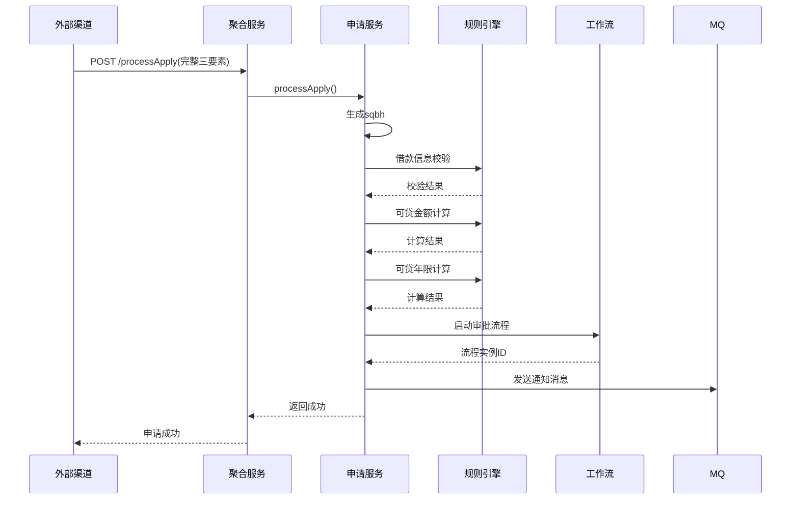
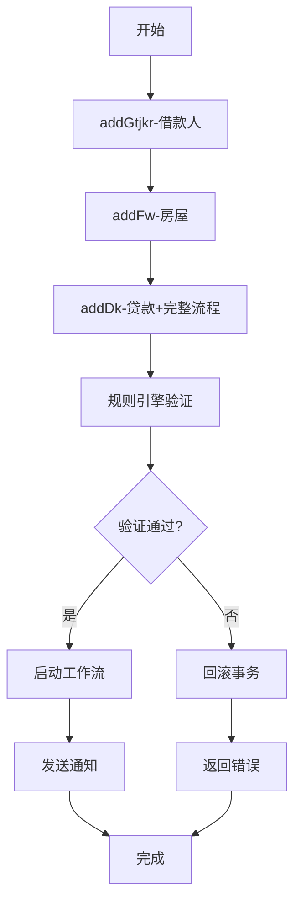

# 贷款申请模块特色设计文档

## 1. 模块概述

贷款申请模块（sq）是住房贷款业务系统的核心入口，负责处理个人住房贷款的完整申请流程。该模块采用先进的架构设计理念，实现了高可用、高扩展、高一致性的业务处理能力。

**核心定位**：

- 作为整个贷款生命周期的起点
- 承载三要素（借款人、房屋、贷款）的完整业务闭环
- 提供多渠道统一接入能力

## 2. 架构设计特色

### 2.1 微服务聚合架构

#### 双层服务架构

```
┌─────────────────┐    ┌──────────────────┐
│   外部聚合层     │    │   内部业务层      │
│ (agg-gm模块)    │◄──►│  (sq-busi模块)   │
└─────────────────┘    └──────────────────┘
        ▲                        ▲
        │                        │
┌───────┴───────┐      ┌─────────┴─────────┐
│ 外部渠道系统   │      │ 归集系统等微服务   │
│ (APP/网厅等)  │      │ (Feign客户端调用)  │
└───────────────┘      └───────────────────┘
```

**架构优势**：

- **统一入口**：外部系统通过`/api/v1/sq/agg/`路径访问，内部通过`/api/v1/sq/`处理
- **职责分离**：聚合层负责协议转换和数据组装，业务层专注核心逻辑
- **灵活扩展**：新增渠道只需在聚合层适配，不影响核心业务

### 2.2 领域驱动设计（DDD）

#### 聚合根模式

- **核心聚合根**：`sq_dk`表作为整个申请的聚合根
- **全局唯一标识**：申请编号（sqbh）作为业务主键贯穿全生命周期
- **事务边界**：三要素作为一个完整业务单元进行事务管理

#### 三要素业务模型

```java
// 完整的业务闭环
借款人信息(addGtjkr) → 房屋信息(addFw) → 贷款信息(addDk)
```

**设计价值**：

- 确保业务数据的完整性和一致性
- 支持复杂的业务规则验证
- 便于后续的变更管理和状态追踪

## 3. 核心技术创新

### 3.1 规则引擎集成

#### 外部规则决策平台接入模型

- **服务定位**：规则引擎为独立微服务（`gzjc.gzzx.engine`），申请模块通过Feign远程调用
- **统一入口**：对内对外均通过`/api/v1/sq/executeRule`触发通用规则调用
- **参数透传**：调用时统一透传`ywrq`（业务日期）、`zxbh`（中心编号）、`params`（业务DTO转Map）
- **双模式并存**：既支持`ruleBm`通用编码调用，也兼容历史`ruleId + ruleVersion`调用

#### 关键应用场景

| 规则编码                    | 应用场景    | 触发环节            | 结果判定重点                      |
| ----------------------- | ------- | --------------- | --------------------------- |
| DKSQGL\_SQZLLR\_JKRZGJY | 借款人资格校验 | 前端分步录入进入下一步前    | `code=0`通过，失败提示`msg`        |
| DKSQGL\_SQZLLR\_FWXXJY  | 房屋信息校验  | addDk流程中的房屋要素校验 | `code!=0`按规则消息拦截            |
| DKSQGL\_SQZLLR\_DKXXJY  | 借款信息校验  | addDk流程规则校验第一步  | `code=0`通过                  |
| DKSQGL\_SQZLLR\_KDJE    | 可贷金额计算  | addDk流程规则校验第二步  | 返回`final_limit/kdje`并校验申请额度 |
| DKSQGL\_SQZLLR\_KDNX    | 可贷年限计算  | addDk流程规则校验第三步  | 返回`max_loan_years`并校验申请年限   |

#### 执行链路与开关控制

1. **入口调用**：业务模块构建`RuleEngineReqDTO`（核心字段`sqbh`、`ruleBm`）
2. **开关检查**：先读取系统参数`GDGL/DKSL/QYGZJY`，关闭时直接返回`ruleResult=false`并跳过校验
3. **远程执行**：调用规则平台后，将`List<RuleExecRespDTO>`转换为Map结构，统一补充`ruleResult=true`
4. **业务判定**：按具体规则解释`code/msg`与结果字段，不同规则的成功码语义可不同

**技术优势**：

- **规则外置**：业务逻辑与决策逻辑分离，降低核心代码复杂度
- **弹性治理**：支持参数化开关与灰度启停，便于生产快速处置
- **统一编排**：贷款申请在同一事务流程中按“借款信息→金额→年限”串行校验
- **兼容演进**：新老规则接入方式并存，便于平滑迁移历史规则资产

### 3.2 多渠道上下文管理

#### 双模式身份透传架构

由于贷款申请模块需要同时支撑“内部柜面员工办理”和“外部渠道（如网厅、APP）自主申请”，系统设计了双模式的上下文管理机制，以兼容不同的请求来源。

| 模式       | 上下文持有者                       | 数据来源与机制                                                                                                                  | 典型适用场景                        |
| -------- | ---------------------------- | ------------------------------------------------------------------------------------------------------------------------ | ----------------------------- |
| **外部渠道** | `ChannelContextHolder`       | 基于 `ThreadLocal<ChannelOrgInfo>`，在渠道综合申请服务中（如 `ChannelSqServiceImpl`），根据借款人公积金账户信息动态推导并设置机构与操作员信息，请求结束时通过 `finally` 块清理。 | 互联网渠道（APP、网厅、政务服务网等）用户自主申请贷款。 |
| **内部员工** | `AuthTools.getCurrentUser()` | 基于微服务认证体系，从请求 Header 中的 Token 解析出登录员工实体（`InnerUser`），包含明确的员工、机构和网点信息。                                                    | 柜面人员通过管理系统代客录入贷款资料。           |

#### 渠道上下文动态推导机制

在外部渠道申请（`ChannelSqServiceImpl.processApply`）场景下，由于没有真实的柜员登录，系统采用动态推导机制填充上下文：

1. **获取信息**：调用 `listGrzh` 查询借款人个人账户。
2. **提取机构**：从账户信息（`GrzhRespDTO`）中提取归属的管理机构编号/名称（`gljgbh`/`gljgmc`）。
3. **设置上下文**：构建 `ChannelOrgInfo` 对象，将其设为“经办机构”与“操作员机构”，并将操作员姓名设为借款人本人，最后存入 `ChannelContextHolder`。
4. **资源释放**：在 `try-finally` 块中严格执行 `ChannelContextHolder.clear()`，防止线程池复用导致的内存泄漏和上下文污染。

#### 统一处理与审计原则

- **底层无感**：无论上下文来自 `ChannelContextHolder` 还是 `AuthTools`，底层实体持久化和业务校验逻辑保持一致，无需针对渠道编写两套数据处理代码。
- **审计追溯**：这两种上下文管理机制确保了每笔贷款申请都有明确的“经办机构”、“操作员”和“操作时间”，满足金融业务严苛的审计和溯源要求。

### 3.3 高级事务控制

在贷款申请这样涉及多表（借款人、房屋、贷款、共有权人、担保）且链路长（调用规则引擎、生成合同、启动工作流、发送MQ）的场景中，系统采用了精细化的事务控制策略，以保证数据的一致性和部分失败时的优雅恢复。

#### AOP 代理与内部方法调用

在 Spring 框架中，同一个类内部的普通方法调用会导致 `@Transactional` 注解失效（因为绕过了 AOP 代理）。为了解决这个问题，代码中广泛使用了 `AopContext.currentProxy()` 来获取当前代理对象，从而确保内部子方法的事务属性生效。

```java
// SqServiceImpl.java 示例
@Override
public R<SqDkAddResDTO> addDk(SqDkReqDTO sqDkReqDTO) {
    // 主方法不加事务，使用代理对象调用子方法，保证子方法事务生效
    SqServiceImpl currentProxy = (SqServiceImpl) AopContext.currentProxy();
    
    // 1. 保存贷款信息（该子方法上有 @Transactional）
    R<SqDkAddResDTO> sqDkAddRtn = currentProxy.addSqDk(sqDkReqDTO);
    
    // 2. 发送 MQ 消息（该子方法也有独立事务）
    currentProxy.sendGrsxMsg(sendGrsxMsgReqDTO);
    return sqDkAddRtn;
}
```

#### 隔离的独立事务（REQUIRES\_NEW）

为了避免在主流程中某个非致命验证（或特定落库行为）失败导致整个大事务回滚，系统将部分落库行为提取到独立的类（如 `SqTransactionServiceImpl`）中，并使用 `Propagation.REQUIRES_NEW` 创建新事务。

```java
// SqTransactionServiceImpl.java 示例
/**
 * 在独立事务中保存sqDk数据
 */
@Transactional(propagation = Propagation.REQUIRES_NEW)
public void saveSqDkData(SqDkReqDTO sqDkReqDTO) {
    // 业务验证与保存...
    boolean result = sqDkDmService.bcSqDk(...);
}
```

**设计目的**：在“先保存数据，再调规则引擎”的流程中，如果规则引擎校验抛出异常，外层事务会捕获该异常（或触发回滚），但由于保存数据是在 `REQUIRES_NEW` 事务中提前提交的，这部分数据得以持久化（或便于后续排查），也可以通过专门的清理方法（如 `deleteSavedData`）进行定点清理。

#### 异常捕获与分布式补偿

在跨服务调用（如调用外部担保系统 `HtDbInfoFeignClient`、启动工作流 `createProcess`）时：

- 将这些操作放在事务的最后一步执行，降低分布式事务失败的风险。
- 对于发短信、发 MQ 消息（如 `sendGrsxMsg`），使用独立的 `@Transactional(rollbackFor = Exception.class)` 和 `try-catch` 包裹，防止边缘消息发送失败阻断主流程的成功返回。

## 4. 中间件应用

### 4.1 消息队列异步通知

申请模块（`sq`）中的消息队列并非只用于“通知”，而是承担了**状态回写、跨模块编排、审批结果同步、用户触达**等关键职责。整体实现基于 Kafka + 统一消息封装（`MessageProducer / MessageDispatcher / MessageHandler`）。

#### 4.1.1 Topic 与职责划分

| Topic 常量                    | 业务职责                   | 处理方式                    |
| --------------------------- | ---------------------- | ----------------------- |
| `CAPINFO_GJJ_GRDK_SQ_TOPIC` | 申请模块统一业务Topic（多事件类型复用） | 统一入口监听后按 `eventType` 路由 |
| `GRDK_SQ_FKDKZTGX_TOPIC`    | 放款结果回写贷款状态             | 统一Topic事件类型之一           |
| `GRDK_SQ_DKSQ_TOPIC`        | 贷款申请审批完成回写             | 统一Topic事件类型之一           |
| `KHFW_GRSX_TOPIC`           | 贷款申请发起后个人事项通知          | 由 sq 模块发送给个人事项侧         |
| `KHFW_GRSX_GX_TOPIC`        | 贷款审批结果个人事项更新通知         | 由 sq 模块发送给个人事项侧         |
| `GRDK_SQ_DKFFSQ_TOPIC`      | 放款批次审批完成回写             | 独立Topic监听               |
| `GRDK_ZXBG_TOPIC`           | 征信报告审批完成回写             | 独立Topic监听               |

#### 4.1.2 生产端（sq 发消息）做了什么

1. **贷款申请发起后推送个人事项**
   - 触发点：`SqServiceImpl.sendGrsxMsg`
   - 消息内容：`GrsxEvtDTO`（含受理编号、申请时间、个人账户、业务类型、流程实例等）
   - 事件封装：`GrsxEvent`（`topic=CAPINFO_GJJ_GRDK_SQ_TOPIC`，`eventType=KHFW_GRSX_TOPIC`）
   - 业务价值：将“贷款申请已发起”异步通知到个人事项系统，不阻塞主提交流程。
2. **贷款审批结果后推送个人事项更新**
   - 触发点：`SqServiceImpl.sendSqDkSpjgMsg`
   - 消息内容：`GrsxGxEvtDTO`（含审批结果、审批意见、审批时间、审批人、通知内容）
   - 事件封装：`GrsxGxEvent`（`topic=CAPINFO_GJJ_GRDK_SQ_TOPIC`，`eventType=KHFW_GRSX_GX_TOPIC`）
   - 业务价值：将审批通过/拒绝状态及时反馈到用户侧消息体系。
3. **审批通过后触发合同模块自动生成合同**
   - 触发点：贷款申请审批消费逻辑中（`SqDksqHandler`）
   - 触发条件：审批通过且担保类型为保证担保（非抵押担保）
   - 事件封装：`HtZdscEvent`（发送到合同模块 Topic：`CAPINFO_GJJ_GRDK_HT_TOPIC`）
   - 业务价值：实现“审批通过 -> 合同生成”跨模块异步编排。

#### 4.1.3 消费端（sq 收消息）做了什么

1. **统一Topic消费入口与事件路由**
   - 监听器：`GrdkSqSub.onMessage`
   - 机制：监听 `CAPINFO_GJJ_GRDK_SQ_TOPIC`，由 `MessageDispatcher` 按 `eventType` 分发到对应 `MessageHandler`
   - 价值：统一消费入口，降低 Topic 膨胀与重复监听成本。
2. **放款结果回写（`FkDkztEditHandler`）**
   - 输入：`FkDkztEditEvtDTO`
   - 处理：按放款成功/失败、是否冲账更新贷款状态（`dkzt/fkzt/spzt/jsxx/预定放款日`）
   - 价值：将放款系统结果可靠回写到申请主数据，保证状态一致。
3. **贷款申请审批结果回写（`SqDksqHandler`）**
   - 输入：`SqDksqEvtDTO`
   - 处理：根据审批状态更新申请审批结果，记录审批人、审批意见、审批时间
   - 扩展动作：审批通过后按担保类型决定是否触发自动签约消息
   - 价值：把工作流审批结果与申请主流程闭环打通。
4. **放款批次审批结果回写（`SqDkffsqSub`** **/** **`SqDkffsqHandler`）**
   - 输入：`SqDksqEvtDTO`（从流程实例业务数据中提取 `dkffpc`）
   - 处理：同时更新放款批次表与贷款表审批状态，保证批次和明细一致
   - 保护：校验流程实例 ID 与批次记录一致性，防止串单更新。
5. **征信报告审批结果回写（`SqZxbgSpwcSub`** **/** **`SqZxbgSpwcHandler`）**
   - 输入：`SqZxbgSpwcEvtDTO`
   - 处理：审批通过走通过分支，审批拒绝走拒绝分支
   - 异常策略：处理异常时执行固定拒绝兜底，不向外抛异常，避免 Kafka 自动重试导致重复副作用。

#### 4.1.4 事务与容错设计要点

- **事务边界**：核心消费处理方法普遍使用 `@Transactional(rollbackFor = Exception.class)`，保证单条消息处理内的数据原子性。
- **主流程解耦**：发送通知类消息通常置于 `try-catch` 中，发送失败不阻断主业务成功返回。
- **幂等防护意识**：放款批次审批消费中通过 `dkffpc + wkid` 校验降低重复/错单更新风险。
- **兼容演进**：当前代码同时保留“直接 `@KafkaListener` 消费类”和“统一Topic+Handler分发”两套实现，体现从点对点监听向统一消息总线治理的演进路径。

#### 4.1.5 定时任务补偿机制（XXL-Job）深度说明

贷款申请链路中存在大量外部依赖（信息交换平台、档案办结服务等），这些依赖在高峰期可能出现超时、瞬时失败、返回延迟或偶发不可用。若把全部可靠性压力都放在主交易链路中，会造成“用户提交等待时间长”“失败重试导致前端重复操作”“主事务耦合过重”等问题。  
为此，申请模块没有采用 Spring `@Scheduled` 做本地固定调度，而是采用 XXL-Job 的 `@XxlJob` 机制，将“补偿执行”作为独立可运维能力接入调度中心，实现可配置频率、可观测、可重跑的任务治理模型。

##### （1）任务一：外联调用失败补偿（`sendWljkJobHandler`）

- **任务目标**：把“未成功完成外联查询”的业务记录进行异步补偿，推动业务数据最终一致。
- **入口定义**：`@XxlJob("sendWljkJobHandler")`。
- **待处理数据来源**：先查询外联结果码为空/空串的记录（非成功状态），形成补偿队列。
- **补偿执行流程**：
  1. 根据外联记录回查借款人信息，补齐调用必要字段。  
  2. 按不同接口编码（如婚姻信息、网签信息）动态组装请求参数。  
  3. 调用统一外联入口 `wljkdy` 触发外部查询。  
  4. 将本次结果写回外联结果表，记录成功/失败与响应信息。  
  5. 单条失败仅记录日志并继续后续记录，避免“整批中断”。
- **解决价值**：
  - 降低外部联系统短暂异常对主流程成功率的冲击；
  - 将同步失败转化为可追踪、可重试的异步恢复；
  - 避免人工逐笔补录，提升日常运维效率。

##### （2）任务二：征信报告档案补偿（`offsetZxbgHandler`）

- **任务目标**：对历史数据中“应办结未办结”的征信报告进行批量修复，补齐档案侧状态。
- **入口定义**：`@XxlJob("offsetZxbgHandler")`。
- **待处理数据来源**：按业务条件筛出待补偿征信记录（例如特定时间段与审批状态组合）。
- **补偿执行流程**：
  1. 批量查询待处理征信报告。  
  2. 逐条调用档案办结通知接口。  
  3. 对异常记录累计失败计数并继续处理，不中断整批任务。  
  4. 任务结束输出成功/失败统计，便于运维复盘。
- **解决价值**：
  - 对历史遗留数据进行“离线修复”，减少人工逐条补办；
  - 建立“业务通过 ≠ 档案已闭环”的兜底修正路径；
  - 将一次性修复能力沉淀为可重复运行的标准任务。

##### （3）设计与治理要点

- **调度与业务解耦**：代码只声明 Job Handler，执行频率、启停、重试策略由调度平台统一治理。
- **补偿优先于阻塞**：主链路优先保证“快速提交”，复杂可靠性由异步补偿承担。
- **可观测性**：任务内记录逐条处理日志与汇总统计，支持问题定位和补偿效果评估。
- **幂等思路**：外联结果更新采用“存在则更新，不存在则新增”策略，降低重复执行风险。
- **批处理容错**：以“单条失败不拖垮整批”为原则，确保任务具有持续推进能力。

##### （4）当前实现中的一个重要注意点

在 `wljkdy` 的实现中，是否将外联结果回填到业务表由 `type` 值控制；其中仅当 `type = "N"` 时，会进入“回填业务表”分支。  
而当前 `sendWljkJobHandler` 补偿任务中设置的是 `type = "0"`（页面调用语义），这意味着现状更偏向“补偿外联记录本身”，不一定触发业务字段回填分支。该行为可能是有意设计，也可能是历史兼容遗留，建议在后续治理中明确该策略，避免运维与业务侧对“补偿范围”理解不一致。

### 4.2 工作流引擎集成

- **自动启动**：申请提交后自动创建审批流程实例
- **状态关联**：业务数据与工作流实例ID双向绑定
- **流程追踪**：支持完整的审批状态管理和历史查询

### 4.3 分布式配置中心

- **参数管理**：通过ParamsUtils获取系统参数
- **动态刷新**：支持运行时参数调整
- **环境隔离**：不同环境使用不同配置

### 4.4 Redis 使用现状（申请模块）

经对 `capinfo-gjj-busi-grdk-sq` 申请模块代码排查，Redis 在当前模块中的业务用途仅发现 1 处，主要用于“征信报告申请次数限制”。

#### 代码位置

- `SqZxbgServiceImpl`：`capinfo-gjj-busi-grdk-sq-busi/src/main/java/.../SqZxbgServiceImpl.java`
- 配置文件：`capinfo-gjj-busi-grdk-sq-app/src/main/resources/application.yml`

#### 使用方式

- **Key 设计**：`ZXBG:LIMIT:{sqrzjhm}:{cxyy}`
- **读取计数**：`opsForValue().get(redisKey)`，校验 24 小时内是否达到 3 次上限
- **增加计数**：`opsForValue().increment(redisKey)`
- **设置过期**：首次计数时 `expire(redisKey, 24, TimeUnit.HOURS)`
- **回退计数**：审批不通过时 `opsForValue().decrement(redisKey)`

#### 结论

- 申请模块中未发现其他 Redis 业务使用点（如通用缓存读写、`@Cacheable/@CacheEvict`、Redisson 分布式锁代码调用）。
- `application.yml` 中虽存在 `spring.data.redis` 与 `redisson` 配置，但在该模块内仅上述征信次数限制逻辑有实际调用。

## 5. 多环境兼容性

### 5.1 数据库多版本支持

通过Maven Profile实现一键切换：

- **MySQL**：`-P dev-mysql`
- **PostgreSQL**：`-P dev-postgre`
- **达梦数据库**：`-P dev-dm`
- **Kingbase**：`-P dev-kingbase`

### 5.2 容器化部署

- **Docker镜像**：标准化构建流程
- **Kubernetes部署**：支持云原生环境
- **配置外置**：环境变量注入敏感配置

## 6. 安全与审计

### 6.1 全链路操作日志

- **@OptLog注解**：自动记录关键操作
- **参数校验**：@Check注解确保输入合法性
- **审计字段**：自动填充操作人、时间、机构信息

### 6.2 统一异常处理

- **BizException**：标准化业务异常处理
- **错误码体系**：统一的错误码和消息格式
- **日志追踪**：完整的异常堆栈和上下文信息

## 7. 性能与可靠性

### 7.1 缓存策略

- **热点数据缓存**：减少数据库压力
- **分布式锁**：防止并发重复提交
- **连接池优化**：数据库连接池参数调优

### 7.2 监控告警

- **健康检查**：集成Spring Boot Actuator
- **指标收集**：关键业务指标监控
- **链路追踪**：分布式调用链路跟踪

## 8. 技术栈亮点总结

| 技术领域      | 具体实现                | 业务价值             |
| --------- | ------------------- | ---------------- |
| **架构设计**  | DDD聚合根 + 微服务聚合      | 高内聚低耦合，易于维护扩展    |
| **规则引擎**  | 外部规则决策平台集成          | 业务规则动态化，快速响应需求变化 |
| **事务管理**  | AOP代理 + 独立事务边界      | 复杂业务场景下的数据一致性保障  |
| **多渠道接入** | 双模式上下文管理            | 统一处理内外部系统，降低维护成本 |
| **异步处理**  | 消息队列 + 工作流          | 提升系统性能，支持复杂业务流程  |
| **多环境支持** | Maven Profile + 容器化 | 快速部署到不同环境，提高交付效率 |

## 9. 典型业务流程

### 9.1 外部渠道申请流程



### 9.2 内部员工分步申请流程



## 10. 最佳实践建议

### 10.1 开发规范

- **接口分层**：严格区分内部API和外部聚合API
- **异常处理**：统一使用BizException处理业务异常
- **事务边界**：谨慎设计事务传播行为，避免过度回滚

### 10.2 运维建议

- **监控重点**：规则引擎调用成功率、工作流启动延迟
- **性能调优**：关注数据库慢查询、缓存命中率
- **安全审计**：定期检查操作日志完整性

***

**文档版本**：v1.0\
**最后更新**：2026-03-23\
**适用项目**：capinfo-gjj-busi-grdk 贷款申请模块
