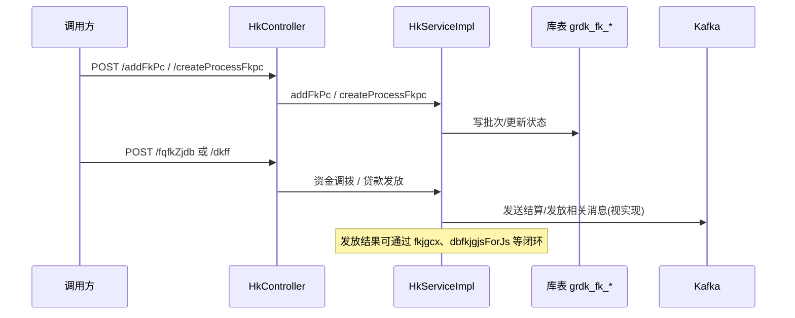
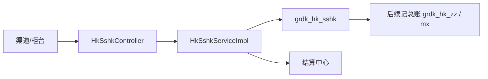

# 贷款还款业务流程

## 1. 文档范围

本文基于 `capinfo-gjj-busi-grdk-hk` 源码，描述贷款还款模块中**可据代码追溯**的主线流程，包括：

- 放款批次与贷款发放（简版）
- 日终处理 `rzcl`
- 扣款数据生成与发送结算
- 实时还款与柜台还款（简版）
- 冲还贷协议与记账消息（消息侧）
- Kafka 消费路由方式

不涉及具体银行接口报文、人行监管报表等**代码外**约定。

---

## 2. 核心业务主线与主键

- **申请维度**：`sqbh`（申请编号）贯穿放款与贷后查询。
- **贷款账户**：`dkzh`（贷款账号）在实时还款、总账、扣款校验中频繁出现。
- **结算流水**：`jslsh` 用于财务记账、冲还贷处理（如 `chdcl/{jslsh}`）。

---

## 3. 状态与记账说明

本模块**未在文档层面**统一罗列一套类似审批流的枚举；还款/放款状态分散在：

- 总账、实时还款表字段（如 `HkZz`、`HkSshk` 相关 DO）
- 与结算中心回写的状态码（需结合 `HkSshkService.getHkSshkJsztdm` 等接口及 Mapper SQL）

若需完整状态机，建议：在库表字段上追溯字典或在 `grdk-core` 枚举中检索 `hk`/`fk` 相关枚举。

---

## 4. 关键数据表（摘自 `@TableName`）

| 表名 | 作用 |
| --- | --- |
| `grdk_fk_pc` | 放款批次 |
| `grdk_fk_pcmx` | 放款批次明细 |
| `grdk_hk_zz` | 还款总账 |
| `grdk_hk_mx` | 还款明细 |
| `grdk_hk_hkjh` | 还款计划 |
| `grdk_hk_sshk` | 实时还款登记 |
| `grdk_hk_kksj_mx` / `grdk_hk_kksj_mx_xq` | 扣款数据及明细 |
| `grdk_hk_yqdj` | 逾期登记 |
| `grdk_hk_ydhk` | 约定还款 |
| `grdk_hk_thk` / `grdk_hk_thk_h` | 停还款及历史 |
| `grdk_hk_myq` / `grdk_hk_myq_mx` | 免逾期及明细 |
| `grdk_hk_chdmx`、`grdk_hk_chdxy_jl` | 冲还贷协议与记录 |
| `grdk_zskrl` | 暂收款认领 |
| `grdk_hk_jtdjgx` / `grdk_hk_jtdjgx_jl` | 家庭代际签约及记录 |

完整列表见 `domain/dao` 下各 `*DO.java`。

---

## 5. 放款流程（同步 + 消息，简版）



- **入口代码**：[HkController](file:///root/capinfo/gjj/capinfo-gjj-busi-grdk/capinfo-gjj-busi-grdk-hk/capinfo-gjj-busi-grdk-hk-busi/src/main/java/cn/capinfo/gjj/busi/grdk/hk/busi/controller/HkController.java) 中 `/addFkPc`、`/dkff`、`/fqfkDbfk` 等。
- **失败冲账**：`POST /dkffCwjzCz` 组装 `DkffCwjzCzEvtDTO` 后 `hkPub.publishCreated(new DkffCwjzCzEvent(...))`。

---

## 6. 日终流程 `rzcl`

1. 调用方 `POST /api/v1/hk/rzcl`，传入待日结银行列表 `List<RzclReqDTO>`。
2. 控制器先执行 `hkSshkService.xxhkZdqx()`，**自动取消未记账的线下还款登记**。
3. 再执行 `hkService.rzclMain(reqDTO)` 完成日终主逻辑（生成扣款、转逾期等细节在 `HkServiceImpl` 内，需下钻阅读）。

参考：[HkController.rzcl](file:///root/capinfo/gjj/capinfo-gjj-busi-grdk/capinfo-gjj-busi-grdk-hk/capinfo-gjj-busi-grdk-hk-busi/src/main/java/cn/capinfo/gjj/busi/grdk/hk/busi/controller/HkController.java)。

---

## 6.1 转逾期财务记账 `tzjsjzZyq`

- **接口**：`POST /api/v1/hk/tzjsjzZyq`，请求体 `ZyqCwjzEvtDTO`。
- **作用**：通知财务记账（转逾期），控制器内调用 `hkService.tzjsjzZyq(reqDTO)`（见 [HkController.tzjsjzZyq](file:///root/capinfo/gjj/capinfo-gjj-busi-grdk/capinfo-gjj-busi-grdk-hk/capinfo-gjj-busi-grdk-hk-busi/src/main/java/cn/capinfo/gjj/busi/grdk/hk/busi/controller/HkController.java)）。
- **与消息的关系**：异步侧存在 `ZyqCwjzHandler`（eventType=`GRDK_HK_ZYQCWJZ_TOPIC`），与同步接口是否完全等价需对照 `HkServiceImpl` 实现。

---

## 7. 扣款数据与结算

```text
createKksj / scKksjYdChd（生成）
  -> kksjDB（打包）
  -> sendPackageToJS（按包发结算）
  -> 结算回推后 updateHkPcSj 等更新批次
```

- **查询**：`pageHkKksj`、`pageHkKksjPc`、`pageHkKksjMx` 等支撑运营查询与对账。

---

## 8. 实时还款与柜台流程（简版）



- **登记**：`/gtHkDj`、`/gtHkDjGjj` 等写入实时还款。
- **试算**：主控制器 `/jsSshk`、`/jsSshkQd`（渠道版去掉还款计划列表）。
- **初始化**：`/gthkInit/{dkzh}`、`/tqhkInit/{dkzh}` 等按场景加载页面数据。

---

## 9. 消息消费路由（GrdkHkSub）

```text
Kafka: CAPINFO_GJJ_GRDK_HK_TOPIC
  -> GrdkHkSub.onMessage(json)
  -> MessageDispatcher.dispatch(json)
  -> 匹配 eventType
  -> 对应 MessageHandler.handle(...)
```

- **新增业务事件**：通常增加 `MessageHandler` 实现，并将 `getEventType()` 设为 [HkTopicConstant](file:///root/capinfo/gjj/capinfo-gjj-busi-grdk/capinfo-gjj-busi-grdk-hk/capinfo-gjj-busi-grdk-hk-api/src/main/java/cn/capinfo/gjj/busi/grdk/hk/api/constant/HkTopicConstant.java) 中常量。
- **发布端**：业务代码通过 `HkPub` 或通用 `MessageProducer` 发送，载荷类型见 `domain/event` 与 `api/dto/evt`。

---

## 10. 与其他模块的衔接（从代码可见部分）

- **贷款申请**：`HkPub.publishEditSqFkZt`、Feign 调用申请接口更新状态（在 `HkServiceImpl` 内）。
- **变更业务**：`updateHkzzAndHkjzForHkfsbg`、`updateHkzzAndHkjzForDkqxbg` 与合同/变更模块联动还款计划。
- **归集/记账**：`GjtqGrzhSub`、`GjtqJzglSub` 监听归集侧 Topic，Handler 内完成与个人账户或记账管理相关逻辑。

具体 Feign 依赖以 `hk-busi` 的 `@Resource` 与 `pom.xml` 为准。

---

## 11. 不确定项说明（源码未完整展开处）

- **`rzclMain`、扣款生成算法、转逾期规则** 等体量大，需直接阅读 `HkServiceImpl` 及对应 `*DmService`、Mapper XML。
- **各 Handler.handle 内注释或空实现**：部分为过渡或环境开关，以当前分支实际代码为准。
- **Kafka 消息体字段**：以 `api/dto/evt` 与结算中心契约为准，本文不展开字段级映射。
